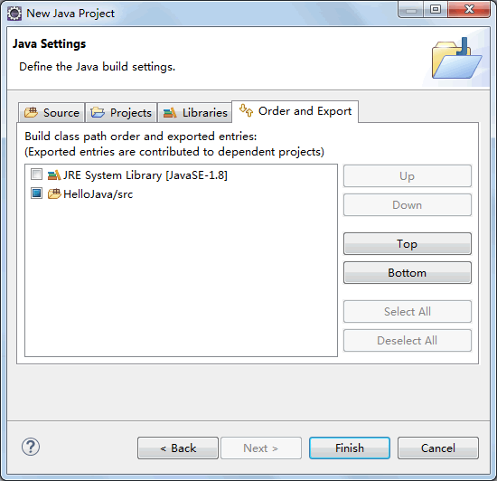

# Java 如何创建项目

虽然在《Java 程序应用实例：“你好 Java”》一节中已经开发过一个 Java 程序，但是那毕竟是通过记事本创建的。在上一节《Java Eclipse 下载安装教程》中，我们已经安装了 Eclipse 工具，因此本节将介绍如何通过 Eclipse 开发 Java 程序。

在 Eclipse 中编写程序，必须先创建项目。Eclipse 中有很多项目，其中 java 项目用于管理和编写 Java 程序，具体步骤如下。

(1) 在图 1 所示的界面中选择“file（文件）”|“new（新建）”|“Java Project（Java 项目）”命令，打开“New Java Project（新建 Java 项目）”对话框。

(2) 设置“Project name（项目名）”为 HelloJava，选中“Use default location（使用缺省位置）”复选框，将项目保存到工作空间中，其他暂时不用设置，如图 1 所示。


图 1 New Java Project（新建 Java 项目）对话框
(3) 单击“Next（下一步）”按钮，在进入的对话框中更改项目的 Sourse（源码）选项，如图 2 所示。同时还可以设置 Project（项目）、Libraries（库）、Order and Export（排序和导出）方面的选项，分别如图 3、图 4 和图 5 所示。


图 2 设置 Sourse（源码）选项

图 3 设置 Project（项目）选项

图 4 设置 Libraries（库）选项

图 5 设置 Order and Export（排序和导出）选项
(3) 单击“Finish（完成）”按钮，创建名为 HelloJava 的项目，Eclipse 会自动生成相关代码和布局结构。在 Eclipse 左侧“Package Explorer（包资源管理器）”窗格中会显示整个 Java 项目的目录结构，默认为空项目。

(4) 右击 src 目录，选择“new（新建）”|“Class（类）” 命令，打开“New Java Class（新建 Java 类）”对话框。设置类的名称为 HelloJava，并选中 public static void main(String[] args) 复选框为新类生成 main() 方法，如图 6 所示。


图 6 New Java Class（新建 Java 类）对话框
(7) 最后单击“Finish（完成）”按钮，会看到生成的 HelloJava.java 文件的内容，并处于编辑状态，如图 7 所示。


图 7 HelloJava.java 文件

#### 例 1

1) 对生成的源代码进行修改，最终文件代码如下。

```
public class HelloJava
{
    public static void main(String[] args)
    {
        //TODO 自动生成的方法存根
        System.out.println(" *");
        System.out.println(" ***");
        System.out.println(" *****");
        System.out.println(" *******");
        System.out.println(" *********");
    }
}
```

读者输入上面代码的时候，会充分体会到 Eclipse 强大的代码辅助功能。图 8 所示为代码的自动提示补全功能。


图 8 自动补全代码
2) 编写完成之后按 Ctrl+S 快捷键保存修改。在工具栏中单击“运行”按钮后，如果程序没有编译错误，在底部的“Console（控制台）”窗格中会看到输出的等腰三角形，这就是程序的运行效果，如图 9 所示。


图 9 查看输出结果