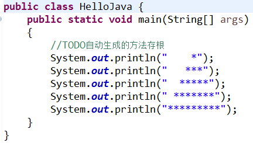

# Java 修改 Eclipse 编辑器字体大小

在第一次使用 Eclipse 编写程序时，由于 Eclipse 默认使用的是 Cosnolas 字体，字号为 10，所以编辑器中的字体非常小，不方便查看。

我们可以通过下面所示的方法来修改编辑器的字体大小。如图 1 所示，具体修改方法为：

1.  选择“窗口”|“首选项”命令，打开“首选项”对话框，从左侧窗格依次展开“General（常规）”|“Appearance（外观）”|“Colors and Fonts（颜色和字体）”选项。
2.  从右侧选择 Java 下的“Java Editor Text Font（Java 编辑器文本字体）”选项。
3.  单击“Edit（编辑）”按钮，在弹出的“字体”对话框中设置字体的样式和大小。

图 1 设置编辑器字体大小（[点击此处查看原图](http://c.biancheng.net/uploads/allimg/181112/3-1Q112141030113.gif)）
设置完成后，依次单击“Apply and Close（确定）”按钮返回 Eclipse，此时即可看到修改效果。图 2 所示为 14 号字体的效果。

图 2 14 号字体的效果