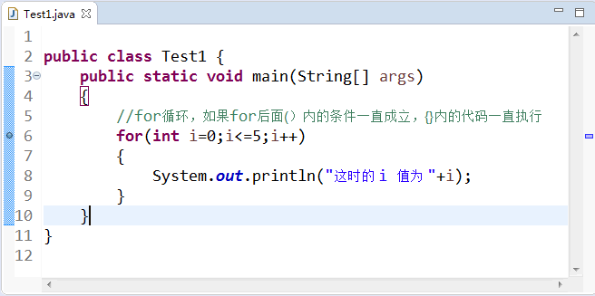
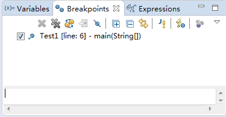
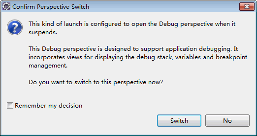
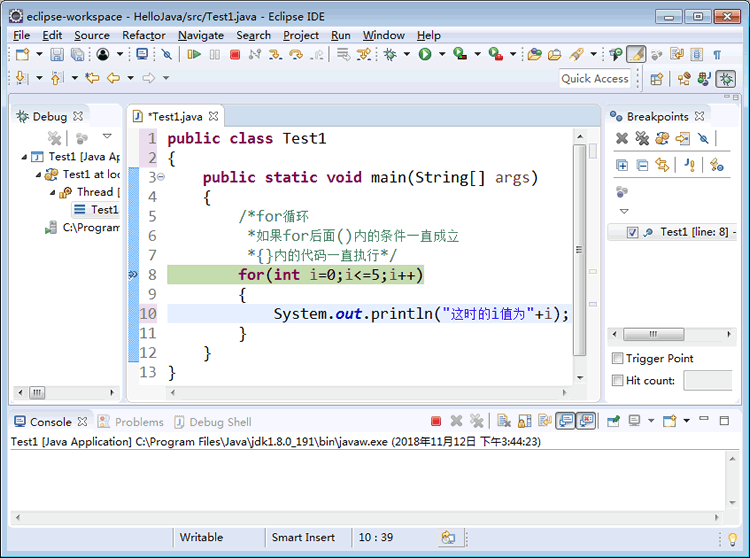
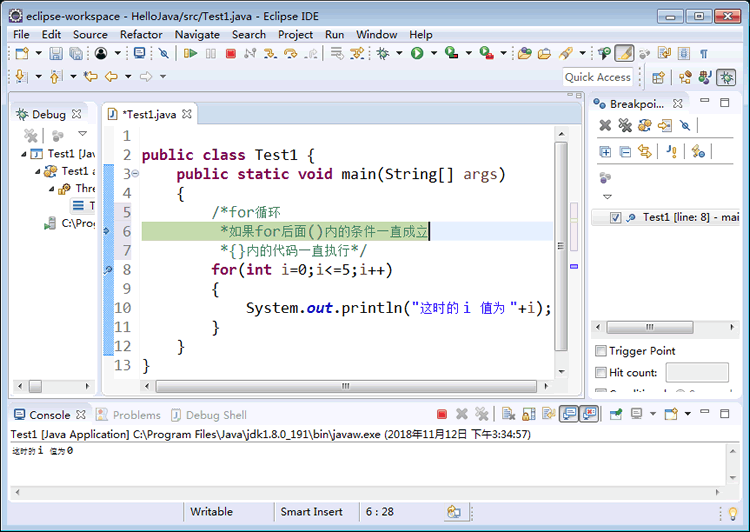

# Java Eclipse 如何调试代码

下面通过一个简单的例子来了解一下 Eclipse 调试程序的方法。

```
public class Test1
{
    public static void main(String[] args)
    {
        //for 循环，如果 for 后面(）内的条件一直成立，{}内的代码一直执行
        for(int i=0;i<=5;i++)
        {
            System.out.println("这时的 i 值为 "+i);
        }
    }
}
```

上述代码完成的主要功能是如果 i 值满足小于或等于 5 的条件，就一直执行输出语句。可以看到 for 关键字后面的小括号中有三个表达式，第一个表达式`int i=0`的作用是定义一个 int 类型的变量并赋初值为 0，第二个表达式`i<=5`说明 i 要满足的条件是小于或等于 5，第三个表达式`i++`的意思是程序每执行一次 i 加 1。

对初学者来说，可能对这几个表达式的理解不太透彻，这样就会对每次控制台中输出的 i 值有所怀疑。接下来介绍每次执行程序后 i 值的变化。

在调试程序时常用的方法就是设置断点，跟踪调试，查看变量值的变化。调试上述代码的方法如下。

(1) 设置断点。双击要插入断点的语句行前面的蓝色区域，这时该行最前面会出现一个蓝色的圆点，也就是断点。本例在第 5 行 for 语句处添加了断点，如图 1 所示。如果想要取消该断点，直接双击断点所在的行号即可。


图 1 添加断点
(2) 选择“Window（窗口）”|“Show View（显示视图）”|“（Breakpoints）断点”命令，打开“Breakpoint（断点）”窗格，在这里可以看到 Test 的第 6 行有一个断点，如图 2 所示。


图 2 “断点”窗格
(3) 要以调试方式运行程序，需要在工具栏中单击“调试”按钮，这样执行到断点的位置时弹出如图 3 所示的对话框，可以发现将要执行的 for 语句已经变成了绿色。单击“Switch（是）” 按钮进入调试模式，如图 4 所示。


图 3 询问是否进入调试模式

图 4 调试模式
(4) 单击按钮或者直接按 F6 键，程序开始单步执行。这时可以看到“变量”窗格中 i 的值是 0，然后继续执行，“控制台”窗格输出“这时的 i 值为 0”。

(5) 继续执行会发现程序重新回到 for 循环开始的位置，准备开始下一次的执行。此时，i 值变化为 1 且“变量”窗格中显示 i 值的行变为了黄色，如图 5 所示。


图 5 “变量”窗格
(6) 继续一直单击按钮，直到程序执行完毕。在这个过程中，可以看到 i 值又从 1 依次变化到 5，然后程序执行结束。

在上述的调试过程中，查看程序中变量值的变化，可以更好地理解程序的执行流程，这种设置断点的调试方式是初学者必须掌握的。

下面给初学者介绍一些如何减少错误的建议。

*   使用 Java 的命名规范，减少命名出错的概率。
*   掌握一定的计算机专业英语，能够读懂一些错误信息，便于根据提示査找错误和修改错误。
*   理解代码的含义之后自己练习写代码，而不是抄写代码。
*   多看、多练、多思考。