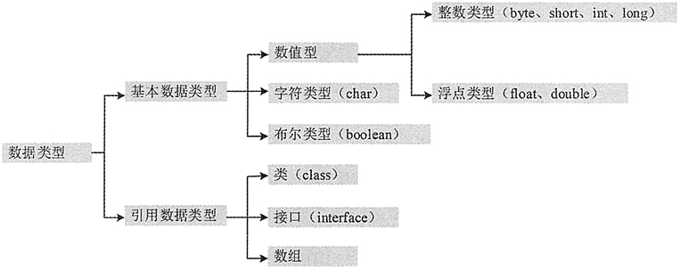

# Java 数据类型

Java 是一种类型安全语言，编译器存储在变量中的数值具有适当的数据类型。学习任何一种编程语言都要了解其数据类型，本文将详细介绍 Java 中的数据类型。

## 数据类型的分类

Java 语言的数据类型分为两种：基本数据类型和引用数据类型。

(1) 基本数据类型包括 boolean（布尔型）、float（单精度浮点型）、char（字符型）、byte（字节型）、short（短整型）、int（整型）、long（长整型）和 double （双精度浮点型）共 8 种，详见表 1 所示。

表 1 Java 的基本数据类型

| 类型名称 | 关键字 | 占用内存 | 取值范围 |
| 字节型 | byte | 1 字节 | -128~127 |
| 短整型 | short | 2 字节 | -32768~32767 |
| 整型 | int | 4 字节 | -2147483648~2147483647 |
| 长整型 | long | 8 字节 | -9223372036854775808L~9223372036854775807L |
| 单精度浮点型 | float | 4 字节 | +/-3.4E+38F（6~7 个有效位） |
| 双精度浮点型 | double | 8 字节 | +/-1.8E+308 (15 个有效位） |
| 字符型 | char | 2 字节 | ISO 单一字符集 |
| 布尔型 | boolean | 1 字节 | true 或 false |

所有的基本数据类型的大小（所占用的字节数）都已明确规定，在各种不同的平台上保持不变，这一特性有助于提高 Java 程序的可移植性。

(2) 引用数据类型建立在基本数据类型的基础上，包括数组、类和接口。引用数据类型是由用户自定义，用来限制其他数据的类型。另外，Java 语言中不支持 C++ 中的指针类型、结构类型、联合类型和枚举类型。

Java 数据类型的结构如图 1 所示。

图 1 Java 数据类型结构图
Java 是一种强制类型的语言，所有的变量都必须先明确定义其数据类型，然后才能使用。Java 中所有的变量、表达式和值都必须有自己的类型，没有“无类型”变量这样的概念。

基本数据类型又可分为 4 大类，即整数类型（包括 byte、short，int 和 long）、浮点类型（包括 float 和 double）、布尔类型和字符类型（char），下面分别介绍这 4 大类数据类型。

## 整数类型

Java 定义了 4 种整数类型变量：字节型（byte）、短整型（short）、整型（int）和长整型（long）。这些都是有符号的值，正数或负数。

#### 字节型（byte）

byte 类型是最小的整数类型。当用户从网络或文件中处理数据流时，或者处理可能与 Java 的其他内置类型不直接兼容的未加工的二进制数据时，该类型非常有用。

#### 短整型（short）

short 类型限制数据的存储为先高字节，后低字节，这样在某些机器中会出错，因此该类型很少被使用。

#### 整型（int）

int 类型是最常使用的一种整数类型。

#### 长整型（long）

对于大型程序常会遇到很大的整数，当超出 int 类型所表示的范围时就要使用 long 类型。

#### 例 1

创建一个 Java 程序，在 main() 方法中声明各种整型的变量并赋予初值，最后将变量相加并输出结果，代码如下：

```
public static void main(String[] args)
{ 
    byte a=20;    //声明一个 byte 类型的变量并赋予初始值为 20
    short b=10;    //声明一个 short 类型的变量并赋予初始值为 10 
    int c=30;    //声明一个 int 类型的变量并赋予初始值为 30
    long d=40;    //声明一个 long 类型的变量并赋予初始值为 40
    long sum=a+b+c+d;
    System.out.println("20+10+30+40="+sum);
}
```

保存该段代码并运行，输出的最终结果如下：

```
20+10+30+40=100
```

在该示例中，首先依次定义了 byte 类型、short 类型、int 类型和 long 类型的 4 个变量，并赋予了初始值，然后定义了一个 long 类型、名称为 sum 的变量。sum 变量的值为前 4 个变量之和，最后输出 sum 变量的值，即相加之后的结果。

提示：因为 byte 类型、short 类型、int 类型和 long 类型都是整数类型，故可以使用“+”相加，而非字符串之间的连接。

## 浮点类型

浮点类型是带有小数部分的数据类型，也叫实型。浮点型数据包括单精度浮点型（float）和双精度浮点型（double），代表有小数精度要求的数字。

单精度浮点型（float）和双精度浮点型（double）之间的区别主要是所占用的内存大小不同，float 类型占用 4 字节的内存空间，double 类型占用 8 字节的内存空间。双精度类型 double 比单精度类型 float 具有更高的精度和更大的表示范围。

Java 默认的浮点型为 double，例如，11.11 和 1.2345 都是 double 型数值。如果要说明一个 float 类型数值，就需要在其后追加字母 f 或 F，如 11.11f 和 1.2345F 都是 float 类型的常数。

例如，可以使用如下方式声明 float 类型的变量并赋予初值。

```
float price=12.2f;    //定义 float 类型并赋予初值
```

也可以使用如下的任意一种方式声明 double 类型的变量并赋予初值。

```
double price=12.254d;    //定义 double 类型的变量并赋予初值
```

或

```
double price=12.254;    //定义 double 类型的变量并赋予初值
```

注意：一个值要能被真正看作 float，它必须以 f（或 F）后缓结束；否则，会被当作 double 值。对 double 值来说，d（或 D）后缓是可选的。

#### 例 2

假设从 A 地到 B 地路程为 2348.4 米，那么往返 A 和 B 两地需要走多少米？

由于路径数据为浮点类型，在这里定义一个类型为 double 的变量来存储单程距离，并定义一个 int 类型的变量来存储次数。另外，因为计算得到的值为 float 类型，所以可以定义一个 float 类型的变量来存储总距离。

代码如下：

```
public static void main(String[] args)
{ 
    double lutu=2348.4;    //定义 double 类型的变量，用于存储单程距离
    int num=2;    //定义 int 类型的变量，用于存储次数
    float total=(float)(lutu*2);    //定义 float 类型的变量，用于存储总距离
    System.out.println("往返 AB 两地共需要行驶："+total+" 米");
}
```

保存文件并运行，输出的结果如下：

```
往返 AB 两地共需要行驶：4696.8 米
```

该示例中首先定义了一个类型为 double、名称为 lutu 的变量用于存储单程距离，然后定义了一个类型为 int、名称为 num 的变量用于存储经过的次数，最后定义了一个类型为 float、名称为 total 的变量用于存储总距离。

其实一个 double 类型的数据与一个 int 类型的数据相乘后得到的结果类型为 double，但是由于单程距离乘以次数为一个单精度浮点型（float 类型）的数，因此可以将总距离转换为 float 类型的数据。

## 布尔类型

布尔类型（boolean）用于对两个数值通过逻辑运算，判断结果是“真”还是“假”。Java 中用保留字 true 和 false 来代表逻辑运算中的“真”和“假”。因此，一个 boolean 类型的变量或表达式只能是取 true 和 false 这两个值中的一个。

在 Java 语言中，布尔类型的值不能转换成任何数据类型，true 常量不等于 1，而 false 常量也不等于 0。这两个值只能赋给声明为 boolean 类型的变量，或者用于布尔运算表达式中。

例如，可以使用以下语句声明 boolean 类型的变量。

```
boolean isable;    //声明 boolean 类型的变量 isable
boolean b=false;    //声明 boolean 类型的变量 a，并赋予初值为 false
```

## 字符类型

Java 语言中的字符类型（char）使用两个字节的 Unicode 编码表示，它支持世界上所有语言，可以使用单引号字符或者整数对 char 型赋值。

一般计算机语言使用 ASCII 编码，用一个字节表示一个字符。ASCII 码是 Unicode 码的一个子集，用 Unicode 表示 ASCII 码时，其高字节为 0，它是其前 255 个字符。

Unicode 字符通常用十六进制表示。例如“\u0000”~“\u00ff”表示 ASCII 码集。“\u”表示转义字符，它用来表示其后 4 个十六进制数字是 Unicode 码。

字符型变量的类型为 char，用来表示单个的字符，例如：

```
char letter='D';
char numChar='5';
```

第一条语句将字符 D 赋给字符型变量 letter；第二条语句将数字字符 5 赋给字符型变量 numChar。

#### 例 3

下面代码在 main() 方法中定义两个字符类型的变量，并使之相对应的 ASCII（Unicode）值相加，最后将相加后的结果输出。

```
public static void main(String[] args)
{
    char a='A';    //向 char 类型的 a 变量赋值为 A，所对应的 ASCII 值为 65
    char b='B';    //向 char 类型的 b 变量赋值为 B，所对应的 ASCII 值为 66
    System.out.println("A 的 ASCII 值与 B 的 ASCII 值相加结果为："+(a+b));
}
```

保存该段代码并运行，输出结果如下所示。

```
A 的 ASCII 值与 B 的 ASCII 值相加结果为：131
```

在该程序中，a 变量首先被赋值为“A”，字母 A 在 ASCII（和 Unicode）中对应的值为 65。接着又定义了一个类型为 char 的变量 b，赋值为“B”，字母 B 在 ASCII（和 Unicode）中所对应的值为 66。因此相加后得出的结果为 131。

提示：字符通常用 16 进制表示，范围从“\uOOOO”~“\uFFFF”，即从 0~65535。\uOOOO 和 \uFFFF 中的 u 告诉编译器是用两个字节（16 位）字符信息表示一个 Unicode 字符。