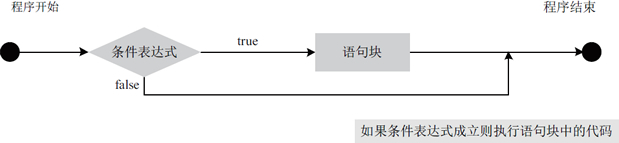
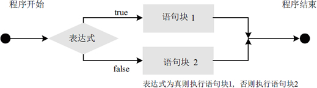
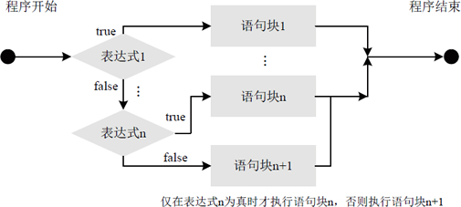
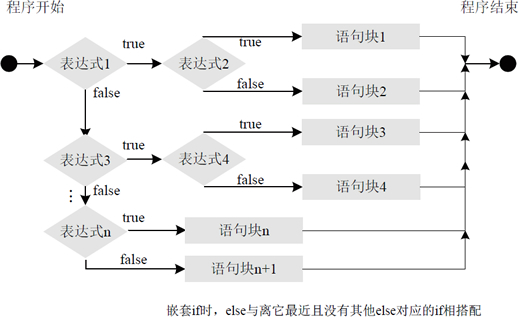

# Java if else 语句详解

选择结构（也叫分支结构）解决了顺序结构不能判断的缺点，可以根据一个条件判断执行哪些语句块。选择结构适合于带有逻辑或关系比较等条件判断的计算。例如，判断是否到下班时间，判断两个数的大小等。

if 语句是使用最多的条件分支结构，它属于选择语句，也可以称为条件语句。下面将详细介绍 if 语句的各种形式及其用法。

## if 语句语法

if 选择结构是根据条件判断之后再做处理的一种语法结构。默认情况下，if 语句控制着下方紧跟的一条语句的执行。不过，通过语句块，if 语句可以控制多个语句。

if 语句的最简语法格式如下，表示“如果满足某种条件，就进行某种处理”。

```
if ( 条件表达式)
{
    语句块;
}
```

其中“条件表达式”和“语句块”是比较重要的两个地方。

1.  `条件表达式`：条件表达式可以是任意一种逻辑表达式，最后返回的结果必须是一个布尔值。取值可以是一个单纯的布尔变量或常量，也可以是使用关系或布尔运算符的表达式。如果条件为真，那么执行语句块；如果条件为假，则语句块将被绕过而不被执行。
2.  `语句块`：该语句块可以是一条语句也可以是多条语句。如果仅有一条语句，可省略条件语句中的大括号{}。

if 条件语句的运行流程如图 1 所示。


图 1  if 语句执行流程图

#### 例 1

编写一个 Java 程序，允许用户从键盘输入一个数字，再判断该数是否大于 100。使用 if 语句的实现代码如下：

```
import java.util.Scanner;
public class Test07
{
    public static void main(String[] args)
    {
        System.out.println("请输入一个数字：");
        Scanner input=new Scanner(System.in);
        int num=input.nextInt(); // 接收键盘输入数据
        if(num>100)    //判断用户输入的数据是否大于 100
            System.out.println("输入的数字大于 100");
        if(num==100)    //判断用户输入的数据是否等于 100
            System.out.println("输入的数字等于 100");
        if (num<100)    //判断用户输入的数据是否小于 100
            System.out.println("输入的数字小于 100");
    }
}
```

运行该程序，分别使用键盘输入 99、100 和 105，结果如下所示：

```
请输入一个数字：
99
输入的数字小于 100
```

```
请输入一个数字：
100
输入的数字等于 100
```

```
请输入一个数字：
105
输入的数字大于 100
```

#### 例 2

假设有 num1 和 num2 两个变量，它们的值分别是 50 和 34。下面编写程序，要求使用 if 语句判断 num1 和 num2 的大小关系，并输出比较结果。

其实现代码如下：

```
public static void main(String[] args)
{
    int num1=50;
    int num2=34;
    if(num1>num2)
        System.out.println("num1 大于 num2");
    if(num1==num2)
        System.out.println("num2 等于 num2");
    if(num1<num2)
        System.out.println("num1 小于 num2");
}
```

该段选择语句判断了 num1 值和 num2 值的大于、等于和小于关系。此处 num1 为 50，num2 为 34，所以执行后会输出“num1 大于 num2”。

#### 例 3

在上述两个案例代码中，由于每个 if 语句的语句块中只包含一条语句，所以省略了大括号。本实例在登录系统中要求用户名、密码和验证码都必须正确，否则将显示登录失败及错误提
示。其中的语句块有多条语句，所以需要使用大括号。代码如下：

```
public static void main(String[] args)
{
    String username="admin";    //用户名
    String userpass="123456";    //密码
    String code="0000";    //验证码
    if(username!="admin"&&userpass!="123456"&&code!="0000") //比较
    {
        System.out.println("登录失败！");
        System.out.println("请检查输入的用户名、密码和验证码是否正确！");
    }
}
```

在这里为 if 语句设置了一个复杂的复合表达式来验证登录条件。执行后的输出结果如下：

```
登录失败！
请检查输入的用户名、密码和验证码是否正确！
```

## 双条件 if 语句

单 if 语句仅能在满足条件时使用，而无法执行任何其他操作（停止）。而结合 else 语句的 if 可以定义两个操作，此时的 if…else 语句表示“如果条件正确则执行一个操作，否则执行另一个操作”。

使用 if…else 语句的语法格式如下所示：

```
if ( 表达式)
{
    语句块 1;
}
else
{
    语句块 2;
}
```

在上述语法格式中，如果 if 关键字后面的表达式成立，那么就执行语句块 1，否则的话则执行语句块 2，其运行流程如图 2 所示。


图 2  if…else 运行流程

#### 例 4

在例 3 中为实现比较 num1 和 num2 的大小，使用了 3 个 if 条件语句分别判断大于、等于和小于的情况。下面使用 if…else 双条件来实现，具体代码如下：

```
public static void main(String[] args)
{
    int num1=50;
    int num2=34;
    if(num1==num2)    //如果等于
        System.out.println("num1 等于 num2");
    if(num1>num2)    //如果大于
        System.out.println("num1 大于 num2");
    else    //否则就是小于
    System.out.println("num1 小于 num2");
}
```

双条件语句减少了代码的编写量，同时增强了程序的可读性。简化后的结果还是一样，执行后会输出“num1 大于 num2”。

## 多条件 if 语句

if 语句的主要功能是给程序提供一个分支。然而，有时候程序中仅仅多一个分支是远远不够的，甚至有时候程序的分支会很复杂，这就需要使用多分支的 if…else if 语句。

通常表现为“如果满足某种条件，就进行某种处理，否则如果满足另一种条件才执行另一种处理……，这些条件都不满足则执行最后一种条件”。

if…else if 多分支语句的语法格式如下所示：

```
if(表达式 1)
{
    语句块 1;
}
else if(表达式 2)
{
    语句块 2;
}
...
else if(表达式 n)
{
    语句块 n;
}
else
{
    语句块 n+1;
}
```

在上述语法格式中，使用 if…else if 语句时，依次判断表达式的值，当某个分支的条件表达式的值为 true 时，则执行该分支对应的语句块，然后跳到整个 if 语句之外继续执行程序。如果所有的表达式均为 false，则执行语句块 n+1，然后继续执行后续程序，其运行流程如图 3 所示。


图 3  if…else if 语句的执行流程

#### 例 5

同样以比较 num1 和 num2 的大小为例，使用 if…else if 多条件的实现代码如下：

```
public static void main(String[] args)
{
    int num1=50;
    int num2=34;
    if(num1==num2)    //如果等于
        System.out.println("num1 等于 num2");
    else if(num1>num2)    //如果大于
        System.out.println("num1 大于 num2");
    else    //否则就是小于
    System.out.println("num1 小于 num2");
}
```

如上述代码所示，num1 和 num2 不满足 if 语句的“num1==num2”条件；接着测试 else if 的“num1>num2”条件，满足该条件并输出“num1 大于 num2”。

#### 例 6

假设某学校对成绩的判断标准是：不低于 90，可以评为优秀；低于 90 但不低于 80，可以评为良好；低于 80 但不低于 60，可以评为中等；否则评为差。

下面输入一个分数，使用多条件 if 语句输出对应等级的功能。实现代码如下：

```
public static void main(String[] args)
{
    System.out.println("请输入考试成绩：");
    Scanner input = new Scanner(System.in);
    int score = input.nextInt();    //接收键盘输入数据
    if(score>=90)
    {    //考试成绩>=90
        System.out.println("优秀");
    }
    else if(score>=80)
    {    //90>考试成绩>=80
        System.out.println("良好");
    }
    else if(score>=60)
    {    //80>考试成绩>=60
        System.out.println("中等");
    }
    else
    {    //考试成绩<60
    System.out.println("差");
    }
}
```

当考试成绩为 90 分以上时，则执行第一个 if 语句，下面的 3 个条件判断语句不会执行；当考试成绩为 80 分以上 90 分以下时，则执行第一个 else if 语句；当考试成绩在 60~80 分，并且包含 60 分的成绩，则执行第二个 else if 语句；如果上述 3 个条件都不满足，则执行 else 语句。

程序运行后的输出效果如下所示：

```
请输入考试成绩：
100
优秀
```

```
请输入考试成绩：
88
良好
```

```
请输入考试成绩：
50
差
```

## 嵌套 if 的使用

if 语句的用法非常灵活，不仅可以单独使用，还可以在 if 语句里嵌套另一个 if 语句。同样，if…else 语句和 if…else if 语句中也可以嵌套另一个 if 结构的语句，以完成更深层次的判断。

嵌套 if 的语法格式如下：

```
if(表达式 1)
{
    if(表达式 2)
    {
        语句块 1;
    }
    else
    {
        语句块 2;
    }
}
else
{
    if(表达式 3)
    {
        语句块 3;
    }
    else if( 表达式 4)
    {
        语句块 4;
    }
    else
    {
        if( 表达式 n)
        {
            语句块 n;
        }
        else
        {
            语句块 n+1;
         }
    }
}
```

在上述格式中，应该注意每一条 else 与离它最近且没有其他 else 对应的 if 相搭配，其执行流程如图 4 所示。


图 4  嵌套 if 语句执行流程

#### 例 7

假设某航空公司为吸引更多的顾客推出了优惠活动。原来的飞机票价为 3000 元，活动时，4~11 月旺季，头等舱 9 折，经济舱 8 折；1~3 月、12 月淡季，头等舱 5 折，经济舱 4 折，求机票的价格。

编写 Java 程序实现代码如下：

```
public static void main(String[] args)
{
    Scanner sc=new Scanner(System.in);
    System.out.println("请输入出行的月份：");
    int month=sc.nextInt();
    System.out.println("选择头等舱还是经济舱？数字 1 为头等舱，数字 2 为经济舱");
    int kind=sc.nextInt();
    double result=60000;    //原始价格
    //旺季的票价计算
    if(month<=11&&month>=4)
    {
        if(kind==1)
        {    //旺季头等舱
            result=result*0.9;
        }
        else if(kind==2)
        {    //旺季经济舱
            result=result*0.8;
        }
        else
        {
            System.out.println("选择种类有误，请重新输入！");
        }
    }
    // 淡季的票价计算
    else if((month>=1&&month<=3)||month==12)
    {
        if(kind==1)
        {    //淡季头等舱
            result=result*0.5;
        }
        else if(kind==2)
        {    //淡季经济舱
            result=result*0.4;
        }
        else
        {
            System.out.println("选择种类有误，请重新输入！");
        }
    }
    else
    {
        System.out.println("日期选择有误，请重新输入！");
    }
    System.out.println("您选择的机票价格为："+result);
}
```

上面代码将用户输入的月份保存到 month 变量，将机票种类保存到 kind 变量。接下来判断变量 month 和 kind 的范围。如果变量 month 在 4~11，kind 为 1 则执行 result=result*0.9，为 2 则执行 result=result*0.8；变量 month 在 1~3、12，kind 为 1 则执行 result=result*0.5，为 2 则执行 result=result*0.4。当用户输入有误时，根据错误情况给予不同的提示。

旺季经济舱出行的输出结果如下所示：

```
请输入出行的月份：
6
选择头等舱还是经济舱？数字 1 为头等舱，数字 2 为经济舱
2
您选择的机票价格为：48000.0
```

```
淡季头等舱的输出结果如下所示：
请输入出行的月份：
2
选择头等舱还是经济舱？数字 1 为头等舱，数字 2 为经济舱
1
您选择的机票价格为：30000.0
```