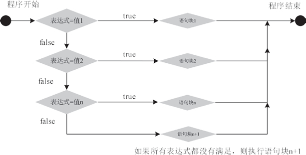

# Java switch case 语句详解

if…else 语句可以用来描述一个“二岔路口”，我们只能选择其中一条路来继续走，然而生活中经常会碰到“多岔路口”的情况。switch 语句提供了 if 语句的一个变通形式，可以从多个语句块中选择其中的一个执行。

## switch 语句格式

switch 语句能解决 if 分支过多的情况，提供一种简洁的方法来处理对应给定表达式的多种情况。

基本语法形式如下所示：

```
switch(表达式)
{
    case 值 1:
        语句块 1;
        break;
    case 值 2:
        语句块 2;
        break;
    …
    case 值 n:
        语句块 n;
        break;
    default:
        语句块 n+1;
    break;
}
```

其中，switch、case、default、break 都是 Java 的关键字。

*   switch：表示“开关”，这个开关就是 switch 关键字后面小括号里的值，小括号里要放一个整型变量或字符型变量。
*   case：表示“情况，情形”，case 后必须是一个整型和字符型的常量表达式，通常是一个固定的字符、数字，例如 10、'a'。case 块可以有多个，顺序可以改变，但是每个 case 后的常量值必须各不相同。
*   default：表示“默认”，即其他情况都不满足。default 后要紧跟冒号，default 块和 case 块的先后顺序可以变动，不会影响程序执行结果。通常，default 块放在末尾，也可以省略不写。
*   break：表示“停止”，即跳出当前结构。switch 语句在其开始处使用一个简单的表达式。表达式的结果将与结构中每个 case 子句的值进行比较。如果匹配，则执行与该 case 关联的语句块。语句块以 case 语句开头，以 break 语句结尾，然后执行 switch 语句后面的语句。如果结果与所有 case 子句均不匹配，则执行 default 后的语句，其运行流程如图 1 所示。


图 1　 switch 语句执行流程图

#### 例 1

在节目的抽奖环节里，节目组会根据每位嘉宾的座位号来进行抽奖游戏，根据不同的号码来决定奖项的大小。使用 switch 语句编写 Java 程序来完成奖项分配，其实现代码如下。

```
public static void main(String[] args)
{
     System.out.println("请输入座位号码：");
     Scanner sc=new Scanner(System.in);
     int num=sc.nextInt();
     switch(num)
     {
         case 8:
             System.out.println("恭喜你，获得了三等奖！");
             break;
         case 88:
             System.out.println("恭喜你，获得了二等奖！");
             break;
         case 888:
             System.out.println("恭喜你，获得了一等奖！");
             break;
         default:
             System.out.println("谢谢参与！");
             break;
     }
}
```

当用户输入的号码为 888 时，获取的 num 值为 888，则与第三个 case 后的值匹配，执行它后面的语句，输出“恭喜你，获得了一等奖！”，然后执行 break 语句，跳出整个 switch 结构。如果输入的号码与 case 中的值都不匹配，则执行 default 后的语句。

程序执行结果如下所示：

```
请输入座位号码：
888
恭喜你，获得了一等奖！
```

```
请输入座位号码：
88
恭喜你，获得了二等奖！
```

```
请输入座位号码：
66
谢谢参与！
```

#### 例 2

编写一个 Java 程序，根据当前的星期数字输出对应的汉字。在这里使用包含 break 的 switch 语句来判断当前的星期，实现代码如下：

```
public static void main(String[] args)
{
    String weekDate="";
    Calendar calendar = Calendar.getInstance();
    int week=calendar.get(Calendar.DAY_OF_WEEK)-1;
    switch(week)
    {
        case 0:
            weekDate="星期日";
            break;
        case 1:
            weekDate="星期一";
            break;
        case 2:
            weekDate="星期二";
            break;
        case 3:
            weekDate="星期三";
            break;
        case 4:
            weekDate="星期四";
            break;
        case 5:
            weekDate="星期五";
            break;
        case 6:
            weekDate="星期六";
            break;
    }
    System.out.println("今天是 "+weekDate);
}
```

本程序首先获取当前的星期值，然后使用 switch 语句判断 week 的值：0 表示星期日，1 表示星期一，2 表示星期二……以此类推，6 表示星期六。只要 week 值与 case 值相符合，则程序将执行该 case 中的语句，并跳出 switch 语句，输出结果。

运行程序，输出的结果如下：

```
今天是星期五
```

## if 语句和 switch 语句的区别

if 和 switch 语句都表示条件语句，可以从使用效率和实用性两方面加以区分。

#### 1\. 从使用效率上区分

从使用效率上区分，在对同一个变量的不同值作条件判断时，既可以使用 switch 语句，也可以使用 if 语句。使用 switch 语句的效率更高一些，尤其是判断的分支越多，越明显。

#### 2\. 从实用性上区分

从语句的实用性角度区分，switch 语句不如 if 条件语句，if 语句是应用最广泛和最实用的语句。

#### 3\. 何时使用 if 语句和 switch 语句

在程序开发的过程中，何时使用 if 语句和 switch 语句，需要根据实际情况而定，应尽量做到物尽其用。不能因为 switch 语句的效率高就一直使用，也不能因为 if 语句常用就不用 switch 语句。需要根据实际情况，具体问题具体分析，使用最适合的条件语句。

一般情况下，对于判断条件较少的，可以使用 if 条件语句，但是在实现一些多条件的判断中，最好使用 switch 语句。