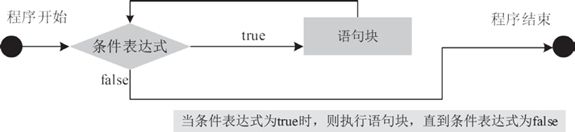
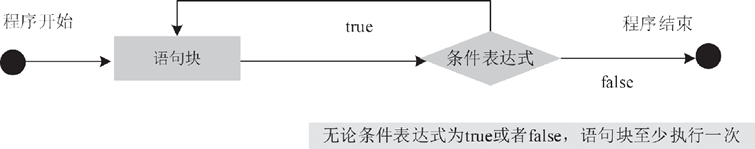

# Java while 和 do whlie 语句

循环也是程序中的重要流程结构之一，适用于需要重复一段代码直到满足特定条件为止的情况。所有流行的编程语言中都有循环语句。Java 中采用的循环语句与 C 中的循环语句相似，主要有 while、do…while、for 和 foreach。本文主要介绍 while 和 do…while。

## while 语句

while 循环语句可以在一定条件下重复执行一段代码。该语句需要判断一个测试条件，如果该条件为真，则执行循环语句（循环语句可以是一条或多条），否则跳出循环。

while 循环语句的语法结构如下：

```
while(条件表达式)
{
    语句块;
}
```

其中语句块中的代码可以是一条或者多条语句，而条件表达式是一个有效的 boolean 表达式，它决定了是否执行循环体。当条件表达式的值为 true 时，就执行大括号中的语句块。

执行完毕，再次检查表达式是否为 true，如果还为 true，则再次执行大括号中的代码，否则就跳出循环，执行 while 循环之后的代码。图 1  表示了 while 循环语句的执行流程。


图 1　 while 循环语句执行流程图

#### 例 1

使用 while 语句计算 10 的阶乘，其具体代码如下所示。

```
public static void main(String[] args)
{
    int i=1;
    int n=1;
    while(i<=10)
    {
        n=n*i;
        i++;
    }
    System.out.println("10 的阶乘结果为："+n);
}
```

在上述代码中，定义了两个变量 i 和 n，循环每执行一次 i 值就加 1，判断 i 的值是否小于等于 10，并利用 n=n*i 语句来实现阶乘。当 i 的值大于 10 之后，循环便不再执行并退出循环。

运行程序，执行的结果如下所示：

```
10 的阶乘结果为：3628800
```

## do…while 语句

do…while 循环语句也是 Java 中运用广泛的循环语句，它由循环条件和循环体组成，但它与 while 语句略有不同。do…while 循环语句的特点是先执行循环体，然后判断循环条件是否成立。

do…while 语句的语法格式如下：

```
do
{
    语句块;
}while(条件表达式);
```

以上语句的执行过程是，首先执行一次循环操作，然后再判断 while 后面的条件表达式是否为 true，如果循环条件满足，循环继续执行，否则退出循环。while 语句后必须以分号表示循环结束，其运行流程如图 2 所示。


图 2 　do…while 循环语句的执行流程注意：do…while 语句与 while 语句唯一的区别在于，不管表达式的结果为真还是为假，循环语句至少执行一次。因此 do…while 循环适合于至少执行一次循环体的情况。

#### 例 2

编写一个程序，计算 10 的阶乘。使用 do…while 循环的实现代码如下所示。

```
public static void main(String[] args)
{
    int number=1,result=1;
    do
    {
        result*=number;
        number++;
    }while (number<=10);
    System.out.print("10 阶乘结果是："+result);
}
```

程序运行后输出结果如下：

```
10 阶乘结果是：3628800
```

#### 例 3

在一个图书系统的推荐图书列表中保存了 50 条信息，现在需要让它每行显示 10 条，分 5 行进行显示。下面使用 do…while 循环语句来实现这个效果，其具体代码如下所示。

```
public static void main(String[] args)
{
    int bookIndex=1;
    do
    {
        System.out.print(bookIndex+"\t");
        if(bookIndex%10==0)
            System.out.println();
        bookIndex++;
    }while(bookIndex<51);
}
```

在上述代码中， 声明一个变量 bookIndex 用来保存图书的索引，该变量赋值为 1 表示从第一本开始。在 do…while 循环体内，首先输出了 bookIndex 的值，然后判断 bookIndex 是否能被 10 整除，如果可以则说明当前行已经输出 10 条，用 System.out.println() 语句输出了一个换行符。之后使 bookIndex 加 1，相当于更新当前的索引。最后在 while 表达式中判断是否超出循环的范围，即 50 条以内。

运行程序，执行的结果如下所示。

```
1 2 3 4 5 6 7 8 9 10
11 12 13 14 15 16 17 18 19 20
21 22 23 24 25 26 27 28 29 30
31 32 33 34 35 36 37 38 39 40
41 42 43 44 45 46 47 48 49 50
```

#### 提示

while 循环和 do…while 循环的相同处是：都是循环结构，使用 while(循环条件) 表示循环条件，使用大括号将循环操作括起来；不同处如下。

*   语法不同：与 while 循环相比，do…while 循环将 while 关键字和循环条件放在后面，而且前面多了 do 关键字，后面多了一个分号。
*   执行次序不同：while 循环先判断，再执行。do…while 循环先执行，再判断。
*   一开始循环条件就不满足的情况下，while 循环一次都不会执行，do…while 循环则不管什么情况下都至少执行一次。