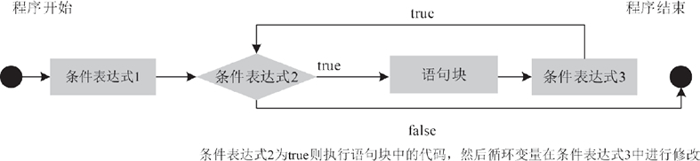

# Java for 语句详解

for 语句是一种在程序执行前就要先判断条件表达式是否为真的循环语句。假如条件表达式的结果为假，那么它的循环语句根本不会执行。for 语句通常使用在知道循环次数的循环中。

for 语句语法格式如下所示。

```
for(条件表达式 1;条件表达式 2;条件表达式 3)
{
语句块;
}
```

for 循环中 3 个条件表达式的含义如表 1 所示。

表 1 for 循环中 3 个表达式的含义

| 表达式 | 形式 | 功能 | 举例 |
| 条件表达式 1 | 赋值语句 | 循环结构的初始部分，为循环变量赋初值 | int i=1 |
| 条件表达式 2 | 条件语句 | 循环结构的循环条件 | i>40 |
| 条件表达式 3 | 迭代语句，通常使用 ++ 或 -- 运算符 | 循环结构的迭代部分，通常用来修改循环 变量的值 | i++ |

for 关键字后面括号中的 3 个条件表达式必须用“;”隔开。for 循环中的这 3 部分以及大括号中的循环体使循环体必需的 4 个组成部分完美地结合在一起，简单明了。

for 循环语句执行的过程为：首先执行条件表达式 1 进行初始化，然后判断条件表达式 2 的值是否为 true，如果为 true，则执行循环体语句块；否则直接退出循环。最后执行表达式 3，改变循环变量的值，至此完成一次循环。接下来进行下一次循环，直到条件表达式 2 的值为 false，才结束循环，其运行流程如图 1 所示。


图 1  for 循环执行流程图
例如，同样是计算 5 的阶乘，使用 for 循环的实现代码如下：

```
public static void main(String[] args)
{
int result=1;
for(int number=1;number<=5;number++)
{
result*=number;
}
System.out.print("5 的阶乘结果是："+result);    //输出"5 的阶乘结果是：120"
}
```

上述语句的含义可以理解为，将 number 变量的值从 1 开始，每次递增 1，直到大于 5 时终止循环。在循环过程中，将 number 的值与当前 result 的值进行相乘。

for 语句中的 3 个条件表达式并不是必须存在的，它们可以部分为空，也可以全为空。下面对这些情况依次进行介绍。

#### 1．条件表达式 1 为空

for 语句中条件表达式 1 的作用可以在程序的其他位置给出，所以当条件表达式 1 为空时，for 语句后面括号内其他条件表达式执行的顺序不变。

例如，使用 for 语句的这种形式计算 1~100 所有奇数的和。

```
public static void main(String[] args)
{
int result=0;
int number=1;    //相当于 for 语句的第 1 个表达式
for(;number<101;number++)
{
if(number%2!=0)    //如果不能整除 2，说明是奇数，则进行累加
result+=number;
}
System.out.print("100 以内所有奇数和为："+result);
}
```

执行后的输出结果如下：

```
100 以内所有奇数和为：2500
```

#### 2．条件表达式 2 为空

当 for 语句中条件表达式 2 为空时，将没有循环的终止条件。此时 for 语句会认为条件表达式 2 的值总是为真，循环无限制执行下去。因此，为了使循环达到某种条件时退出，需要在语句块中进行逻辑判断，并使用 break 语句来跳出循环，否则将产生死循环。

同样是计算 1~100 所有奇数的和，使用这种方式的代码如下。

```
public static void main(String[] args)
{
int result=0;
for(int number=1; ;number++)
{
if(number>100)break;    //相当于 for 语句的表达式 2，满足时就退出 for 循环
if(number%2!=0)    //如果不能整除 2，说明是奇数，则进行累加
result+=number;
}
System.out.print("100 以内所有奇数和为："+result);
}
```

#### 3．条件表达式 3 为空

当 for 语言中条件表达式 3 为空时，也就没有设置控制变量的表达式，即每次循环之后无法改变变量的值，此时也无法保证循环正常结束。

同样是计算 1~100 所有奇数的和，使用这种方式的代码如下：

```
public static void main(String[] args)
{
int result=0;
for(int number=1;number<101;)
{
if(number%2!=0)    //如果不能整除 2，说明是奇数，则进行累加
result+=number;
number++;    //相当于 for 语句的条件表达式 3，每次递增 1
}
System.out.print("100 以内所有奇数和为："+result);
}
```

如果没有循环体语句，number 变量的值为 1，永远小于 101，因此将无法结束循环，形成无限循环。在上面代码中将 number 的递增语句放在 for 循环体内，效果与完整 for 语句功能相同。

#### 4．3 个条件表达式都为空

在 for 循环语句中，无论缺少哪部分条件表达式，都可以在程序的其他位置补充，从而保持 for 循环语句的完整性，使循环正常进行。

当 for 语句中循环体全为空时，即没有循环初值，不判断循环条件，循环变量不增值，此时无条件执行循环体，形成无限循环或者死循环。对于这种情况，读者在使用时应该尽量避免。

例如，计算 1~100 所有奇数的和，使用这种方式的代码如下：

```
public static void main(String[] args)
{
int result=0;
int number=1;    //相当于 for 语句的条件表达式 1
for(;;)
{
if(number>100)
break;    //相当于 for 语句的条件表达式 2
if(number%2!=0)    //如果不能整除 2，说明是奇数，则进行累加
result+=number;
number++;    //相当于 for 语句的条件表达式 3
}
System.out.print("100 以内所有奇数和为： "+result);
}
```

#### 例 1

编写一个 Java 程序，统计某超市上半年的总销售量，要求由用户输入每月的销量。使用 for 循环的实现代码如下。

```
public static void main(String[] args)
{
int sum=0;
int num=0;
Scanner sc=new Scanner(System.in);
for(int i=1;i<=6;i++)
{
System.out.println("请输入第"+i+" 个月的销售数量：");
num=sc.nextInt();
sum+=num;
}
System.out.println("上半年的销售总量为："+sum);
}
```

在该程序中, 声明循环变量 i，控制循环的次数，它被初始化为 1。每执行一次循环，都要对 i 进行判断，看其值是否小于等于 6，条件成立则继续累加成绩，否则退出循环。

每执行完一次循环体，都会对 i 累加 1。如此循环重复，直到 i 的值大于 6 时停止循环。此时退出 for 循环体，执行最下方的语句输出累加的销售总量。

运行程序，执行结果如下所示。

```
请输入第 1 个月的销售数量：
6840
请输入第 2 个月的销售数量：
5449
请输入第 3 个月的销售数量：
6546
请输入第 4 个月的销售数量：
2400
请输入第 5 个月的销售数量：
908
请输入第 6 个月的销售数量：
8048
上半年的销售总量为：30191
```