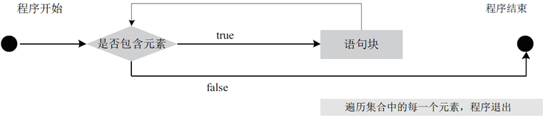

# Java foreach 语句

foreach 循环语句是 Java 1.5 的新特征之一，在遍历数组、集合方面，foreach 为开发者提供了极大的方便。foreach 循环语句是 for 语句的特殊简化版本，主要用于执行遍历功能的循环。

foreach 循环语句的语法格式如下：

```
for(类型 变量名:集合)
{
    语句块;
}
```

其中，“类型”为集合元素的类型，“变量名”表示集合中的每一个元素，“集合”是被遍历的集合对象或数组。每执行一次循环语句，循环变量就读取集合中的一个元素，其执行流程如图 1 所示。


图 1  foreach 循环语句的执行流程图

#### 例 1

在一个字符串数组中存储了几种编程语言，现在将这些编程语言遍历输出。

foreach 语句的实现代码如下：

```
public static void main(String[] args)
{
    String[] languages={"Java","ASP.NET","Python","C#","PHP"};
    System.out.println("现在流行的编程语言有：");

    //使用 foreach 循环语句遍历数组
    for(String lang:languages)
    {
        System.out.println(lang);
    }
}
```

在循环体执行的过程中，每循环一次，会将 languages 数组中的一个元素赋值给 lang 变量，直到遍历 languages 数组中所有元素，循环终止。

该程序运行后的结果如下所示。

```
现在流行的编程语言有：
Java
ASP.NET
Python
C#
PHP
```