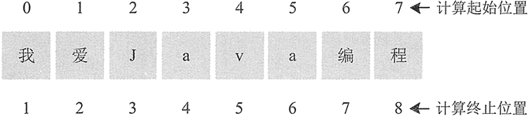

# Java 提取子字符串（substring()）

String 类的 substring() 方法用于对字符串进行提取，该方法主要有两种重载形式，下面分别介绍。

#### 1\. substring(int beginIndex) 形式

此方式用于提取从索引位置开始至结尾处的字符串部分。调用时，括号中是需要提取字符串的开始位置，方法的返回值是提取的字符串。例如：

```
String str="我爱 Java 编程";
String result=str.substring(3);
System.out.println(result);    //输出：Java 编程
```

#### 2\. substring(int beginIndex，int endIndex) 形式

此方法中的 beginIndex 表示截取的起始索引，截取的字符串中包括起始索引对应的字符；endIndex 表示结束索引，截取的字符串中不包括结束索引对应的字符，如果不指定 endIndex，则表示截取到目标字符串末尾。该方法用于提取位置 beginIndex 和位置 endIndex 位置之间的字符串部分。

这里需要特别注意的是， 对于开始位置 beginIndex， Java 是基于字符串的首字符索引为 0 处理的，但是对于结束位置 endIndex，Java 是基于字符串的首字符索引为 1 来处理的，如图 1 所示。


图 1 字符串中的字符索引
注意：substring() 方法是按字符截取，而不是按字节截取。

#### 
例 1

创建一个字符串，对它使用 substring() 方法进行截取并输出结果。示例代码如下：

```
public static void main(String[] args)
{
    String day="Today is Monday";    //原始字符串
    System.out.println("substring(0)结果："+day.substring(0));
    System.out.println("substring(2)结果："+day.substring(2));
    System.out.println("substring(10)结果："+day.substring(10));
    System.out.println("substring(2,10)结果："+day.substring(2,10));
    System.out.println("substring(0,5)结果："+day.substring(0,5));
}
```

输出结果如下所示：

```
substring(0)结果：Today is Monday
substring(2)结果：day is Monday
substring(10)结果：onday
substring(2,10)结果：day is M
substring(0,5)结果：Today
```