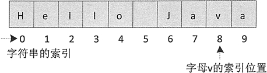

# Java 查找字符串（indexOf()、lastlndexOf()和 charAt()）

字符串查找分为两种形式：一种是在字符串中获取匹配字符（串）的索引值，另一种是在字符串中获取指定索引位置的字符。

## 根据字符查找

String 类的 indexOf() 方法和 lastlndexOf() 方法用于在字符串中获取匹配字符（串）的索引值。

#### 1\. indexOf() 方法

indexOf() 方法用于返回字符（串）在指 定字符串中首次出现的索引位置，如果能找到，则返回索引值，否则返回 -1。该方法主要有两种重载形式：

```
str.indexOf(value)
str.indexOf(value,int fromIndex)
```

其中，str 表示指定字符串；value 表示待查找的字符（串）；fromIndex 表示查找时的起始索引，如果不指定 fromIndex，则默认从指定字符串中的开始位置（即 fromIndex 默认为 0）开始查找。

例如，下列代码在字符串"Hello Java”中查找字母 v 的索引位置。

```
String s="Hello Java";
int size=s.indexOf('v');    //size 的结果为 8
```

上述代码执行后 size 的结果为 8，它的查找过程如图 1 所示。


图 1 indexOf() 方法查找字符过程

#### 例 1

编写一个简单的 Java 程序，演示 indexOf() 方法查找字符串的用法，并输出结果。代码如下：

```
public static void main(String[] args)
{
    String words="today,monday,sunday";
    System.out.println("原始字符串是'"+words+"'");
    System.out.println("indexOf(\"day\")结果："+words.indexOf("day"));
    System.out.println("indexOf(\"day\",5)结果："+words.indexOf("day",5));
    System.out.println("indexOf(\"o\")结果："+words.indexOf("o"));
    System.out.println("indexOf(\"o\",6)结果："+words.indexOf("o",6));
}
```

运行后的输出结果如下：

```
原始字符串是'today,monday,sunday'
indexOf("day")结果：2
indexOf("day",5)结果：9
indexOf("o")结果：1
indexOf("o",6)结果：7
```

#### 2\. lastlndexOf() 方法

lastIndexOf() 方法用于返回字符（串）在指定字符串中最后一次出现的索引位置，如果能找到则返回索引值，否则返回 -1。该方法也有两种重载形式：

```
str.lastIndexOf(value)
str.lastlndexOf(value, int fromIndex)
```

注意：lastIndexOf() 方法的查找策略是从右往左查找，如果不指定起始索引，则默认从字符串的末尾开始查找。

#### 例 2

编写一个简单的 Java 程序，演示 lastIndexOf() 方法查找字符串的用法，并输出结果。代码如下：

```
public static void main(String[] args)
{
    String words="today,monday,Sunday";
    System.out.println("原始字符串是'"+words+"'");
    System.out.println("lastIndexOf(\"day\")结果："+words.lastIndexOf("day"));
    System.out.println("lastIndexOf(\"day\",5)结果："+words.lastIndexOf("day",5));
    System.out.println("lastIndexOf(\"o\")结果："+words.lastIndexOf("o"));
    System.out.println("lastlndexOf(\"o\",6)结果："+words.lastIndexOf("o",6));
}
```

运行后的输出结果如下：

```
原始字符串是'today,monday,Sunday'
lastIndexOf("day")结果：16
lastIndexOf("day",5)结果：2
lastIndexOf("o")结果：7
lastlndexOf("o",6)结果：1
```

## 根据索引查找

String 类的 charAt() 方法可以在字符串内根据指定的索引查找字符，该方法的语法形式如下：

```
字符串名.charAt(索引值)
```

charAt() 方法的使用示例如下：

```
String words="today,monday,sunday";
System.out.println(words.charAt(0));    //结果：t
System.out.println(words.charAt(1));    // 结果：o
System.out.println(words.charAt(8));    // 结果：n
```