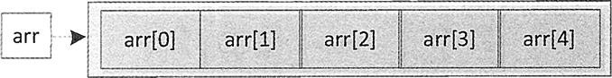

# Java 一维数组详解：Java 创建一维数组、初始化一维数组、获取单个/全部元素

一维数组实质上是一组相同类型数据的线性集合，是数组中最简单的一种数组。本文将重点介绍一维数组的创建、初始化和使用。

## 创建一维数组

为了在程序中使用一个数组，必须声明一个引用该数组的变量，并指明整个变量可以引用的数组类型。声明一维数组的语法格式为：

```
数据类型数组名[];    //声明数组
```

或者

```
数据类型[]数组名;    //声明数组
```

以上两种格式都可以声明一个数组，其中的数据类型既可以是基本数据类型，也可以是引用数据类型。数组名可以是任意合法的变量名。声明数组就是要告诉计算机该数组中数据的类型是什么。例如：

```
int[] score;    //存储学生的成绩，类型为整型
double[] price;    //存储商品的价格，类型为浮点型
String[] name;    //存储商品名称，类型为字符串型
```

在声明数组时不需要规定数组的长度，例如：

```
int score[10];    //这是错误的
```

注意：在声明数组变量时千万不要漏写[]。

## 分配空间

声明了数组，只是得到了一个存放数组的变量，并没有为数组元素分配内存空间，不能使用。因此要为数组分配内存空间，这样数组的每一个元素才有一个空间进行存储。

简单地说，分配空间就是要告诉计算机在内存中为它分配几个连续的位置来存储数据。在 Java 中可以使用 new 关键字来给数组分配空间。分配空间的语法格式如下：

```
数组名=new 数据类型[数组长度];    //分配空间
```

其中，数组长度就是数组中能存放的元素个数，显然应该为大于 0 的整数，例如：

```
score=new int[10];
price=new double[30];
name=new String[20];
```

这里的 score 是已经声明过的 int[] 类型的变量，当然也可以在声明数组时就给它分配空间，语法格式如下：

```
数据类型[]数组名=new 数据类型[数组长度];
```

#### 例 1

例如，声明并分配一个长度为 5 的 int 类型数组 arr，代码如下：

```
int arr=new int[5];
```

执行后 arr 数组在内存中的格式如图 1 所示。


图 1 一维数组的内存格式
在图 1 中 arr 为数组名称，方括号“[]”中的值为数组的下标。数组通过下标来区分数组中不同的元素，并且下标是从 0 开始的。因此这里包含 5 个元素的 arr 数组最大下标为 4。

注意：一旦声明了数组的大小，就不能再修改。这里的数组长度也是必需的，不能少。

尽管数组可以存储一组基本数据类型的元素，但是数组整体属于引用数据类型。当声明一个数组变量时，其实是创建了一个类型为“数据类型[]”（如 int[]、double[], String[]）的数组对象，它具有表 1 所示的方法和属性。

表 1 数组的方法和属性

| 方法 | 名称 | 返回值 |
| clone() | Object |
| equals(Object obj) | boolean |
| getClass() | Class<?> |
| hashCode() | int |
| notify() | void |
| notify All() | void |
| toString() | String |
| wait() | void |
| wait(long timeout) | void |
| wait(long timeout,int nanos) | void |
| 属性 | length | int |

## 初始化一维数组

数组可以进行初始化操作，在初始化数组的同时，可以指定数组的大小，也可以分别初始化数组中的每一个元素。在 Java 语言中，初始化数组有以下 3 种方式。

#### 使用 new 指定数组大小后进行初始化

使用 new 关键字创建数组，在创建时指定数组的大小。语法如下：

```
type[] array=new int[size];
```

创建数组之后，元素的值并不确定，需要为每一个数组的元素进行赋值，其下标从 0 开始。

#### 例 2

创建包含 5 个元素的 int 类型的数组，然后分别将元素的值设置为 1、2、3、5 和 8。代码如下：

```
int[] number=new int[5];
number[0]=1;
number[1]=2;
number[2]=3;
number[3]=5;
number[4]=8;
```

注意：使用 new 创建数组之后，它还只是一个引用，直接将值赋给引用，初始化过程才算结束。

#### 使用 new 指定数组元素的值

使用上述方式初始化数组时，只有在为元素赋值时才确定值。可以不使用上述方式，而是在初始化时就已经确定值。语法如下：

```
type[] array=new type[]{值 1,值 2,值 3,值 4,• • •,值 n};
```

#### 例 3

更改例 2 中的代码，使用 new 直接指定数组元素的值。代码如下：

```
int[] number=new int[]{1, 2, 3, 5, 8};
```

上述代码的效果等价于例 2 的效果。

#### 直接指定数组元素的值

在上述两种方式的语法中，type 可以省略，如果已经声明数组变量，那么直接使用这两种方式进行初始化。如果不想使用上述两种方式，那么可以不使用 new 直接指定数组元素的值。语法如下：

```
type[] array={值 1,值 2,值 3,值 值 n};
```

#### 例 4

在前面例子的基础上更改代码，直接使用上述语法实现 number 数组的初始化。代码如下：

```
int[] number={1,2,3,5,8};
```

使用这种方式时，数组的声明和初始化操作要同步，即不能省略数组变量的类型。如下的代码就是错误的：

```
int[] number;
number={1,2,3,5,8};
```

## 获取单个元素

获取单个元素是指获取数组中的一个元素，如第一个元素或最后一个元素。获取单个元素的方法非常简单，指定元素所在数组的下标即可。语法如下：

```
array[index];
```

其中，array 表示数组变量，index 表示下标，下标为 0 表示获取第一个元素，下标为 array.length-1 表示获取最后一个元素。当指定的下标值超出数组的总长度时，会拋出 ArraylndexOutOfBoundsException 异常。

#### 例 5

获取 number 数组中的第一个元素和最后一个元素，并将元素的值输出。代码如下：

```
int[] number={1,2,3,5,8};
System.out.println("获取第一个元素："+number[0]);
System.out.println("获取最后一个元素："+number[number.length-1]);
```

执行上述代码，输出结果如下所示：

```
获取第一个元素：1
获取最后一个元素：8
```

#### 例 6

编写一个 Java 程序，使用数组存放录入的 5 件商品价格，然后使用下标访问第 3 个元素的值。

```
import java.util.Scanner;
public class Test06
{
    public static void main(String[] args)
    {
        int[] prices=new int[5];    //声明数组并分配空间
        Scanner input=new Scanner(System.in);    //接收用户从控制台输入的数据
        for(int i=0;i<prices.length;i++)
        {
            System.out.println("请输入第"+(i+1)+"件商品的价格：");
            prices[i]=input.nextInt();    //接收用户从控制台输入的数据
        }
        System.out.println("第 3 件商品的价格为："+prices[2]);
    }
}
```

上述代码的“int[] prices=new int[5]”语句创建了需要 5 个元素空间的 prices 数组，然后结合 for 循环向数组中的每个元素赋值。

数组的索引从 0 开始，而 for 循环中的变量 i 也从 0 开始，因此 score 数组中的元素可以使用 scored 来表示，大大简化了代码。最后使用 prices[2] 获取 prices 数组的第 3 个元素，最终运行效果如下所示。

```
请输入第 1 件商品的价格：
5
请输入第 2 件商品的价格：
4
请输入第 3 件商品的价格：
6
请输入第 4 件商品的价格：
4
请输入第 5 件商品的价格：
8
第 3 件商品的价格为：6
```

## 获取全部元素

当数组中的元素数量不多时，要获取数组中的全部元素，可以使用下标逐个获取元素。但是，如果数组中的元素过多，再使用单个下标则显得烦琐，此时使用一种简单的方法可以获取全部元素——使用循环语句。

下面利用 for 循环语句遍历 number 数组中的全部元素，并将元素的值输出。代码如下：

```
int[] number={1,2,3,5,8};
for (int i=0;i<number.length;i++)
{
    System.out.println("第"+(i+1)+"个元素的值是："+number[i]);
}
```

除了使用 for 语句，还可以使用 foreach 遍历数组中的元素，并将元素的值输出。代码如下:

```
for(int val:number)
{
    System.out.print("元素的值依次是："+val+"\t");
}
```