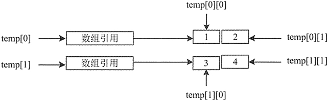

# Java 二维数组详解：二维数组的声明和初始化，以及获取二维数组的值

为了方便组织各种信息，计算机常将信息以表的形式进行组织，然后再以行和列的形式呈现出来。二维数组的结构决定了其能非常方便地表示计算机中的表，以第一个下标表示元素所在的行，第二个下标表示元素所在的列。下面简单了解一下二维数组，包括数组的声明和初始化。

## 创建二维数组

在 Java 中二维数组被看作数组的数组，即二维数组为一个特殊的一维数组，其每个元素又是一个一维数组。Java 并不直接支持二维数组，但是允许定义数组元素是一维数组的一维数组，以达到同样的效果。声明二维数组的语法如下：

```
type array[][];
type[][] array;
```

其中，type 表示二维数组的类型，array 表示数组名称，第一个中括号表示行，第二个中括号表示列。

下面分别声明 int 类型和 char 类型的数组，代码如下：

```
int[][] age;
char[][] sex;
```

## 初始化二维数组

二维数组可以初始化，和一维数组一样，可以通过 3 种方式来指定元素的初始值。这 3 种方式的语法如下：

```
array=new type[][]{值 1,值 2,值 3,…,值 n};
array=new type[][]{new 构造方法(参数列),…};
type[][] array={{第 1 行第 1 列的值,第 1 行第 2 列的值,…},{第 2 行第 1 列的值,第 2 行第 2 列的值,…},…};
```

#### 例 1

使用第一种方式声明 int 类型的二维数组，然后初始化该二维数组。代码如下：

```
int[][] temp;
temp=new int[][]
{
    {1,2},{3,4}
};
```

上述代码创建了一个二行二列的二维数组 temp，并对数组中的元素进行了初始化。图 1 所示为该数组的内存结构。


图 1 二维数组内存结构
使用第二种方式声明 int 类型的二维数组，然后初始化该二维数组。代码如下：

```
int[][] temp;
temp=new int [][]
{
    {new int(1),new int(2)},{new int(3),new int(4)}
};
```

使用第三种方式声明 int 类型的二维数组，并且初始化数组。代码如下：

```
int[][] temp={{1,2},{3,4}};
```

## 获取单个元素

在上节使用 3 种方式创建并初始化了一个二行二列的 int 类型数组 temp。当需要获取二维数组中元素的值时，也可以使用下标来表示。语法如下：

```
array[i-1][j-1];
```

其中，array 表示数组名称，i 表示数组的行数，j 表示数组的列数。例如，要获取第二行第二列元素的值，应该使用 temp[1][1]来表示。这是由于数组的下标起始值为 0，因此行和列的下标需要减 1。

#### 例 2

通过下标获取 class_score 数组中第二行第二列元素的值与第四行第一列元素的值。代码如下：

```
public static void main(String[] args)
{
    double[][] class_score={{10.0,99,99},{100,98,97},{100,100,99.5},{99.5,99,98.5}};
    System.out.println("第二行第二列元素的值："+class_score[1][1]);
    System.out.println("第四行第一列元素的值："+class_score[3][0]);
}
```

执行上述代码，输出结果如下：

```
第二行第二列元素的值：98.0
第四行第一列元素的值：99.5
```

## 获取全部元素

在一维数组中直接使用数组的 length 属性获取数组元素的个数。而在二维数组中，直接使用 length 属性获取的是数组的行数，在指定的索引后加上 length（如 array[0].length）表示的是该行拥有多少个元素，即列数。

如果要获取二维数组中的全部元素，最简单、最常用的办法就是使用 for 语句。

#### 例 3

使用 for 循环语句遍历 double 类型的 class_score 数组的元素，并输出每一行每一列元素的值。代码如下：

```
public static void main(String[] args)
{
    double[][] class_score={{100,99,99},{100,98,97},{100,100,99.5},{99.5,99,98.5 }};
    for(int i=0;i<class_score.length;i++)
    {    //遍历行
        for(int j=0;j<class_score[i].length;j++)
        {
            System.out.println("class_score["+i+"]["+j+"]="+class_score[i][j]);
        }
    }
}
```

上述代码使用嵌套 for 循环语句输出二维数组。在输出二维数组时，第一个 for 循环语句表示以行进行循环，第二个 for 循环语句表示以列进行循环，这样就实现了获取二维数组中每个元素的值的功能。

执行上述代码，输出结果如下所示。

```
class_score[0][0]=100.0
class_score[0][1]=99.0
class_score[0][2]=99.0
class_score[1][0]=100.0
class_score[1][1]=98.0
class_score[1][2]=97.0
class_score[2][0]=100.0
class_score[2][1]=100.0
class_score[2][2]=99.5
class_score[3][0]=99.5
class_score[3][1]=99.0
class_score[3][2]=98.5
```

#### 例 4

假设有一个矩阵为 5 行 5 列，该矩阵是由程序随机产生的 10 以内数字排列而成。下面使用二维数组来创建该矩阵，代码如下：

```
public class Test11
{
    public static void main(String[] args）
    {
        //创建一个二维矩阵
        int[][] matrix=new int[5][5];
        //随机分配值
        for(int i=0;i<matrix.length;i++)
        {
            for(int j=0;j<matrix[i].length;j++)
            {
                matrix[i][j]=(int)(Math.random()*10);
            }
        }
        System.out.println("下面是程序生成的矩阵\n");
        //遍历二维矩阵并输出
        for(int k=0;k<matrix.length;k++)
        {
            for(int g=0;g<matrix[k].length;g++)
            {
                System.out.print(matrix[k][g]+"");
            }
            System.out.println();
        }
    }
}
```

在该程序中，首先定义了一个二维数组，然后使用两个嵌套的 for 循环向二维数组中的每个元素赋值。其中，Math.random() 方法返回的是一个 double 类型的数值，数值为 0.6、0.9 等，因此乘以 10 之后为 10 以内的整数。最后又使用了两个嵌套的 for 循环遍历二维数组，输出二维数组中的值，从而产生矩阵。

运行该程序的结果如下所示。

```
34565
96033
48741
10583
63985
```

## 获取整行元素

除了获取单个元素和全部元素之外，还可以单独获取二维数组的某一行中所有元素的值，或者二维数组中某一列元素的值。获取指定行的元素时，需要将行数固定，然后只遍历该行中的全部列即可。

#### 例 5

编写一个案例，接收用户在控制台输入的行数，然后获取该行中所有元素的值。代码如下：

```
public static void main(String[] args)
{
    double[][] class_score={{100,99,99},{100,98,97},{100,100,99.5},{99.5,99,98.5}};
    Scanner scan=new Scanner(System.in);
    System.out.println("当前数组只有"+class_score.length+"行，您想查看第几行的元素？请输入：");
    int number=scan.nextInt();
    for(int j=0;j<class_score[number-1].length;j++)
    {
        System.out.println("第"+number+"行的第["+j+"]个元素的值是："+class_score[number-1][j]);
    }
}
```

执行上述代码进行测试，输出结果如下所示。

```
当前数组只有 4 行，您想查看第几行的元素？请输入：
3
第 3 行的第[0]个元素的值是：100.0
第 3 行的第[1]个元素的值是：100.0
第 3 行的第[2]个元素的值是：99.5
```

## 获取整列元素

获取指定列的元素与获取指定行的元素相似，保持列不变，遍历每一行的该列即可。

#### 例 6

编写一个案例，接收用户在控制台中输入的列数，然后获取二维数组中所有行中该列的值。代码如下：

```
public static void main(String[] args)
{
    double[][] class_score={{100,99,99},{100,98,97},{100,100,99.5},{99.5,99,98.5}};
    Scanner scan=new Scanner(System.in);
    System.out.println("您要获取哪一列的值？请输入：");
    int number=scan.nextInt();
    for(int i=0;i<class_score.length;i++)
    {
        System.out.println("第 "+(i+1)+" 行的第["+number+"]个元素的值是"+class_score[i][number]);
    }
}
```

执行上述代码进行测试，如下所示。

```
您要获取哪一列的值？请输入：
2
第 1 行的第[2]个元素的值是 99.0
第 2 行的第[2]个元素的值是 97.0
第 3 行的第[2]个元素的值是 99.5
第 4 行的第[2]个元素的值是 98.5
```