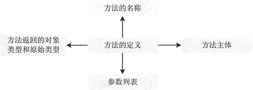

# Java 成员方法：Java 成员方法的声明和调用、形参和实参及局部变量

声明成员方法可以定义类的行为，行为表示一个对象能够做的事情或者能够从一个对象取得的信息。类的各种功能操作都是用方法来实现的，属性只不过提供了相应的数据。一个完整的方法通常包括方法名称、方法主体、方法参数和方法返回值类型，其结构如图 1 所示。


图 1 方法组成元素
成员方法一旦被定义，便可以在程序中多次调用，提高了编程效率。声明成员方法的语法格式如下：

```
public class Test
{
    [public|private|protected][static]<void|return_typexmethod_name>([paramList])
    {
        //方法体
    }
}
```

上述代码中一个方法包含 4 部分：方法的返回值、方法名称、方法的参数和方法体。其中 retum_type 是方法返回值的数据类型，数据类型可以是原始的数据类型，即常用的 8 种数据类型，也可以是一个引用数据类型，如一个类、接口和数组等。

除了这些，一个方法还可以没有返回值，即返回类型为 void，像 main() 方法。method_name 表示自定义的方法名称，方法的名称首先要遵循标识符的命名约定，除此之外，方法的名称第一个单词的第一个字母是小写，第二单词的第一个字母是大写，依此类推。

paramList 表示参数列表，这些变量都要有自己的数据类型，可以是原始数据类型，也可以是复杂数据类型，一个方法主要依靠参数来传递消息。方法主体是方法中执行功能操作的语句。其他各修饰符的含义如下。

*   public、private、protected：表示成员方法的访问权限。
*   static：表示限定该成员方法为静态 方法。
*   final：表示限定该成员方法不能被重写或重载。
*   abstract：表示限定该成员方法为抽象方法。抽象方法不提供具体的实现，并且所属类型必须为抽象类。

#### 例 1

为上一节创建的学生类 Student 添加一个可以返回学生信息字符串的方法。代码如下：

```
public class Student
{
    public StringBuffer printInfo(Student st)
    {
        StringBuffer sb=new StringBuffer();
        sb.append("学生姓名："+st.Name+"\n 学生年龄："+st.Age+"\n 学生性别："+st.isSex());
        return sb;
    }
}
```

上述代码创建了一个名称为 printInfo 的方法，其返回值类型为 StringBuffer（引用数据类型）。该方法需要传递一个 Student 类型的参数，最后需要将一个 StringBuffer 类型的数据返回。

#### 1\. 成员方法的返回值

若方法有返回值，则在方法体中用 return 语句指明要返回的值，其格式如下所示。

```
return 表达式
```

或者

```
return(表达式)
```

其中，表达式可以是常量、变量、对象等。表达式的数据类型必须与声明成员方法时给出的返回值类型一致。

#### 2\. 形参、实参及成员方法的调用

一般来说，可以通过以下方式来调用成员方法：

```
methodName({paramList})
```

关于方法的参数，经常会提到形参与实参，形参是定义方法时参数列表中出现的参数，实参是调用方法时为方法传递的参数。

#### 例 2

下面 retumMin() 方法中的 m 和 n 是形参，调用 retumMin() 方法时的 x 和 y 是实参。

```
public int returnMin(int m,int n)
{
    return Math.min(m,n);    //m 和 n 是形参
}
public static void main(String[] args)
{
    int x=50;
    int y=100;
    Test t=new Test();
    int i=t.returnMin(x,y);    //x 和 y 是实参
    System.out.println(i);
}
```

方法的形参和实参具有以下特点：

*   形参变量只有在被调用时才分配内存单元，在调用结束时，即刻释放所分配的内存单元。因此，形参只有在方法内部有效，方法调用结束返回主调 方法后则不能再使用该形参变量。
*   实参可以是常量、变量、表达式、方法等，无论实参是何种类型的量，在进行方法调用时，它们都必须具有确定的值，以便把这些值传送给形参。因此应预先用赋值、输入等办法使实参获得确定值。
*   实参和形参在数量、类型和顺序上应严格一致，否则会发生“类型不匹配” 的错误。
*   方法调用中发生的数据传送是单向的，即只能把实参的值传送绐形参，而不能把形参的值反向地传送给实参。因此在方法调用过程中，形参的值发生改变，而实参中的值不会变化。

#### 例 3

下面的示例演示了调用 add() 方法前后形参 x 的变化。

```
public int add(int x)
{
    x+=30;
    System.out.println("形参 x 的值："+x);
    return x;
}
public static void main(String[] args)
{
    int x=150;
    System.out.println("调用 add() 方法之前 x 的值："+x);
    Test t=new Test();
    int i=t.add(x);
    System.out.println("实参 x 的值："+x);
    System.out.println("调用 add() 方法的返回值："+i);
}
```

运行上述程序，输出结果如下：

```
调用 add() 方法之前 x 的值：150
形参 x 的值：180
实参 x 的值：150
调用 add() 方法的返回值：180
```

从输出结果可以看出，形参 x 值的改变，并没有影响实参 x。

在调用成员方法时应注意以下 4 点：

1.  对无参成员方法来说，是没有实际参数列表的（即没有 paramList），但方法名后的括号不能省略。
2.  对带参数的成员方法来说，实参的个数、顺序以及它们的数据类型必须与形式参数的个数、顺序以及它们的数据类型保持一致，各个实参间用逗号分隔。实参名与形参名可以相同，也可以不同。
3.  实参也可以是表达式，此时一定要注意使表达式的数据类型与形参的数据类型相同，或者使表达式的类型按 Java 类型转换规则达到形参指明的数据类型。
4.  实参变量对形参变量的数据传递是“值传递”，即只能由实参传递给形参，而不能由形参传递给实参。程序中执行到调用成员方法时，Java 把实参值复制到一个临时的存储区（栈）中，形参的任何修改都在栈中进行，当退出该成员方法时，Java 自动清除栈中的内容。

#### 3\. 方法体中的局部变量

在方法体内可以定义本方法所使用的变量，这种变量是局部变量。它的生存期与作用域是在本方法内，也就是说，局部变量只能在本方法内有效或可见，离开本方法则这些变量将被自动释放。

在方法体内定义变量时，变量前不能加修饰符。局部变量在使用前必须明确赋值，否则编译时会出错。另外，在一个方法内部，可以在复合语句中定义变量，这些变量只在复合语句中有效。