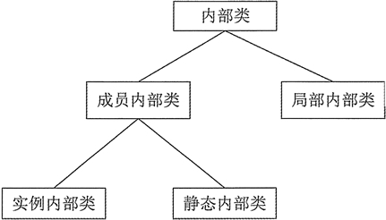

# Java 内部类：Java 什么是内部类？

在一个类内部的类，我们称之为内部类。内部类可以很好地实现隐藏，一般的非内部类是不允许有 private 与 protected 权限的，但内部类可以。内部类拥有外围类的所有元素的访问权限。

内部类可以分为：实例内部类、静态内部类和成员内部类，每种内部类都有它特定的一些特点，本节先详细介绍一些和内部类相关的知识。

在类 A 中定义类 B，那么类 B 就是内部类，也称为嵌套类，相对而言，类 A 就是外部类。如果有多层嵌套，例如类 A 中有内部类 B，而类 B 中还有内部类 C，那么通常将最外层的类称为顶层类（或者顶级类）。

内部类也可以分为多种形式，与变量非常类似，如图 1 所示。


图 1 内部类的分类
内部类的特点如下：

1.  内部类仍然是一个独立的类，在编译之后内部类会被编译成独立的 .class 文件，但是前面冠以外部类的类名和 $ 符号。
2.  内部类不能用普通的方式访问。内部类是外部类的一个成员，因此内部类可以自由地访问外部类的成员变量，无论是否为 private 的。
3.  内部类声明成静态的，就不能随便访问外部类的成员变量，仍然是只能访问外部类的静态成员变量。

**【例 1】**内部类的使用方法非常简单，例如下面的代码演示了内部类最简单的应用。

```
public class Test
{
    public class InnerClass
    {
        public int getSum(int x,int y)
        {
            return x+y;
        }
    }
    public static void main(String[] args)
    {
        Test.InnerClass ti=new Test().new InnerClass();
        int i=ti.getSum(2/3);
        System.out.println(i);    //输出 5
    }
}
```

有关内部类的说明有如下几点。

*   外部类只有两种访问级别：public 和默认；内部类则有 4 种访问级别：public、protected、 private 和默认。
*   在外部类中可以直接通过内部类的类名访问内部类。

```
InnerClass ic=new InnerClassf);    //InnerClass 为内部类的类名
```

*   在外部类以外的其他类中则需要通过内部类的完整类名访问内部类。

```
Test.InnerClass ti=newTest().new InnerClass();    //Test.innerClass 是内部类的完整类名
```

*   内部类与外部类不能重名。

提示：内部类的很多访问规则可以参考变量和方法。