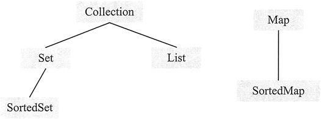
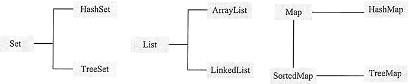

# Java 集合类的概念

Java 的所有集合类都位于 java.util 包，其中提供了一个表示和操作对象集合的统一构架，包含大量集合接口，以及这些接口的实现类和操作它们的算法。

一个集合是一个对象，但它表示一组对象，Java 集合中实际存放的是对象的引用值，不能存放基本数据类型值。

## 集合中的接口

集合框架是一个类库的集合，包含实现集合的接口。接口是集合的抽象数据类型，提供对集合中所表示的内容进行单独操作的可能。

*   Collection 接口：该接口是最基本的集合接口，一个 Collection 代表一个元素。
*   List 接口：该接口实现了 Collection 接口。List 是有序集合，允许有相同的元素。使用 List 能够精确地控制每个元素插入的位置，用户能够使用索引（元素在 List 中的位置，类似于数组下标）来访问 List 中的元素，与数组类似。
*   Set 接口：该接口也实现了 Collection 接口。它不能包含重复的元素，SortedSet 是按升序排列的 Set 集合。
*   Map 接口：包含键值对，Map 不能包含重复的键。SortedMap 是一个按升序排列的 Map 集合。

集合框架中的接口结构如图 1 所示。

图 1 集合框架中的接口结构图

## 接口实现类

Java 平台提供了许多数据集接口的实现类。例如实现 Set 接口的常用类有 HashSet 和 TreeSet，它们都可以容纳所有类型的对象，但是不能保证序列顺序永久不变。

实现 List 接口的常用类有 ArrayList 和 LinkedList，它们也可以容纳所有类型的对象包括 null，并且都保证元素的存储位置。

实现 Map 映射的类是 HashMap，可实现一个键到值的映射。

*   HashSet：为优化査询速度而设计的 Set。它是基于 HashMap 实现的，HashSet 底层使用 HashMap 来保存所有元素，实现比较简单。
*   TreeSet：该类不仅实现了 Set 接口，还实现了 java.util.SortedSet 接口，该实现类是一个有序的 Set，这样就能从 Set 里面提取一个有序序列。
*   ArrayList：一个用数组实现的 List，能进行快速的随机访问，效率高而且实现了可变大小的数组。
*   LinkedList：对顺序访问进行了优化，但随机访问的速度相对较慢。此外它还有 addFirst()、addLast()、getFirst()、getLast()、removeFirst() 和 removeLast() 等方法，能把它当成栈（Stack）或队列（Queue）来用。

集合框架接口中实现类 的结构如图 2 所示。

图 2 集合框架中的实现类结构图