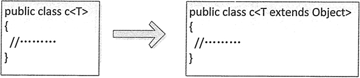

# Java 泛型详解：Java 泛型集合、泛型类、泛型方法、泛型的使用

在 Java 1.5 之前没有泛型，通常需要使用强制类型转换的方式将一种数据类型转换为另一种数据类型，这种转换要求开发者对实际参数的类型具有可预知性。对于强制类型转换错误的情况，编译器可能不会提示错误，但是在运行时会出现异常，这是一个安全隐患。

为了解决这一隐患，从 Java 1.5 开始提供了泛型。泛型可以在编译的时候检查类型安全，并且所有的强制转换都是自动和隐式的，提高了代码的重用率。本节将详细介绍 Java 中泛型的使用。

## 泛型集合

泛型本质上是提供类型的“类型参数”，也就是参数化类型。我们可以为类、接口或方法指定一个类型参数，通过这个参数限制操作的数据类型，从而保证类型转换的绝对安全。

#### 例 1

下面将结合泛型与集合编写一个案例实现图书信息输出。

(1) 首先需要创建一个表示图书的实体类 Book，其中包括的图书信息有图书编号、图书名称和价格。Book 类的具体代码如下：

```
public class Book
{
    private int Id;    //图书编号
    private String Name;    //图书名称
    private int Price;    //图书价格
    public Book(int id,String name,int price)
    {    //构造方法
        this.Id=id;
        this.Name=name;
        this.Price=price;
    }
    public String toString()
    {    //重写 toString()方法
        return this.Id+", "+this.Name+"，"+this.Price;
    }
}
```

(2) 使用 Book 作为类型创建 Map 和 List 两个泛型集合，然后向集合中添加图书元素，最后输出集合中的内容。具体代码如下：

```
import java.util.ArrayList;
import java.util.HashMap;
import java.util.List;
import java.util.Map;
public class Test14
{
    public static void main(String[] args)
    {
        //创建 3 个 Book 对象
        Book book1=new Book(1,"唐诗三百首",8);
        Book book2=new Book(2,"小星星",12);
        Book book3=new Book(3,"成语大全",22);
        Map<Integer,Book> books=new HashMap<Integer,Book>();    //定义泛型 Map 集合
        books.put(1001,book1);    //将第一个 Book 对象存储到 Map 中
        books.put(1002,book2);    //将第二个 Book 对象存储到 Map 中
        books.put(1003,book3);    //将第三个 Book 对象存储到 Map 中
        System.out.println("泛型 Map 存储的图书信息如下：");
        for(Integer id:books.keySet())
        {
            //遍历键
            System.out.print(id+"——");
            System.out.println(books.get(id));    //不需要类型转换
        }
        List<Book> bookList=new ArrayList<Book>();    //定义泛型的 List 集合
        bookList.add(book1);
        bookList.add(book2);
        bookList.add(book3);
        System.out.println("泛型 List 存储的图书信息如下：");
        for(int i=0;i<bookList.size();i++)
        {
            System.out.println(bookList.get(i));    //这里不需要类型转换
        }
    }
}
```

在该示例中，代码“Map<Integer,Book> books=new HashMap<Integer,Book>();”创建了一个键类型为 Integer、值类型为 Book 的泛型集合，即指明了该 Map 集合中存放的键必须是 Integer 类型、值必须为 Book 类型，否则编译出错。在获取 Map 集合中的元素时，不需要将"books.get(id);"获取的值强制转换为 Book 类型，程序会隐式转换。在创建 List 集合时，同样使用了泛型，因此在获取集合中的元素时也不需要将“bookList.get(i)”代码强制转换为 Book 类型，程序会隐式转换。

执行结果如下：

```
泛型 Map 存储的图书信息如下：
1001——1, 唐诗三百首，8
1003——3, 成语大全，22
1002——2, 小星星，12
泛型 List 存储的图书信息如下：
1, 唐诗三百首，8
2, 小星星，12
3, 成语大全，22
```

## 泛型类

除了可以定义泛型集合之外，还可以直接限定泛型类的类型参数。语法格式如下：

```
public class class_name<data_type1,data_type2,…>{}
```

其中，class_name 表示类的名称，data_ type1 等表示类型参数。Java 泛型支持声明一个以上的类型参数，只需要将类型用逗号隔开即可。

泛型类一般用于类中的属性类型不确定的情况下。在声明属性时，使用下面的语句：

```
private data_type1 property_name1;
private data_type2 property_name2;
```

该语句中的 data_type1 与类声明中的 datajype1 表示的是同一种数据类型。

#### 例 2

在实例化泛型类时，需要指明泛型类中的类型参数，并赋予泛型类属性相应类型的值。例如，下面的示例代码创建了一个表示学生的泛型类，该类中包括 3 个属性，分别是姓名、年龄和性别。

```
public class Stu<N,A,S>
{
    private N name;    //姓名
    private A age;    //年龄
    private S sex;    //性别
    //创建类的构造函数
    public Stu(N name,A age,S sex)
    {
        this.name=name;
        this.age=age;
        this.sex=sex;
    }
    //下面是上面 3 个属性的 setter/getter 方法
    public N getName()
    {
        return name;
    }
    public void setName(N name)
    {
        this.name=name;
    }
    public A getAge()
    {
        return age;
    }
    public void setAge(A age)
    {
        this.age = age;
    }
    public S getSex()
    {
        return sex;
    }
    public void setSex(S sex)
    {
        this.sex=sex;
    }
}
```

接着创建测试类。在测试类中调用 Stu 类的构造方法实例化 Stu 对象，并给该类中的 3 个属性赋予初始值，最终需要输出学生信息。测试类的代码实现如下：

```
public class Test14
{
    public static void main(String[] args)
    {
        Stu<String,Integer,Character> stu=new Stu<String,Integer,Character>("张晓玲",28,'女');
        String name=stu.getName();
        Integer age=stu.getAge();
        Character sex=stu.getSex();
        System.out.println("学生信息如下：");
        System.out.println("学生姓名："+name+"，年龄："+age+"，性别："+sex);
    }
}
```

该程序的运行结果如下：

```
学生信息如下：
学生姓名：张晓玲，年龄：28，性别：女
```

在该程序的 Stu 类中，定义了 3 个类型参数，分别使用 N、A 和 S 来代替，同时实现了这 3 个属性的 setter/getter 方法。在主类中，调用 Stu 类的构造函数创建了 Stu 类的对象，同时指定 3 个类型参数，分别为 String、Integer 和 Character。在获取学生姓名、年龄和性别时，不需要类型转换，程序隐式地将 Object 类型的数据转换为相应的数据类型。

## 泛型方法

到目前为止，我们所使用的泛型都是应用于整个类上。泛型同样可以在类中包含参数化的方法，而方法所在的类可以是泛型类，也可以不是泛型类。也就是说，是否拥有泛型方法，与其所在的类是不是泛型没有关系。

泛型方法使得该方法能够独立于类而产生变化。如果使用泛型方法可以取代类泛型化，那么就应该只使用泛型方法。另外，对一个 static 的方法而言，无法访问泛型类的类型参数。因此，如果 static 方法需要使用泛型能力，就必须使其成为泛型方法。

定义泛型方法的语法格式如下：

```
[访问权限修饰符][static][final]<类型参数列表>返回值类型方法名([形式参数列表])
```

例如：

```
public static List<T> find(Class<T>class,int userId){}
```

一般来说编写 Java 泛型方法，其返回值类型至少有一个参数类型应该是泛型，而且类型应该是一致的，如果只有返回值类型或参数类型之一使用了泛型，那么这个泛型方法的使用就被限制了。下面就来定义一个泛型方法，具体介绍泛型方法的创建和使用。

#### 例 3

使用泛型方法打印图书信息。定义泛型方法，参数类型使用“T”来代替。在方法的主体中打印出图书信息。代码的实现如下：

```
public class Test16
{
    public static<T> void List(T book)
    {    //定义泛型方法
        if(book!=null)
        {
            System.out.println(book);
        }
    }
    public static void main(String[] args)
    {
        Book stu=new Book(1,"细学 Java 编程",28);
        List(stu);    //调用泛型方法
    }
}
```

该程序中的 Book 类为前面示例中使用到的 Book 类。在该程序中定义了一个名称为 List 的方法，该方法的返回值类型为 void，类型参数使用“T”来代替。在调用该泛型方法时，将一个 Book 对象作为参数传递到该方法中，相当于指明了该泛型方法的参数类型为 Book。

该程序的运行结果如下：

```
1, 细学 Java 编程，28
```

## 泛型的高级用法

泛型的用法非常灵活，除在集合、类和方法中使用外，本节将从三个方面介绍泛型的高级用法，包括限制泛型可用类型、使用类型通配符、继承泛型类和实现泛型接口。

#### 1\. 限制泛型可用类型

在 Java 中默认可以使用任何类型来实例化一个泛型类对象。当然也可以对泛型类实例的类型进行限制，语法格式如下：

```
class 类名称<T extends anyClass>
```

其中，anyClass 指某个接口或类。使用泛型限制后，泛型类的类型必须实现或继承 anyClass 这个接口或类。无论 anyClass 是接口还是类，在进行泛型限制时都必须使用 extends 关键字。

例如，在下面的示例代码中创建了一个 ListClass 类，并对该类的类型限制为只能是实现 List 接口的类。

```
//限制 ListClass 的泛型类型必须实现 List 接口
public class ListClass<T extends List>
{
    public static void main(String[] args)
    {
        //实例化使用 ArrayList 的泛型类 ListClass，正确
        ListClass<ArrayList> lc1=new ListClass<ArrayList>();
        //实例化使用 LinkedList 的泛型类 LlstClass，正确
        ListClass<LinkedList> lc2=new ListClass<LinkedList>();
        //实例化使用 HashMap 的泛型类 ListClass，错误，因为 HasMap 没有实现 List 接口
        //ListClass<HashMap> lc3=new ListClass<HashMap>();
    }
}
```

在上述代码中，定义 ListClass 类时设置泛型类型必须实现 List 接口。例如，ArrayList 和 LinkedList 都实现了 List 接口，所以可以实例化 ListClass 类。而 HashMap 没有实现 List 接口，所以在实例化 ListClass 类时会报错。

当没有使用 extends 关键字限制泛型类型时，其实是默认使用 Object 类作为泛型类型。因此，Object 类下的所有子类都可以实例化泛型类对象，如图 1 所示的这两种情况。


图 1 两个等价的泛型类

#### 2\. 使用类型通配符

Java 中的泛型还支持使用类型通配符，它的作用是在创建一个泛型类对象时限制这个泛型类的类型必须实现或继承某个接口或类。

使用泛型类型通配符的语法格式如下：

```
泛型类名称<? extends List>a=null;
```

其中，“<? extends List>”作为一个整体表示类型未知，当需要使用泛型对象时，可以单独实例化。

例如，下面的示例代码演示了类型通配符的使用。

```
A<? extends List>a=null;
a=new A<ArrayList> ();    //正确
b=new A<LinkedList> ();    //正确
c=new A<HashMap> ();    //错误
```

在上述代码中，同样由于 HashMap 类没有实现 List 接口，所以在编译时会报错。

#### 3\. 继承泛型类和实现泛型接口

定义为泛型的类和接口也可以被继承和实现。例如下面的示例代码演示了如何继承泛型类。

```
public class FatherClass<T1>{}
public class SonClass<T1,T2,T3> extents FatherClass<T1>{}
```

如果要在 SonClass 类继承 FatherClass 类时保留父类的泛型类型，需要在继承时指定，否则直接使用 extends FatherClass 语句进行继承操作，此时 T1、T2 和 T3 都会自动变为 Object，所以一般情况下都将父类的泛型类型保留。

下面的示例代码演示了如何在泛型中实现接口。

```
interface interface1<T1>{}
interface SubClass<T1,T2,T3> implements
Interface1<T2>{}
```