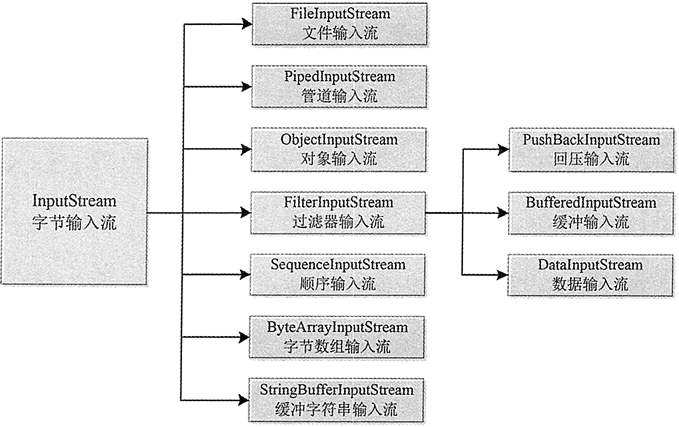

# Java 流的概念：什么是输入/输出流？

在 Java 中所有数据都是使用流读写的。流是一组有序的数据序列，将数据从一个地方带到另一个地方。根据数据流向的不同，可以分为输入（Input）流和输出（Output）流两种。

下面详细介绍什么是输入流和输出流，以及 Java 中流的类型及每种类型的相关类。

## 什么是输入/输出流

Java 程序通过流来完成输入/输出，所有的输入/输出以流的形式处理。因此要了解 I/O 系统，首先要理解输入/输出流的概念。

输入就是将数据从各种输入设备（包括文件、键盘等）中读取到内存中，输出则正好相反，是将数据写入到各种输出设备（比如文件、显示器、磁盘等）。例如键盘就是一个标准的输入设备，而显示器就是一个标准的输出设备，但是文件既可以作为输入设备，又可以作为输出设备。

数据流是 Java 进行 I/O 操作的对象，它按照不同的标准可以分为不同的类别。

*   按照流的方向主要分为输入流和输出流两大类。
*   数据流按照数据单位的不同分为字节流和字符流。
*   按照功能可以划分为节点流和处理流。

数据流的处理只能按照数据序列的顺序来进行，即前一个数据处理完之后才能处理后一个数据。数据流以输入流的形式被程序获取，再以输出流的形式将数据输出到其他设备。图 1 所示的是输入流模式，图 2 所示的是输出流模式。

图 1 输入流模式

图 2 输出流模式

## 输入流

Java 流功能相关的类都封装在 java.io 包中，而且每个数据流都是一个对象。所有输入流类都是 InputStream 抽象类（字节输入流）和 Reader 抽象类（字符输入流）的子类。其中 InputStream 类是字节输入流的抽象类，是所有字节输入流的父类，其层次结构如图 3 所示。

图 3 InputStream 类的层次结构图
InputStream 类中所有方法遇到错误时都会引发 IOException 异常。如下是该类中包含的常用方法。

*   int read()：从输入流读入一个 8 字节的数据，将它转换成一个 0~255 的整数，返回一个整数，如果遇到输入流的结尾返回 -1。
*   int read(byte[] b)：从输入流读取若干字节的数据保存到参数 b 指定的字芳数组中，返回的字芾数表示读取的字节数，如果遇到输入流的结尾返回 -1。
*   int read(byte[] b,int off,int len)：从输入流读取若干字节的数据保存到参数 b 指定的字节数组中，其中 off 是指在数组中开始保存数据位置的起始下标，len 是指读取字节的位数。返回的是实际读取的字节数，如果遇到输入流的结尾则返回 -1。
*   void close()：关闭数据流，当完成对数据流的操作之后需要关闭数据流。
*   int available()：返回可以从数据源读取的数据流的位数。
*   skip(long n)：从输入流跳过参数 n 指定的字节数目。
*   boolean markSupported()：判断输入流是否可以重复读取，如果可以就返回 true。
*   void mark(int readLimit)：如果输入流可以被重复读取，从流的当前位置开始设置标记，readLimit 指定可以设置标记的字苟数。
*   void reset()：使输入流重新定位到刚才被标记的位置，这样可以重新读取标记过的数据。

上述最后 3 个方法一般会结合在一起使用，首先使用 markSupported() 判断，如果可以重复读取，则使用 mark(int readLimit) 方法进行标记，标记完成之后可以使用 read() 方法读取标记范围内的字节数，最后使用 reset() 方法使输入流重新定位到标记的位置，继而完成重复读取操作。

Java 中的字符是 Unicode 编码，即双字节的，而 InputerStream 是用来处理单字节的，在处理字符文本时不是很方便。这时可以使用 Java 的文本输入流 Reader 类，该类是字符输入流的抽象类，即所有字输入流的实现都是它的子类。

Reader 类的具体层次结构如图 4 所示，该类的方法与 InputerSteam 类的方法类似，这里不再介绍。

图 4 Reader 类的层次结构

## 输出流

在 Java 中所有输出流类都是 OutputStream 抽象类（字节输出流）和 Writer 抽象类（字符输出流）的子类。其中 OutputStream 类是字节输出流的抽象类，是所有字节输出流的父类，其层次结构如图 5 所示。

图 5 OutputStream 类的层次结构图
OutputStream 类是所有字节输出流的超类，用于以二进制的形式将数据写入目标设备，该类是抽象类，不能被实例化。OutputStream 类提供了一系列跟数据输出有关的方法，如下所示。

*   int write (b)：将指定字节的数据写入到输出流。
*   int write (byte[] b)：将指定字节数组的内容写入输出流。
*   int write (byte[] b,int off,int len)：将指定字节数组从 off 位置开始的 len 字芳的内容写入输出流。
*   close()：关闭数据流，当完成对数据流的操作之后需要关闭数据流。
*   flush()：刷新输出流，强行将缓冲区的内容写入输出流。

字符输出流的父类是 Writer，其层次结构如图 6 所示。

图 6 OutputStream 类的层次结构图