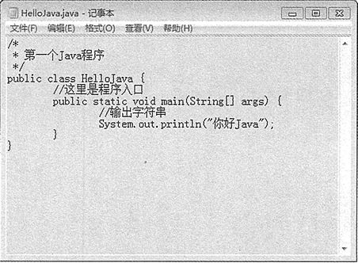
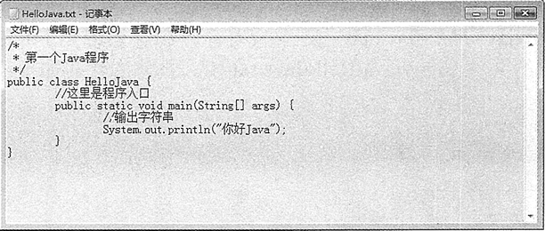

# Java 字节流的使用：字节输入/输出流、文件输入/输出流、字节数组输入/输出流

在本章的第一节《Java 什么是输入/输出流？》中就提到 Java 所有表示字节输入流类的父类是 InputStream，它是一个抽象类，因此继承它的子类要重新定义父类中的抽象方法。所有表示字节输出流类的父类是 OutputStream，它也是一个抽象类，同样子类需要重新定义父类的抽象方法。

下面首先介绍上述两个父类提供的常用方法，然后介绍如何使用它们的子类输入和输出字节流，包括 ByteArrayInputStream 类、ByteArrayOutputStream 类、FileInputStream 类和 FileOutputStream 类。

## 字节输入流

InputStream 类及其子类的对象表示一个字节输入流。

InputStream 类的常用子类如下。

*   ByteArrayInputStream 类：将字节数组转换为字节输入流，从中读取字节。
*   FileInputStream 类：从文件中读取数据。
*   PipedInputStream 类：连接到一个 PipedOutputStream（管道输出流）。
*   SequenceInputStream 类：将多个字节输入流串联成一个字节输入流。
*   ObjectInputStream 类：将对象反序列化。

使用 InputStream 类的方法可以从流中读取一个或一批字节。表 1 列出了 InputStream 类的常用方法。

表 1 InputStream 类的常用方法

| 方法名及返回值类型 | 说明 |
| int read() | 从输入流中读取一个 8 位的字节，并把它转换为 0~255 的整数，最后返 回整数。 如果返回 -1，则表示已经到了输入流的末尾。为了提高 I/O 操作的效率，建议尽量
使用 read() 方法的另外两种形式 |
| int read(byte[] b) | 从输入流中读取若干字节，并把它们保存到参数 b 指定的字节数组中。 该方法返回 读取的字节数。如果返回 -1，则表示已经到了输入流的末尾 |
| int read(byte[] b, int off, int len) | 从输入流中读取若干字节，并把它们保存到参数 b 指定的字节数组中。其中，off 指 定在字节数组中开始保存数据的起始下标；len 指定读取的字节数。该方法返回实际
读取的字节数。如果返回 -1，则表示已经到了输入流的末尾 |
| void close() | 关闭输入流。在读操作完成后，应该关闭输入流，系统将会释放与这个输入流相关 的资源。注意，InputStream 类本身的 close() 方法不执行任何 操作，但是它的许多
子类重写了 close() 方法 |
| int available() | 返回可以从输入流中读取的字节数 |
| long skip(long n) | 从输入流中跳过参数 n 指定数目的字节。该方法返回跳过的字节数 |
| void mark(int readLimit) | 在输入流的当前位置开始设置标记，参数 readLimit 则指定了最多被设置 标记的字 节数 |
| boolean markSupported() | 判断当前输入流是否允许设置标记，是则返回 true，否则返回 false |
| void reset() | 将输入流的指针返回到设置标记的起始处 |

注意：在使用 mark() 方法和 reset() 方法之前，需要判断该文件系统是否支持这两个方法，以避免对程序造成影响。

## 字节输出流

OutputStream 类及其子类的对象表示一个字节输出流。OutputStream 类的常用子类如下。

*   ByteArrayOutputStream 类：向内存缓冲区的字节数组中写数据。
*   FileOutputStream 类：向文件中写数据。
*   PipedOutputStream 类：连接到一个 PipedlntputStream（管道输入流）。
*   ObjectOutputStream 类：将对象序列化。

利用 OutputStream 类的方法可以从流中写入一个或一批字节。表 2 列出了 OutputStream 类的常用方法。

表 2 OutputStream 类的常用方法

| 方法名及返回值类型 | 说明 |
| void write(int b) | 向输出流写入一个字节。这里的参数是 int 类型，但是它允许使用表达式， 而不用强制转换成 byte 类型。为了提高 I/O 操作的效率，建议尽量使用
write() 方法的另外两种形式 |
| void write(byte[] b) | 把参数 b 指定的字节数组中的所有字节写到输出流中 |
| void write(byte[] b,int off,int len) | 把参数 b 指定的字节数组中的若干字节写到输出流中。其中，off 指定字节 数组中的起始下标，len 表示元素个数 |
| void close() | 关闭输出流。写操作完成后，应该关闭输出流。系统将会释放与这个输出 流相关的资源。注意，OutputStream 类本身的 close() 方法不执行任何操
作，但是它的许多子类重写了 close() 方法 |
| void flush() | 为了提高效率，在向输出流中写入数据时，数据一般会先保存到内存缓冲 区中，只有当缓冲区中的数据达到一定程度时，缓冲区中的数据才会被写
入输出流中。使用 flush() 方法则可以强制将缓冲区中的数据写入输 出流，
并清空缓冲区 |

## 字节数组输入流

`ByteArrayInputStream` 类可以从内存的字节数组中读取数据，该类有如下两种构造方法重载形式。

1.  ByteArrayInputStream(byte[] buf)：创建一个字节数组输入流，字节数组类型的数据源由参数 buf 指定。
2.  ByteArrayInputStream(byte[] buf,int offse,int length)：创建一个字节数组输入流，其中，参数 buf 指定字节数组类型的数据源，offset 指定在数组中开始读取数据的起始下标位置，length 指定读取的元素个数。

#### 例 1

使用 ByteArrayInputStream 类编写一个案例，实现从一个字节数组中读取数据，再转换为 int 型进行输出。代码如下：

```
package ch13;
import java.io.ByteArrayInputStream;
public class test08
{
    public static void main(String[] args)
    {
        byte[] b=new byte[]{1,-1,25,-22,-5,23};    //创建数组
        ByteArrayInputStream bais=new ByteArrayInputStream(b,0,6);    //创建字节数组输入流
        int i=bais.read();    //从输入流中读取下一个字节，并转换成 int 型数据
        while(i!=-1)
        {    //如果不返回-1，则表示没有到输入流的末尾
            System.out.println("原值="+(byte)i+"\t\t\t 转换为 int 类型="+i);
            i=bais.read();    //读取下一个
        }
    }
}
```

在该示例中，字节输入流 bais 从字节数组 b 的第一个元素开始读取 4 字节元素，并将这 4 字节转换为 int 类型数据，最后返回。

提示：上述示例中除了打印 i 的值外，还打印出了 (byte)i 的值，由于 i 的值是从 byte 类型的数据转换过来的，所以使用 (byte)i 可以获取原来的 byte 数据。

该程序的运行结果如下：

```
原值=1            转换为 int 类型=1
原值=-1            转换为 int 类型=255
原值=25            转换为 int 类型=25
原值=-22            转换为 int 类型=234
原值=-5            转换为 int 类型=251
原值=23            转换为 int 类型=23
```

从上述的运行结果可以看出，字节类型的数据 -1 和 -22 转换成 int 类型的数据后变成了 255 和 234，对这种结果的解释如下：

*   字节类型的 1，二进制形式为 00000001，转换为 int 类型后的二进制形式为 00000000 00000000 0000000000000001，对应的十进制数为 1。
*   字节类型的 -1，二进制形式为 11111111，转换为 int 类型后的二进制形式为 00000000 00000000 0000000011111111，对应的十进制数为 255。

可见，从字节类型的数转换成 int 类型的数时，如果是正数，则数值不变；如果是负数，则由于转换后，二进制形式前面直接补了 24 个 0，这样就改变了原来表示负数的二进制补码形式，所以数值发生了变化，即变成了正数。

提示：负数的二进制形式以补码形式存在，例如 -1，其二进制形式是这样得来的：首先获取 1 的原码 00000001，然后进行反码操作，1 变成 0，0 变成 1，这样就得到 11111110，最后进行补码操作，就是在反码的末尾位加 1，这样就变成了 11111111。

## 字节数组输出流

`ByteArrayOutputStream` 类可以向内存的字节数组中写入数据，该类的构造方法有如下两种重载形式。

1.  ByteArrayOutputStream()：创建一个字节数组输出流，输出流缓冲区的初始容量大小为 32 字节。
2.  ByteArrayOutputStream(int size)：创建一个字节数组输出流，输出流缓冲区的初始容量大小由参数 size 指定。

ByteArrayOutputStream 类中除了有前面介绍的字节输出流中的常用方法以外，还有如下两个方法。

1.  intsize()：返回缓冲区中的当前字节数。
2.  byte[] toByteArray()：以字节数组的形式返回输出流中的当前内容。

#### 例 2

使用 ByteArrayOutputStream 类编写一个案例，实现将字节数组中的数据输出，代码如下所示。

```
package ch13;
import java.io.ByteArrayOutputStream;
import java.util.Arrays;
public class Test09
{
    public static void main(String[] args)
    {
        ByteArrayOutputStream baos=new ByteArrayOutputStream();
        byte[] b=new byte[]{1,-1,25,-22,-5,23};    //创建数组
        baos.write(b,0,6);    //将字节数组 b 中的前 4 个字节元素写到输出流中
        System.out.println("数组中一共包含："+baos.size()+"字节");    //输出缓冲区中的字节数
        byte[] newByteArray=baos.toByteArray();    //将输出流中的当前内容转换成字节数组
        System.out.println(Arrays.toString(newByteArray));    //输出数组中的内容
    }
}
```

该程序的输出结果如下：

```
数组中一共包含：6 字节
[1, -1, 25, -22, -5, 23]
```

## 文件输入流

FileInputStream 是 Java 流中比较常用的一种，它表示从文件系统的某个文件中获取输入字节。通过使用 FileInputStream 可以访问文件中的一个字节、一批字节或整个文件。

在创建 FileInputStream 类的对象时，如果找不到指定的文件将拋出 FileNotFoundException 异常，该异常必须捕获或声明拋出。

FileInputStream 常用的构造方法主要有如下两种重载形式。

1.  FileInputStream(File file)：通过打开一个到实际文件的连接来创建一个 FileInputStream，该文件通过文件系统中的 File 对象 file 指定。
2.  FileInputStream(String name)：通过打开一个到实际文件的链接来创建一个 FileInputStream，该文件通过文件系统中的路径名 name 指定。

下面的示例演示了 FileInputStream() 两个构造方法的使用。

```
try
{
    //以 File 对象作为参数创建 FileInputStream 对象
    FileInputStream fis1=new FiieInputStream(new File("F:/mxl.txt"));
    //以字符串值作为参数创建 FilelnputStream 对象
    FileInputStream fis2=new FileInputStream("F:/mxl.txt");
}
catch(FileNotFoundException e)
{
    System.out.println("指定的文件找不到!");
}
```

#### 例 3

假设有一个 E:\myjava\HelloJava.java 文件，下面使用 FileInputStream 类读取并输出该文件的内容。具体代码如下：

```
package ch13;
import java.io.File;
import java.io.FileInputStream;
import java.io.IOException;
public class Test10
{
    public static void main(String[] args)
    {
        File f=new File("E:/myjava/HelloJava.java");
        FileInputStream fis=null;
        try
        {
            //因为 File 没有读写的能力,所以需要有个 InputStream
            fis=new FileInputStream(f);
            //定义一个字节数组
            byte[] bytes=new byte[1024];
            int n=0;    //得到实际读取到的字节数
            System.out.println("E:\\myjava\\HelloJava.java 文件内容如下：");
            //循环读取
            while((n=fis.read(bytes))!=-1)
            {
                String s=new String(bytes,0,n);    //将数组中从下标 0 到 n 的内容给 s
                System.out.println(s);
            }
        }
        catch(Exception e)
        {
            e.printStackTrace();
        }
        finally
        {
            try
            {
                fis.close();
            }
            catch(IOException e)
            {
                e.printStackTrace();
            }
        }
    }
}
```

如上述代码，在 FileInputDemo 类的 main() 方法中首先创建了一个 File 对象 f，该对象指向 E:\myjava\HelloJava.java 文件。接着使用 FileInputStream 类的构造方法创建了一个 FileInputStream 对象 fis，并声明一个长度为 1024 的 byte 类型的数组，然后使用 FileInputStream 类中的 read() 方法将 HelloJava.java 文件中的数据读取到字节数组 bytes 中，并输出该数据。最后在 finally 语句中关闭 FileInputStream 输入流。

图 1 所示为 HelloJava.java 文件的原始内容，如下所示的是运行程序后的输出内容。

```
D:\myjava\HelloJava.java 文件内容如下：
/*
*第一个 Java 程序
*/
public class HelloJava{
    //这里是程序入口
    public static void main(String[] args){
        //输出字符串
        System.out.println("你好 Java");
    }
}
```


图 1 HelloJava.java 文件内容
注意：FileInputStream 类重写了父类 InputStream 中的 read() 方法、skip() 方法、available() 方法和 close() 方法，不支持 mark() 方法和 reset() 方法。

## 文件输出流

FileOutputStream 类继承自 OutputStream 类，重写和实现了父类中的所有方法。FileOutputStream 类的对象表示一个文件字节输出流，可以向流中写入一个字节或一批字节。在创建 FileOutputStream 类的对象时，如果指定的文件不存在，则创建一个新文件；如果文件已存在，则清除原文件的内容重新写入。

FileOutputStream 类的构造方法主要有如下 4 种重载形式。

1.  FileOutputStream(File file)：创建一个文件输出流，参数 file 指定目标文件。
2.  FileOutputStream(File file,boolean append)：创建一个文件输出流，参数 file 指定目标文件，append 指定是否将数据添加到目标文件的内容末尾，如果为 true，则在末尾添加；如果为 false，则覆盖原有内容；其默认值为 false。
3.  FileOutputStream(String name)：创建一个文件输出流，参数 name 指定目标文件的文件路径信息。
4.  FileOutputStream(String name,boolean append)：创建一个文件输出流，参数 name 和 append 的含义同上。

注意：使用构造方法 FileOutputStream(String name,boolean append) 创建一个文件输出流对象，它将数据附加在现有文件的末尾。该字符串 name 指明了原文件，如果只是为了附加数据而不是重写任何已有的数据，布尔类型参数 append 的值应为 true。

对文件输出流有如下四点说明：

1.  在 FileOutputStream 类的构造方法中指定目标文件时，目标文件可以不存在。
2.  目标文件的名称可以是任意的，例如 F:\\abc、F:\\abc.de 和 F:\\abC.de.fg 等都可以，可以使用记事本等工具打开并浏览这些文件中的内容。
3.  目标文件所在目录必须存在，否则会拋出 java.io.FileNotFoundException 异常。
4.  目标文件的名称不能是已存在的目录。例如 F 盘下已存在 java 文件夹，那么就不能使用 java 作为文件名，即不能使用 F:\\java，否则抛出 java.io.FileNotFoundException 异常。

#### 例 4

同样是读取 E:\myjava\HelloJava.java 文件的内容，在这里使用 FileInputStream 类实现，然后再将内容写入新的文件 E:\myjava\HelloJava.txt 中。具体的代码如下：

```
package ch13;
import java.io.File;
import java.io.FileInputStream;
import java.io.FileOutputStream;
import java.io.IOException;
public class Test11
{
    public static void main(String[] args)
    {
        FileInputStream fis=null;    //声明 FileInputStream 对象 fis
        FileOutputStream fos=null;    //声明 FileOutputStream 对象 fos
        try
        {
            File srcFile=new File("E:/myjava/HelloJava.java");
            fis=new FileInputStream(srcFile);    //实例化 FileInputStream 对象
            File targetFile=new File("E:/myjava/HelloJava.txt");    //创建目标文件对象，该文件不存在
            fos=new FileOutputStream(targetFile);    //实例化 FileOutputStream 对象
            byte[] bytes=new byte[1024];    //每次读取 1024 字节
            int i=fis.read(bytes);
            while(i!=-1)
            {
                fos.write(bytes,0,i);    //向 E:\newStudent.txt 文件中写入内容
                i=fis.read(bytes);
            }
            System.out.println("写入结束！");
        }
        catch(Exception e)
        {
            e.printStackTrace();
        }
        finally
        {
            try
            {
                fis.close();    //关闭 FileInputStream 对象
                fos.close();    //关闭 FileOutputStream 对象
            }
            catch(IOException e)
            {
                e.printStackTrace();
            }
        }
    }
}
```

如上述代码，将 E:\myjava\HelloJava.java 文件中的内容通过文件输入/输出流写入到了 E:\myjava\HelloJava.txt 文件中。由于 HelloJava.txt 文件并不存在，所以在执行程序时将新建此文件，并写入相应内容。

运行程序，成功后会在控制台输出“写入结束！”。此时，打开 E:\myjava\HelloJava.txt 文件会发现，其内容与 HelloJava.java 文件的内容相同，如图 2 所示。


图 2
技巧：在创建 FileOutputStream 对象时，如果将 append 参数设置为 true，则可以在目标文件的内容末尾添加数据，此时目标文件仍然可以暂不存在。