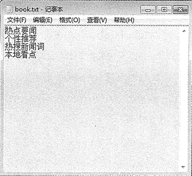

# Java 字符流的使用：字符输入/输出流、字符文件和字符缓冲区的输入/输出流

尽管 java 中字节流的功能十分强大，几乎可以直接或间接地处理任何类型的输入/输出操作，但利用它却不能直接操作 16 位的 Unicode 字符。这就要用到字符流。本节将重点介绍字符流的操作。

## 字符输入流

Reader 类是所有字符流输入类的父类，该类定义了许多方法，这些方法对所有子类都是有效的。

Reader 类的常用子类如下。

*   CharArrayReader 类：将字符数组转换为字符输入流，从中读取字符。
*   StringReader 类：将字符串转换为字符输入流，从中读取字符。
*   BufferedReader 类：为其他字符输入流提供读缓冲区。
*   PipedReader 类：连接到一个 PipedWriter。
*   InputStreamReader 类：将字节输入流转换为字符输入流，可以指定字符编码。

与 InputStream 类相同，在 Reader 类中也包含 close()、mark()、skip() 和 reset() 等方法，这些方法可以参考 InputStream 类的方法。下面主要介绍 Reader 类中的 read() 方法，如表 1 所示。

表 1 Reader 类中的 read()方法

| 方法名及返回值类型 | 说明 |
| int read() | 从输入流中读取一个字符，并把它转换为 0~65535 的整数。如果返回 -1， 则表示 已经到了输入流的末尾。为了提高 I/O 操作的效率，建议尽量使 用下面两种 read()
方法 |
| int read(char[] cbuf) | 从输入流中读取若干个字符，并把它们保存到参数 cbuf 指定的字符数组中。 该方 法返回读取的字符数，如果返回 -1，则表示已经到了输入流的末尾 |
| int read(char[] cbuf,int off,int len) | 从输入流中读取若干个字符，并把它们保存到参数 cbuf 指定的字符数组中。其中， off 指定在字符数组中开始保存数据的起始下标，len 指定读 取的字符数。该方法返
回实际读取的字符数，如果返回 -1，则表示已经 到了输入流的末尾 |

## 字符输出流

与 Reader 类相反，Writer 类是所有字符输出流的父类，该类中有许多方法，这些方法对继承该类的所有子类都是有效的。

Writer 类的常用子类如下。

*   CharArrayWriter 类：向内存缓冲区的字符数组写数据。
*   StringWriter 类：向内存缓冲区的字符串（StringBuffer）写数据。
*   BufferedWriter 类：为其他字符输出流提供写缓冲区。
*   PipedWriter 类：连接到一个 PipedReader。
*   OutputStreamReader 类：将字节输出流转换为字符输出流，可以指定字符编码。

与 OutputStream 类相同，Writer 类也包含 close()、flush() 等方法，这些方法可以参考 OutputStream 类的方法。下面主要介绍 Writer 类中的 write() 方法和 append() 方法，如表 2 所示。

表 2 Writer 类中的 write()方法和 append()方法

| 方法名及返回值类型 | 说明 |
| void write(int c) | 向输出流中写入一个字符 |
| void write(char[] cbuf) | 把参数 cbuf 指定的字符数组中的所有字符写到输出流中 |
| void write(char[] cbuf,int off,int len) | 把参数 cbuf 指定的字符数组中的若干字符写到输出流中。其中，off 指定 字符数组中的起始下标，len 表示元素个数 |
| void write(String str) | 向输出流中写入一个字符串 |
| void write(String str, int off,int len) | 向输出流中写入一个字符串中的部分字符。其中，off 指定字符串中的起 始偏移量，len 表示字符个数 |
| append(char c) | 将参数 c 指定的字符添加到输出流中 |
| append(charSequence esq) | 将参数 esq 指定的字符序列添加到输出流中 |
| append(charSequence esq,int start,int end) | 将参数 esq 指定的字符序列的子序列添加到输出流中。其中，start 指定 子序列的第一个字符的索引，end 指定子序列中最后一个字符后面的字符
的索引，也就是说子序列的内容包含 start 索引处的字符，但不包括 end
索引处的字符 |

注意：Writer 类所有的方法在出错的情况下都会引发 IOException 异常。关闭一个流后，再对其进行任何操作都会产生错误。

## 字符文件输入流

为了读取方便，Java 提供了用来读取字符文件的便捷类——FileReader。该类的构造方法有如下两种重载形式。

1.  FileReader(File file)：在给定要读取数据的文件的情况下创建一个新的 FileReader 对象。其中，file 表示要从中读取数据的文件。
2.  FileReader(String fileName)：在给定从中读取数据的文件名的情况下创建一个新 FileReader 对象。其中，fileName 表示要从中读取数据的文件的名称，表示的是一个文件的完整路径。

在用该类的构造方法创建 FileReader 读取对象时，默认的字符编码及字节缓冲区大小都是由系统设定的。要自己指定这些值，可以在 FilelnputStream 上构造一个 InputStreamReader。

注意：在创建 FileReader 对象时可能会引发一个 FileNotFoundException 异常，因此需要使用 try catch 语句捕获该异常。

字符流和字节流的操作步骤相同，都是首先创建输入流或输出流对象，即建立连接管道，建立完成后进行读或写操作，最后关闭输入/输出流通道。

#### 例 1

要将 E:\myjava\HelloJava.java 文件中的内容读取并输出到控制台，使用 FileReader 类的实现代码如下：

```
package ch13;
import java.io.FileReader;
import java.io.IOException;
public class Test12
{
    public static void main(String[] args)
    {
        FileReader fr=null;
        try
        {
            fr=new FileReader("E:/myjava/HelloJava.java");    //创建 FileReader 对象
            int i=0;
            System.out.println("E:\\myjava\\HelloJava.java 文件内容如下：");
            while((i=fr.read())!=-1)
            {    //循环读取
                System.out.print((char) i);    //将读取的内容强制转换为 char 类型
            }
        }
        catch(Exception e)
        {
            System.out.print(e);
        }
        finally
        {
            try
            {
                fr.close();    //关闭对象
            }
            catch(IOException e)
            {
                e.printStackTrace();
            }
        }
    }
}
```

如上述代码，首先创建了 FileReader 字符输入流对象 fr，该对象指向 E:\myjava\HelloJava.java 文件，然后定义变量 i 来接收调用 read() 方法的返回值，即读取的字符。在 while 循环中，每次读取一个字符赋给整型变量 i，直到读取到文件末尾时退出循环（当输入流读取到文件末 尾时，会返回值 -1）。

## 字符文件输出流

Java 提供了写入字符文件的便捷类——FileWriter，该类的构造方法有如下 4 种重载形式。

1.  FileWriter(File file)：在指定 File 对象的情况下构造一个 FileWriter 对象。其中，file 表示要写入数据的 File 对象。
2.  FileWriter(File file,boolean append)：在指定 File 对象的情况下构造一个 FileWriter 对象，如果 append 的值为 true，则将字节写入文件末尾，而不是写入文件开始处。
3.  FileWriter(String fileName)：在指定文件名的情况下构造一个 FileWriter 对象。其中，fileName 表示要写入字符的文件名，表示的是完整路径。
4.  FileWriter(String fileName,boolean append)：在指定文件名以及要写入文件的位置的情况下构造 FileWriter 对象。其中，append 是一个 boolean 值，如果为 true，则将数据写入文件末尾，而不是文件开始处。

在创建 FileWriter 对象时，默认字符编码和默认字节缓冲区大小都是由系统设定的。要自己指定这些值，可以在 FileOutputStream 上构造一个 OutputStream Writer 对象。

FileWriter 类的创建不依赖于文件存在与否，如果关联文件不存在，则会自动生成一个新的文件。在创建文件之前，FileWriter 将在创建对象时打开它作为输出。如果试图打开一个只读文件，将引发一个 IOException 异常。

注意：在创建 FileWriter 对象时可能会引发 IOException 或 SecurityException 异常，因此需要使用 try catch 语句捕获该异常。

#### 例 2

编写一个程序，将用户输入的 4 个字符串保存到 E:\myjava\book.txt 文件中。在这里使用 FileWriter 类中的 write() 方法循环向指定文件中写入数据，实现代码如下：

```
package ch13;
import java.io.FileWriter;
import java.io.IOException;
import java.util.Scanner;
public class Test13
{
    public static void main(String[] args)
    {
        Scanner input=new Scanner(System.in);
        FileWriter fw=null;
        try
        {
            fw=new FileWriter("E:\\myjava\\book.txt");    //创建 FileWriter 对象
            for(int i=0;i<4;i++)
            {
                System.out.println("请输入第"+(i+1)+"个字符串：");
                String name=input.next();    //读取输入的名称
                fw.write(name+"\r\n");    //循环写入文件
            }
            System.out.println("录入完成！");
        }
        catch(Exception e)
        {
            System.out.println(e.getMessage());
        }
        finally
        {
            try
            {
                fw.close();    //关闭对象
            }
            catch(IOException e)
            {
                e.printStackTrace();
            }
        }
    }
}
```

如上述代码，首先创建了一个指向 E:\myava\book.txt 文件的字符文件输出流对象 fw，然后使用 for 循环录入 4 个字符串，并调用 write() 方法将字符串写入到指定的文件中。最后在 finally 语句中关闭字符文件输出流。

运行该程序，根据提示输入 4 个字符串，如下所示。接着打开 E:\myjava\book.txt 文件，将看到写入的内容，如图 1 所示。

```
请输入第 1 个字符串：
热点要闻
请输入第 2 个字符串：
个性推荐
请输入第 3 个字符串：
热搜新闻词
请输入第 4 个字符串：
本地看点
录入完成！
```


图 1 book.txt 文件内容

## 字符缓冲区输入流

BufferedReader 类主要用于辅助其他字符输入流，它带有缓冲区，可以先将一批数据读到内存缓冲区。接下来的读操作就可以直接从缓冲区中获取数据，而不需要每次都从数据源读取数据并进行字符编码转换，这样就可以提高数据的读取效率。

BufferedReader 类的构造方法有如下两种重载形式。

1.  BufferedReader(Reader in)：创建一个 BufferedReader 来修饰参数 in 指定的字符输入流。
2.  BufferedReader(Reader in,int size)：创建一个 BufferedReader 来修饰参数 in 指定的字符输入流，参数 size 则用于指定缓冲区的大小，单位为字符。

除了可以为字符输入流提供缓冲区以外，BufferedReader 还提供了 `readLine()` 方法，该方法返回包含该行内容的字符串，但该字符串中不包含任何终止符，如果已到达流末尾，则返回 null。readLine() 方法表示每次读取一行文本内容，当遇到换行（\n）、回车（\r）或回车后直接跟着换行标记符即可认为某行已终止。

#### 例 3

使用 BufferedReader 类中的 readLine() 方法逐行读取 E:\myjava\Book.txt 文件中的内容，并将读取的内容在控制台中打印输出，代码如下：

```
package ch13;
import java.io.BufferedReader;
import java.io.FileNotFoundException;
import java.io.FileReader;
import java.io.IOException;
public class Test13
{
    public static void main(String[] args)
    {
        FileReader fr=null;
        BufferedReader br=null;
        try
        {
            fr=new FileReader("E:\\myjava\\book.txt");    //创建 FileReader 对象
            br=new BufferedReader(fr);    //创建 BufferedReader 对象
            System.out.println("E:\\myjava\\book.txt 文件中的内容如下：");
            String strLine="";
            while((strLine=br.readLine())!=null)
            {    //循环读取每行数据
                System.out.println(strLine);
            }
        }
        catch(FileNotFoundException e1)
        {
            e1.printStackTrace();
        }
        catch(IOException e)
        {
            e.printStackTrace();
        }
        finally
        {
            try
            {
                fr.close();    //关闭 FileReader 对象
                br.close();
            }
            catch(IOException e)
            {
                e.printStackTrace();
            }
        }
    }
}
```

如上述代码，首先分别创建了名称为 fr 的 FileReader 对象和名称为 br 的 BufferedReader 对象，然后调用 BufferedReader 对象的 readLine() 方法逐行读取文件中的内容。如果读取的文件内容为 Null，即表明已经读取到文件尾部，此时退出循环不再进行读取操作。最后将字符文件输入流和带缓冲的字符输入流关闭。

运行该程序，输出结果如下所示：

```
E:\myjava\book.txt 文件中的内容如下：
热点要闻
个性推荐
热搜新闻词
本地看点
```

## 字符缓冲区输出流

BufferedWriter 类主要用于辅助其他字符输出流，它同样带有缓冲区，可以先将一批数据写入缓冲区，当缓冲区满了以后，再将缓冲区的数据一次性写到字符输出流，其目的是为了提高数据的写效率。

BufferedWriter 类的构造方法有如下两种重载形式。

1.  BuflferedWriter(Writer out)：创建一个 BufferedWriter 来修饰参数 out 指定的字符输出流。
2.  BufferedWriter(Writer out,int size)：创建一个 BufferedWriter 来修饰参数 out 指定的字符输出流，参数 size 则用于指定缓冲区的大小，单位为字符。

该类除了可以给字符输出流提供缓冲区之外，还提供了一个新的方法——`newLine()`，该方法用于写入一个行分隔符。行分隔符字符串由系统属性 line.separator 定义，并且不一定是单个新行（\n）符。

提示：BufferedWriter 类的使用与 FileWriter 类相同，这里不再重述。