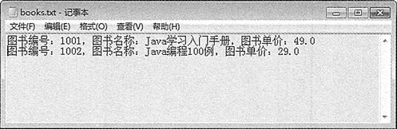

# Java 保存图书信息

在本章《Java 字节流的使用》和《Java 字符流的使用》中已经详细介绍了字节、字符输入/输出流的应用，利用输出流我们可以将一些数据保存到磁盘文件中，利用输入流可以读取磁盘文件中的内容。本节将综合使用文件输入/输出流完成存储图书并将图书信息再读取出来的功能。

每到学校开学季都会新进一批图书教材，需要将这些图书信息保存到文件，再将它们打印出来方便老师查看。下面编写程序，使用文件输入/输出流完成图书信息的存储和读取功能，具体的实现步骤如下。

(1) 创建 Book 类，在该类中包含 no、name 和 price 3 个属性，分别表示图书编号、图书名称和图书单价。同时还包含两个方法 write() 和 read()，分别用于将图书信息写入到磁盘文件中和从磁盘文件中读取图书信息并打印到控制台。

此外，在 Product 类中包含有该类的 toString() 方法和带有 3 个参数的构造方法，具体的内容如下：

```
package ch13;
import java.io.BufferedReader;
import java.io.FileReader;
import java.io.FileWriter;
import java.io.IOException;
import java.util.List;
public class Book
{
    private int no;    //编号
    private String name;    //名称
    private double price;    //单价
    public Book(int no,String name,double price)
    {
        this.no=no;
        this.name=name;
        this.price=price;
    }
    public String toString()
    {
        return "图书编号："+this.no+"，图书名称："+this.name+"，图书单价："+this.price+"\n";
    }
    public static void write(List books)
    {
        FileWriter fw=null;
        try
        {
            fw=new FileWriter("E:\\myjava\\books.txt");    //创建 FileWriter 对象
            for(int i=0;i<books.size();i++)
            {
                fw.write(books.get(i).toString());    //循环写入
            }
        }
        catch(Exception e)
        {
            System.out.println(e.getMessage());
        }
        finally
        {
            try
            {
                fw.close();
            }
            catch(IOException e)
            {
                e.printStackTrace();
            }
        }
    }
    public static void read()
    {
        FileReader fr=null;
        BufferedReader br=null;
        try
        {
            fr=new FileReader("E:\\myjava\\books.txt");
            br=new BufferedReader(fr);    //创建 BufferedReader 对象
            String str="";
            while((str=br.readLine())!=null)
            {    //循环读取每行数据
                System.out.println(str);    //输出读取的内容
            }           
        }
        catch(Exception e)
        {
            System.out.println(e.getMessage());
        }
        finally
        {
            try
            {
                br.close();
                fr.close();
            }
            catch(IOException e)
            {
                e.printStackTrace();
            }
        }
    }
}
```

如上述代码，分别使用字符文件输出流 FileWriter 和字符缓冲区输入流 BufferedReader 完成对图书信息的存储和读取功能。

(2) 编写测试类 Test14，创建两个 Book 对象，并将这两个对象保存到 List 集合中，再将 List 集合对象传递给 Book 类中的 write() 方法，向 F:\product.txt 文件中写入图书信息。最后调用 Product 类中的 read() 方法读取该文件内容，代码如下：

```
package ch13;
import java.util.ArrayList;
import java.util.List;
import java.util.Scanner;
public class Test14
{
    public static void main(String[] args)
    {
        Book book1=new Book(1001,"Java 学习入门手册",49);
        Book book2=new Book(1002,"Java 编程 100 例",29);
        List books=new ArrayList();
        books.add(book1);
        books.add(book2);
        Book.write(books);
        System.out.println("********************图书信息******************");
        Book.read();
    }
}
```

(3) 运行程序，输出的图书信息，如下所示。打开 E:\myjava\books.txt 文件，该文件的内容如图 1 所示。

```
********************图书信息******************
图书编号：1001，图书名称：Java 学习入门手册，图书单价：49.0
图书编号：1002，图书名称：Java 编程 100 例，图书单价：29.0
```


图 1 文件保存的图书信息