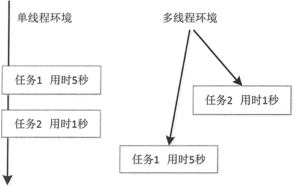

# Java 线程的概念：什么是线程？

世间万物都可以同时完成很多工作。例如，人体可以同时进行呼吸、血液循环、思考问题等活动。用户既可以使用计算机听歌，也可以编写文档和发送邮件，而这些活动的完成可以同时进行。这种同时执行多个操作的“思想”在 Java 中被称为并发，而将并发完成的每一件事称为线程。

在 Java 中，并发机制非常重要，但并不是所有程序语言都支持线程。在以往的程序中，多以一个任务完成以后再进行下一个任务的模式进行，这样下一个任务的开始必须等待前一个任务的结束。Java 语言提供了并发机制，允许开发人员在程序中执行多个线程，每个线程完成一个功能，并与其他线程并发执行。这种机制被称为多线程。

多线程是非常复杂的机制，比如同时阅读 3 本书。首先阅读第 1 本第一章，然后再阅读第 2 本第一章，再阅读第 3 本第一章，接着回过头阅读第 1 本第二章，以此类推，就体现了多线程的复杂性。

既然多线程这么复杂，那么它在操作系统中是怎样工作的呢？其实，Java 中的多线程在每个操作系统中的运行方式也存在差异，在此以 Windows 操作系统为例介绍其运行模式。

Windows 系统是多任务操作系统，它以进程为单位。一个进程是一个包含有自身地址的程序，每个独立执行的程序都称为进程，也就是正在执行的程序。图 1 所示为 Windows 7 系统下使用任务管理器查看进程的结果。

图 1 查看 Windows 7 的进程（[点此查看原图](http://c.biancheng.net/uploads/allimg/181030/3-1Q030134000555.jpg)）
系统可以分配给每个进程一段有限的执行 CPU 的时间（也称为 CPU 时间片），CPU 在这段时间中执行某个进程，然后下一个时间段又跳到另一个进程中去执行。由于 CPU 切换的速度非常快，给使用者的感受就是这些任务似乎在同时运行，所以使用多线程技术后，可以在同一时间内运行更多不同种类的任务。

图 2 的左图是单线程环境下任务 1 和任务 2 的执行模式。任务 1 和任务 2 是两个完全独立、互不相关的任务，任务 1 是在等待远程服务器返回数据，以便进行后期的处理，这时 CPU 一直处于等待状态，一直在“空运行”。如果任务 2 是在 5 秒之后被运行，虽然执行任务 2 用的时间非常短，仅仅是 1 秒，但必须在任务 1 运行结束后才可以运行任务 2。由于运行在单任务环境中，所以任务 2 有非常长的等待时间，系统运行效率大幅降低。

单任务的特点就是排队执行，也就是同步，就像在 cmd 中输入一条命令后，必须等待这条命令执行完才可以执行下一条命令一样。这就是单任务环境的缺点，即 CPU 利用率大幅降低。

图 2 单线程和多线程执行模式
图 2 的右侧则是多线程环境下的执行模式。从中可以发现，CPU 完全可以在任务 1 和任务 2 之间来回切换，使任务 2 不必等到 5 秒再运行，系统的运行效率大大得到提升。这就是要使用多线程技术、要学习多线程的原因。

那么什么是线程呢？线程可以理解成是在进程中独立运行的子任务。比如，QQ.exe 运行时就有很多的子任务在同时运行。像好友视频、下载文件、传输数据、发送表情等，这些不同的任务或者说功能都可以同时运行，其中每一项任务完全可以理解成是“线程”在工作，传文件、听音乐、发送图片表情等功能都有对应的线程在后台默默地运行。