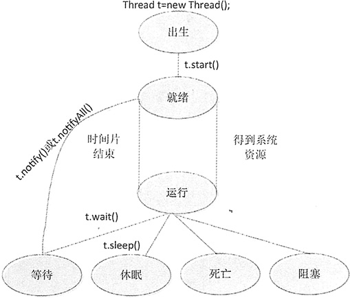

# Java 线程的生命周期及线程的几种状态

线程也具有生命周期，主要包括 7 种状态，分别是出生状态、就绪状态、运行状态、等待状态、休眠状态、阻塞状态和死亡状态，如图 1 所示。

图 1 线程生命周期图
下面对线程生命周期中的 7 种状态做说明。

1.  出生状态：用户在创建线程时所处的状态，在用户使用该线程实例调用 start() 方法之前，线程都处于出生状态。
2.  就绪状态：也称可执行状态，当用户调用 start() 方法之后，线程处于就绪状态。
3.  运行状态：当线程得到系统资源后进入运行状态。
4.  等待状态：当处于运行状态下的线程调用 Thread 类的 wait() 方法时，该线程就会进入等待状态。进入等待状态的线程必须调用 Thread 类的 notify() 方法才能被唤醒。notifyAll() 方法是将所有处于等待状态下的线程唤醒。
5.  休眠状态：当线程调用 Thread 类中的 sleep() 方法时，则会进入休眠状态。
6.  阻塞状态：如果一个线程在运行状态下发出输入/输出请求，该线程将进入阻塞状态，在其等待输入/输出结束时，线程进入就绪状态。对阻塞的线程来说，即使系统资源关闭，线程依然不能回到运行状态。
7.  死亡状态：当线程的 run() 方法执行完毕，线程进入死亡状态。

提示：一旦线程进入可执行状态，它会在就绪状态与运行状态下辗转，同时也可能进入等待状态、休眠状态、阻塞状态或死亡状态。

根据图 1 所示，可以总结出使线程处于就绪状态有如下几种方法。

*   调用 sleep() 方法。
*   调用 wait() 方法。
*   等待输入和输出完成。

当线程处于就绪状态后，可以用如下几种方法使线程再次进入运行状态。

*   线程调用 notify() 方法。
*   线程调用 notifyAll() 方法。
*   线程调用 intermpt() 方法。
*   线程的休眠时间结束。
*   输入或者输出结束。