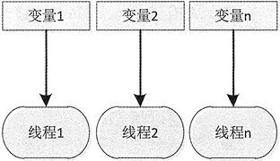
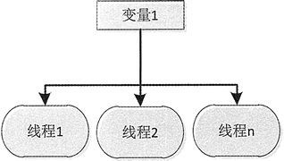

# Java 多线程之间访问实例变量

自定义线程类中的实例变量针对其他线程可以有共享与不共享之分，这在多个线程之间进行交互时是很重要的一个技术点。

图 1 所示为不共享数据的示例，图 2 所示为共享数据的示例。


图 1 线程之间不共享数据实例图

图 2 线程间共享数据示例图

#### 例 1

如图 1 所示，在不共享数据时每个线程都拥有自己作用域的变量，且多个线程之间相同变量名的值也不相同。下面创建一个示例演示这种特性。

首先创建自定义的线程类 MyThread03， 代码如下：

```
package ch14;
public class MyThread03  extends Thread
{
    private int count=5; 
    public MyThread03(String name)
    { 
        super(); 
        this.setName(name);//设置线程名称 
    } 
    @Override 
    public void run()
    { 
        super.run(); 
        while (count>0)
        { 
            count--; 
            System.out.println("由 "+this.currentThread().getName()+" 计算，count="+count); 
        } 
    }
}
```

如上述代码所示，MyThread03 线程的代码非常简单。下面编写代码在主线程中创建 3 个 MyThread03 线程，并启动这些线程。具体代码如下：

```
package ch14;
public class Test05
{
    public static void main(String[] args)
    { 
        MyThread03 a=new MyThread03("A"); 
        MyThread03 b=new MyThread03("B"); 
        MyThread03 c=new MyThread03("C"); 
        a.start(); 
        b.start(); 
        c.start(); 
    }
}
```

运行主线程将看到图 1 所示效果。从如下所示的运行结果可以看出，程序一共创建了 3 个线程，每个线程都有各自的 count 变量，自己减少自己的 count 变量的值。这样的情况就是变量不共享，此实例并不存在多个线程访问同一个实例变量的情况。

```
由 B 计算，count=4
由 B 计算，count=3
由 B 计算，count=2
由 B 计算，count=1
由 B 计算，count=0
由 C 计算，count=4
由 C 计算，count=3
由 C 计算，count=2
由 C 计算，count=1
由 C 计算，count=0
由 A 计算，count=4
由 A 计算，count=3
由 A 计算，count=2
由 A 计算，count=1
由 A 计算，count=0
```

#### 例 2

如果想实现多个线程共同对一个变量进行操作的目的，该如何设计代码呢？这时就必须使用共享数据的方案。共享数据的情况就是多个线程可以访问同一个变量，比如在实现投票功能的软件时，多个线程可以同时处理同一个人的票数。

下面通过一个示例来看一下数据共享情况。首先对例 1 的 MyThread03 类进行修改，这里将新线程类命名为 MyThread04。

```
package ch14;
public class MyThread04  extends Thread
{
    private int count=5; 
    @Override 
    public void run()
    { 
        super.run(); 
        count--; 
        //此示例不要用 for 语句，因为使用同步后其他线程就得不到运行的机会了， 
        //一直由一个线程进行减法运算 
        System.out.println("由 "+this.currentThread().getName()+" 计算，count="+count); 
    }
}
```

编写代码在主线程中创建 5 个 MyThread04 线程，并启动这些线程。具体代码如下：

```
package ch14;
public class Test06
{
    public static void main(String[] args)
    { 
        MyThread04 mythread=new MyThread04(); 
        Thread a=new Thread(mythread,"A"); 
        Thread b=new Thread(mythread,"B"); 
        Thread c=new Thread(mythread,"C"); 
        Thread d=new Thread(mythread,"D"); 
        Thread e=new Thread(mythread,"E"); 
        a.start(); 
        b.start(); 
        c.start(); 
        d.start(); 
        e.start();
    }
}
```

运行主线程将看到如下所示的效果。从运行结果中可以看到，线程 A 和 B 打印出的 count 值都是 3，说明 A 和 B 同时对 count 进行处理，产生了“非线程安全”问题，但我们想要得到的打印结果却不是重复的，而是依次递减的。

```
由 A 计算，count=4
由 B 计算，count=3
由 C 计算，count=1
由 E 计算，count=1
由 D 计算，count=0
```

在某些 JVM 中，i-- 的操作要分成如下 3 步：

*   取得原有 i 值。
*   计算 i-1。
*   对 i 进行赋值。

在这 3 个步骤中，如果有多个线程同时访问，那么一定会出现非线程安全问题。

其实这个示例就是典型的销售场景：5 名销售员，每名销售员卖出一件货品后不可以得出相同的剩余数量，必须在每一名销售员卖完一件货品后其他销售员才可以在新的剩余物品数上继续减 1 操作。这时就需要使多个线程之间进行同步，也就是用按顺序排队的方式进行减 1 操作。更改代码如下：

```
package ch14;
public class MyThread04  extends Thread
{
    private int count=5; 
    @Override 
    synchronized  public void run()
    { 
        super.run(); 
        count--; 
        //此示例不要用 for 语句，因为使用同步后其他线程就得不到运行的机会了， 
        //一直由一个线程进行减法运算 
        System.out.println("由 "+this.currentThread().getName()+" 计算，count="+count); 
    }
}
```

再次运行程序，就不会出现值一样的情况了，如下所示。

```
由 A 计算，count=4
由 B 计算，count=3
由 C 计算，count=2
由 D 计算，count=1
由 E 计算，count=0
```

通过在 run() 方法前加 synchronized 关键字，使多个线程在执行 run() 方法时，以排队的方式进行处理。当一个线程调用 run() 前，先判断 run() 方法有没有被上锁，如果上锁，说明有其他线程正在调用 run()方法，必须等其他线程对 run() 方法调用结束后才可以执行 run()方法。这样也就实现了排队调用 run() 方法的目的，达到了按顺序对 count 变量减 1 的效果。synchronized 可以在任意对象及方法上加锁，而加锁的这段代码称为“互斥区” 或“临界区”。

当一个线程想要执行同步方法里面的代码时，线程首先尝试去拿这把锁，如果能够拿到锁，那么这个线程就可以执行 synchronize 里面的代码。如果不能拿到锁，那么这个线程就会不断地尝试拿锁，直到能够拿到为止，而且有多个线程同时去争抢这把锁。