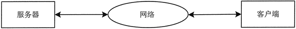
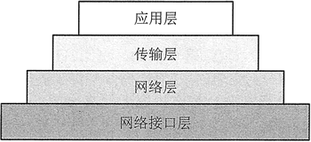
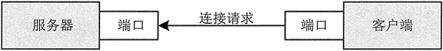

# Java 网络编程基础知识

网络编程的目的就是直接或间接地通过网络协议与其他计算机进行通信。在 Java 语言中包含网络编程所需要的各种类，编程人员只需要创建这些类的对象，调用相应的方法，就可以进行网络应用程序的编写。

要进行网络程序的编写，编程人员需要对网络传输协议、端口和套接字等方面的知识有一定的了解。下面就从这几个方面对网络编程的基础进行介绍。

## 网络分类

了解网络编程之前首先带领读者对计算机网络进行一些简单的了解。计算机网络是指将有独立功能的多台计算机，通过通信设备线路连接起来，在网络软件的支持下，实现彼此之间资源共享和数据通信的整个系统。

按照地理范围主要将网络分为局域网、城域网、广域网和因特网。

*   局域网（LocalArea Network）简称 LAN，是一种在小范围内实现的计算机网络，一般在一个建筑物内或者一个工厂、一个事业单位内部独有，范围较小。
*   城域网（Metropolitan Area Network）简称为 MAN，一般是一个城市内部组建的计算机信息网络，提供全市的信息服务。
*   广域网（Wide Area Network）简称为 WAN，它的范围很广，可以分布在一个省、一个国家或者几个国家。
*   因特网（Internet）则是由无数的 LAN 和 WAN 组成的。

## 网络编程模型

在网络通信中主要有两种模式的通信方式：一种是客户机/服务器（Client/Server）模式，简称为 C/S 模式；另一种是浏览器/服务器（Browser/Server）模式，简称 B/S 模式。下面主要针对这两种模式进行介绍。

#### Client/Server 模式

图 1 是客户机、服务器以及网络三者之间的关系图，使用这种模式的程序很多，例如很多读者喜欢玩的网络游戏，需要在本机上安装一个客户端，服务器运行在游戏开发公司的机房。

图 1 C/S 模型
使用 C/S 模式的程序，在开发时需要分别针对客户端和服务器端进行专门开发。这种开发模式的优势在于由于客户端是专门开发的，表现力会更强。缺点就是通用性差，也就是说一种程序的客户端只能和对应的服务器端进行通信，不能和其他的服务器端进行通信，在实际维护中，也需要维护专门的客户端和服务器端，维护的压力较大。

#### Browser/Server 模式

对于很多程序，运行时不需要专门的客户端，而是使用通用的客户端，例如使用浏览器。用户使用浏览器作为客户端的这种模式叫作浏览器/服务器模式。使用这种模式开发程序时只需开发服务器端即可，开发的压力较小，不需要维护客户端。但是对浏览器的限制比较大，表现力不强。

## 网络协议

网络协议是网络上所有设备（网络服务器、计算机及交换机、路由器、防火墙等）之间通信规则的集合，它规定了通信时信息必须采用的格式和这些格式的意义。目前的网络协议有很多种，在这里简单介绍几种常用的网络协议。

#### IP 协议

IP 是英文 Internet Protocol（网络之间互联的协议）的缩写，中文简称为网协，也就是为计算机网络相互连接进行通信而设计的协议。在 Internet 中它是能使连接到网上的所有计算机网络实现相互通信的一套规则，规定了计算机在 Internet 上进行通信时应当遵守的规则。任何厂家生产的计算机系统只有遵守 IP 协议才可以与 Internet 互联。

Internet 网络中采用的协议是 TCP/IP 协议，其全称是 `Transmission Control Protocol/Internet Protocol`。Internet 依靠 TCP/IP 协议在全球范围内实现不同硬件结构、不同操作系统、不同网络的互联。

对网络编程来说，主要是计算机和计算机之间的通信，首要的问题就是如何找到网络上数以亿计的计算机。为了解决这个问题，网络中的每个设备都会有唯一的数字标识，也就是 IP 地址。

在计算机网络中，现在命名 IP 地址的规定是 IPv4 协议，该协议规定每个 IP 地址由 4 个 0~255 的数字组成。每台接入网络的计算机都拥有一个唯一的 IP 地址，这个地址可能是固定的，也可能是动态的。

目前 IETF（Internet Engineering Task Force，互联网工程任务组）设计的用于替代现行版本 IP 协议（IPv4）的下一代协议 IPv6，釆用 6 字节来表示 IP 地址，但目前还没有开始使用。

TCP/IP 定义了电子设备如何连入 Internet 以及数据如何在它们之间传输的标准。协议采用 4 层的层级结构，分别是应用层、传输层、网络层和网络接口层。每一层都呼叫它的下一层所提供的网络来完成自己的需求。

TCP 负责发现传输的问题，一有问题就发出信号要求重新传输，直到所有数据安全正确地传输到目的地，而 IP 是给 Internet 的每一台电脑规定一个地址。图 2 是 TCP/IP 层次结构图。

图 2 TCP/IP 层次结构

#### TCP 与 UDP 协议

尽管 TCP/IP 协议从名称看只包括 TCP 这个协议名，但是在 TCP/IP 协议的传输层同时存在 TCP（Transmission Control Protocol，传输控制协议）和 UDP（User Datagram Protocol，用户数据报协议）两个协议。

在网络通信中 TCP 协议类似于使用手机打电话，可以保证把信息传递给别人；而 UDP 协议类似于发短信，接收人有可能接收不到传递的信息。

在网络通信中使用 TCP 的方式需要建立专门的虚拟连接，然后进行可靠的数据连接，如果数据发送失败，客户端会自动重发该数据。而使用 UDP 方式不需要建立专门的虚拟连接，传输也不是很可靠，如果发送失败则客户端无法获得。

TCP 协议是一种以固定连线为基础的协议，它提供两台计算机之间可靠的数据传送。而 UDP 无连接通信协议，它不保证可靠数据的传输，但能够向若干目标发送数据以及接收来自若干源的数据。

对于一些重要的数据，一般使用 TCP 方式来进行数据传输，而大量的非核心数据则通过 UDP 方式进行传递。使用 TCP 方式传递的速度稍微慢一点，而且传输时产生的数据量会比 UDP 大一点。

## 套接字和端口

在网络上很多应用程序都是采用客户端/服务器（C/S）的模式，实现网络通信必须将两台计算机连接起来建立一个双向的通信链路，这个双向通信链路的每一端称之为一个套接字（Socket）。

一台服务器上可能提供多种服务，使用 IP 地址只能唯一定位到某一台计算机，却不能准确地连接到想要连接的服务器。通常使用一个 0~65535 的整数来标识该机器上的某个服务，这个整数就是端口号（Port）。端口号并不是指计算机上实际存在的物理位置，而是一种软件上的抽象。

端口号主要分为以下两类：

1.  由 Internet 名字和号码指派公司 ICANN 分配绐一些常用的应用层程序固定使用的熟知端口，其值是 0~1023。例如 HTTP 服务一般使用 80 端口，FTP 服务使用 21 端口。
2.  一般端口用来随时分配绐请求通信的客户进程。

运行在一台特定机器上的某个服务器（如 FTP 服务器）都有一个套接字绑定在该服务器上，服务器只是等待和监听客户的连接请求。客户端客户需要知道服务器的主机名和端口号。

为了建立连接请求，客户机试图与服务器上指定端口号上的服务进行连接，这个请求过程如图 3 所示。

图 3 客户向服务器发送请求
如果服务器接收到客户端的请求，就会创建一个套接字，客户端使用该套接字与服务器通信，但此时客户端的套接字并没有绑定到与服务器连接的端口号上。