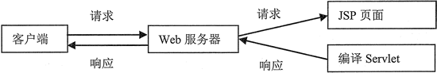

# JSP 的特点与工作流程

我们可以将 JSP 看作 Java Servlet 的一种扩展，在使用时 JSP 必须被编译为 Servlet，也就是 Java 类，然后才能调用执行，Servlet 所产生的 Web 页面不能包含在 HTML 标签中。JSP 的应用特点如下。

#### 1\. 实现跨平台操作

JSP 技术的最大特点是其编写的代码与设计平台完全无关，用户可以将在任何平台上编写的 JSP 页面拿来在任何 Web 服务器或 Web 应用服务器上运行，然后通过任何 Web 浏览器访问。

除此之外，JSP 还可以在任何平台上建立服务器组件，在任何服务器上运行程序。从 JSP 的这个特点可以看出，应用程序开发者只要在自己选用的任意平台上编写 Web 页面，就可以将编写好的页面放在任意服务器上运行，当需要对页面进行修改时，也无须考虑开发运行平台。

JSP 页面的内置脚本语言是基于 Java 编程语言的，因此，JSP 页面都要被编译为 Servlet。

#### 2\. 可重复使用组件

JSP 页面依赖于可重用的、跨平台的组件来执行应用程序中所要求的更为复杂的处理。基于组件的方法的特点是：能够提高总体开发过程的效率，使得各种组织在他们现有优点的基础上得到更好的优化处理。

开发人员能够共享并且交换执行普通操作的组件，这些组件除了可以将网页的设计与逻辑程序的设计分离以节约开发时间，还可以充分利用 Java 以及其他脚本语言的跨平台的能力及其灵活性。

#### 3\. 标记简化的语言

标准的 JSP 标记可以访问和实例化 JavaBean 组件，并且可以设置或检索组件属性，以及下载 Applet，执行用其他方法更难以编码和耗时的功能。

JSP 技术可以将许多功能封装起 来，在进行 Web 页面开发时，利用这些封装的功能就可以方便地使用与 JSP 相关的 XML 标记进行动态内容的生成。

#### 4\. 实现应用程序与页面显示的分离化

应用程序与页面显示的分离化可以使 Web 页面的设计者和管理人员能够互不影响地编辑和使用 JSP 页面，而不影响其内容的生成。

Web 页面的开发人员可以利用 HTML 或 XML 标记来设计和格式化最终页面，而利用 JSP 标记或 Scriptlet 来生成页面上的动态内容。生成的内容被封装在标记和 JavaBean 组件中，并将它们捆绑在 Scriptlet 中，使得所有的脚本程序都运行在服务器端。

通常，在服务器端由 JSP 引擎解释 JSP 标记和 Scriptlet，生成所请求的内容，同时，将结果以 HTML 或者 XML 页面的形式发送回浏览器。这样做，不但可以对程序代码进行保密，又可以保证任何基于 HTML 的 Web 浏览器的跨平台使用。

与 Servlet 相比，JSP 可以提供所有 Servlet 的功能，比使用 println 编写和修改 HTML 更方便。

#### 提示：

JSP 还可以更明确地进行分工，Web 页面的设计人员编写 HTML 时，只需要留出地方让 Servlet 程序员插入动态部分就可以了。

在编写 JSP 程序时，要了解它的执行顺序，JSP 的执行流程如图 1 所示。首先，客户端向 Web 服务器提出请求，然后 JSP 引擎负责将页面转化为 Servlet，此 Servlet 经过虚拟机编译生成类文件，然后再把类文件加载到内存中执行。最后，由服务器将处理结果返回给客户端。

图 1 JSP 的执行流程

#### 提示：

JSP 页面代码会被编译成 Servlet 代码，执行效率没有 Servlet 快，但并不是每一次都需要编译 JSP 页面。当 JSP 第一次被编译成类文件后，重复调用该 JSP 页面时，若 JSP 引擎发现该 JSP 页面没有被改动过，那么会直接使用编译后的类文件而不会再次编译成新的 Servlet。当然，如果页面被修改后，则需要重新加载和编译。