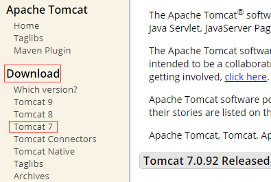
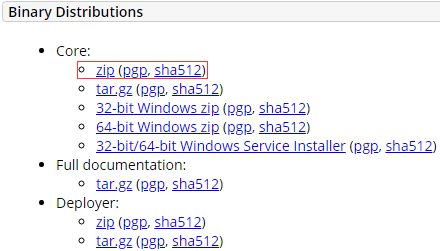
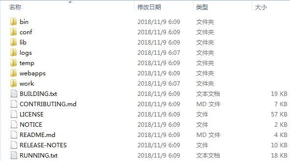
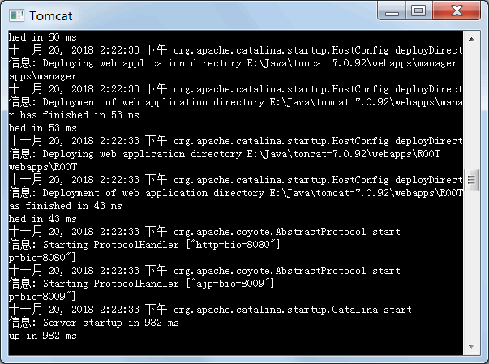
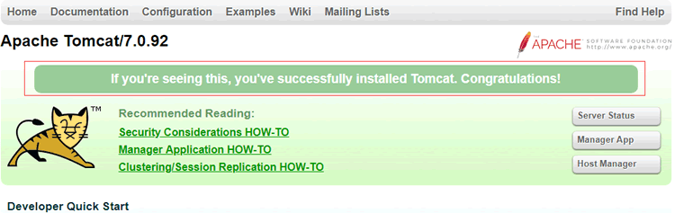
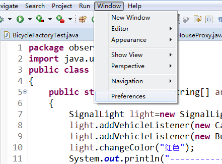
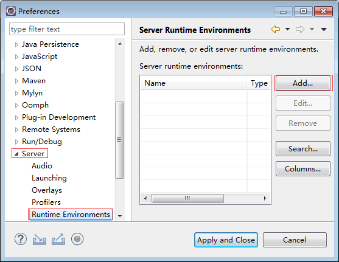
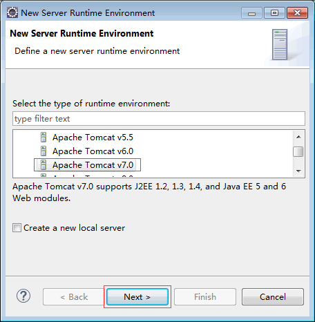
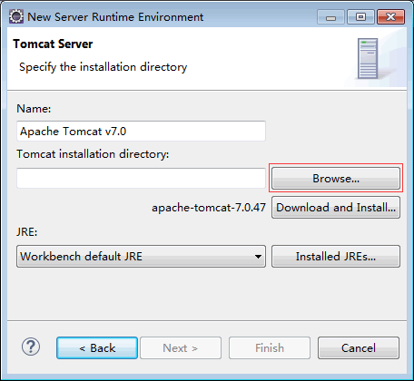
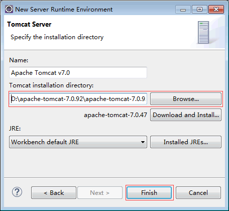

# JSP 开发环境搭建（Tomcat 的安装和配置）

使用 JSP 开发程序，需要具备对应的运行环境：Web 浏览器、Web 服务器、JDK 开发工具包、数据库（MySQL、SQL Server 等）。下面以 Windows 操作系统为平台介绍 JSP 的安装与配置。

## JDK 的安装与配置

JDK 包含运行 Java 程序必需的 Java 运行环境（Java Runtime Environment，JRE）及开发过程中常用的库文件。在使用 JSP 开发网站前，要先安装 JDK 组件。

在 Java 教程的一开始，《Java JDK 下载与安装教程》和《Java JDK 环境变量配置》两篇教程就已经详细地介绍了 JDK 的安装和配置，所以在此我们就不再对其进行介绍，读者可以点击本文中的链接直接进入以上两篇教程进行学习。

## Tomcat 的安装与启动

Tomcat 是由 JavaSoft 和 Apache 开发团队共同合作推出的产品，它完全支持 Servlet 和 JSP，并且可以免费使用。

由于 JSP 程序是需要在服务器中运行的，因此还需要运行网页的 Apache 服务器。下面来安装 Apache 服务器 Tomcat。

(1) 进入 Tomcat 官方网站 http://tomcat.apache.org，下载 Tomcat 7.0，如图 1 所示。

a) Tomcat 官方首页

b) 下载 Tomcat 7.0
图 1 Tomcat 7.0 下载页面
(2) 下载后解压文件，如图 2 所示。

图 2 解压文件
(3) 进入 Tomcat 安装目录下的 bin 子目录，可以看到 startup.bat 和 shutdown.bat 文件。双击 startup.bat 启动 Tomcat 服务器，将产生如图 3 所示的输出信息。

图 3 启动 Tomcat 服务
(4) 在浏览器中输入 http://localhost:8080，出现如图 4 所示情况则表示 Tomcat 安装成功。

图 4 测试 Tomcat 服务

#### 提示：

直到看到提示信息“Server startup in 1571 ms”输出，表示 Tomcat 启动完毕。 否则可能出现错误，将无法启动。这时，需要关闭 Tomcat 服务器，可以关闭这个 CMD 窗口，也可以双击运行 shutdown.bat。
Tomcat 服务器默认占用 8080 端口，如果 Tomcat 要使用的端口已经被占用，则 Tomcat 服务器将无法启动。

## Eclipse 的安装与使用

Eclipse 提供了大量的 Java 工具集，如 CCS/JS/HTML/XML 编辑器，可以帮助创建 EJB 和 Struts 项目的向导、编辑 Hibernate 配置文件和执行 MySQL 语句的工具等。

(1) 进入 Eclipse 官方网站 https://www.eclipse.org/downloads/，下载并安装 Eclipse。具体的下载安装步骤我们在《Java Eclipse 下载安装教程》中已经进行了详细地介绍，读者可以点击本文中的链接直接进入《Java Eclipse 下载安装教程》中进行学习。

(2) 绑定 Eclipse 与 Tomcat，在 Eclipse 中选择 Window→Preferences 命令，如图 5 所示，打开 Preferences 窗口。

图 5 选择 Preferences 命令
(3) 在 Preferences 对话框，依次单击 Server→Runtime Enviroments→Add，如图 6 所示。

图 6 单击 Add 按钮
(4) 选择相应版本的 Tomcat，单击 Next 按钮，如图 7 所示。

图 7 选择 Tomcat 版本
(5) 单击 Browse 按钮，如图 8 所示。

图 8 单击 Browse 按钮
(6) 选择 Tomcat 的安装路径，如图 9 所示，单击 Finish 按钮，完成 Eclipse 的绑定配置。

图 9 选择 Tomcat 的安装路径