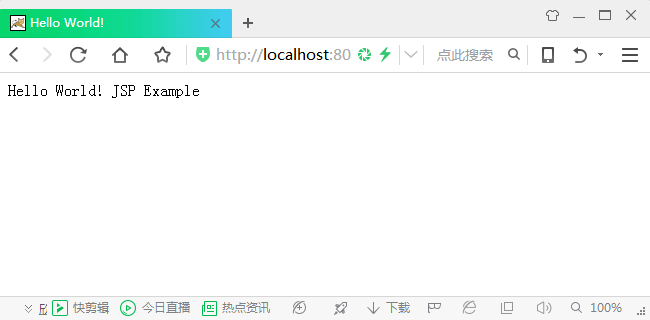

# 第一个 JSP 程序

根据前面几节教程所介绍的内容，试写一个 HelloWorld.jsp 文件代码，调试并运行显示结果。其实现过程分为以下几个步骤。

(1) 在 C:\Tomcat\webapps\ROOT 下新建一个测试的 JSP 页面，文件名为 HelloWorld.jsp。源程序如下：

```
<%@ page language="java"%>
<!--导入的 Java 包-->
<html>
<head>
    <title>Hello World!</title>
</head>
<body bgcolor="#FFFFFF">
<%
    String msg="JSP Example";
　  //定义字符串对象
    out.println("Hello World!");
%>
<%=msg%>
<!--显示变量值-->
</body>
</html>
```

(2) 启动 Tomcat，然后在打开的浏览器中，输入 http://localhost:8080/HelloWorld.jsp，若显示 Hello World! 则说明程序运行成功，显示结果如图 1 所示。


图 1 显示结果