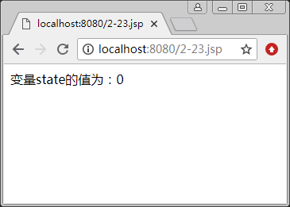
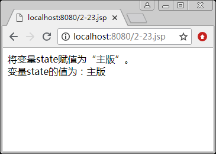
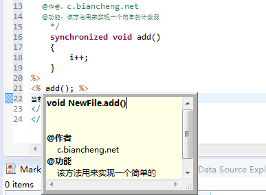

# JSP 注释（多种注释详解）

JSP 语法缺少不了注释声明，注释是为了能让他人看懂代码。

在 JSP 页面中可以使用多种注释，如 HTML 中的注释、Java 中的注释和在严格意义上说属于 JSP 页面自己的注释——带有 JSP 表达式和隐藏的注释。在 JSP 规范中，它们都属于 JSP 中的注释，并且它们的语法规则和运行的效果有所不同。接下来我们将介绍 JSP 中的各种注释。

## HTML 中的注释

JSP 文件是由 HTML 标记和嵌入的 Java 程序段组成的，所以在 HTML 中的注释同样可以在 JSP 文件中使用。注释格式如下：

<!--注释内容-->

【例 1】 HTML 中的注释：

```
<!--欢迎提示信息！-->
<table><tr><td>欢迎访问! </td></tr></table>
```

使用该方法注释的内容在客户端浏览器中是看不到的，但可以通过查看 HTML 源代码看到这些注释内容。

访问该页面后，将会在客户端浏览器中输出以下内容：

```
欢迎访问！
```

通过查看 HTML 源代码，将会看到如下内容：

```
<!--欢迎提示信息！-->
<table><tr><td>欢迎访问! </td></tr></table>
```

## 带有 JSP 表达式的注释

在 HTML 注释中可以嵌入 JSP 表达式，注释格式如下：

<!--comment<%=expression %>-->

包含该注释语句的 JSP 页面被请求后，服务器能够识别注释中的 JSP 表达式，从而来执行该表达式，而对注释中的其他内容不做任何操作。

当服务器将执行结果返回给客户端后，客户端浏览器会识别该注释语句，所以被注释的内容不会显示在浏览器中。

【例 2】使用带有 JSP 表达式的注释：

```
<%String name="XYQ";%>
<!--当前用户：<%=name%>-->
<table><tr><td>欢迎登录：<%=name%></td></tr></table>
```

访问该页面后，将会在客户端浏览器中输出以下内容：

```
欢迎登录：XYQ
```

通过查看 HTML 源代码，将会看到以下内容：

```
<!--当前用户：<%=name%>-->
<table><tr><td>欢迎登录：XYQ</td></tr></table>
```

## 隐藏注释

前面已经介绍了如何使用 HTML 中的注释，这种注释虽然在客户端浏览页面时不会看见，但它却存在于源代码中，可通过在客户端查看源代码看到被注释的内容。所以严格来说，这种注释并不安全。下面介绍一种隐藏注释，注释格式如下：

<%--注释内容--%>

用该方法注释的内容，不仅在客户端浏览时看不到，而且即使在客户端查看 HTML 源代码，也不会看到，所以安全性较高。

【例 3】使用隐藏注释：

```
<%--获取当前时间--%>
<table>
    <tr><td>当前时间为：<% =(new java.util.Date()).toLocaleString() %></td></tr>
</tabla>
```

访问该页面后，将会在客户端浏览器中输出以下内容：

```
当前时间为：2017-3-19 15:27:20
```

通过查看 HTML 源代码，将会看到以下内容：

```
<table>
    <tr><td>当前时间为：2017-3-19 15 : 27 : 20</td></tr>
</table>
```

## 脚本程序（Scriptlet）中的注释

脚本程序中包含的是一段 Java 代码，所以在脚本程序中的注释与在 Java 中的注释是相同的。

脚本程序中包括下面 3 种注释方法。

#### 1\. 单行注释

单行注释的格式如下：

//注释内容

符号“//”后面的所有内容为注释的内容，服务器对该内容不进行任何操作。因为脚本程序在客户端通过查看源代码是不可见的，所以在脚本程序中通该方法注释的内容也是不可见的，并且后面将要提到的通过多行注释和提示文档进行注释的内容都是不可见的。

【例 4】JSP 文件中包含以下代码：

```
<%
    int count=6; //定义一个计数变量
%>
计数变量 count 的当前值为：<%=count%>
```

访问该页面后，将会在客户端浏览器中输出以下内容：

```
计数变量 cxnmt 的当前值为：6
```

通过查看 HTML 源代码，将会看到以下内容：

```
计数变量 count 的当前值为：6
```

因为服务器不会对注释的内容进行处理，所以可以通过该注释暂时删除某一行代码。例如下面的代码。

【例 5】使用单行注释暂时删除一行代码：

```
<%
    String name="XYQ";
    //name="XYQ2017";
%>
用户名：<%=name%>
```

包含上述代码的 JSP 文件被执行后，将输出如下结果：

```
用户名：XYQ
```

#### 2\. 多行注释

多行注释是通过“/*”与“*/”符号进行标记的，它们必须成对出现，在它们之间输入的注释内容可以换行。注释格式如下：

/*
注释内容 1
注释内容 2
*/

为了程序界面的美观，开发人员习惯在每行注释内容的前面添加一个号，构成如下所示的注释格式：

/*
*注释内容 1
*注释内容 2
*/

与单行注释一样，在“/*”与“*/”之间注释的所有内容，即使是 JSP 表达式或其他脚本程序，服务器都不会做任何处理，并且多行注释的开始标记和结束标记可以不在同一个脚本程序中同时出现。

【例 6】在 JSP 文件中包含以下代码：

```
<%@ page contentType="text/html;charset=UTF-8"%>
<%
    String state="0";
    /*if(state.equals("0"))
    { 
        //equals()方法用来判断两个对象是否相等
        state="主版";
%>
将变量 state 赋值为“主版”。<br>
<%
}
*/
%>
变量 state 的值为：<%=state%>
```

包含上述代码的 JSP 文件被执行后，将输出如图 1 所示的结果。


图 1 多行注释(一)   
若去掉代码中的“/*”和“*/”符号，则将输出如图 2 所示的结果。


图 2 多行注释(二)

#### 3\. 文档注释。

该种注释会被 Javadoc 文档工具在生成文档时读取，文档是对代码结构和功能的描述。注释格式如下：

/**
提示信息 1
提示信息 2
*/

该注释方法与上面介绍的多行注释很相似，但细心的读者会发现，它是以“/**”符号作为注释的开始标记，而不是“/*”。与多行注释一样，对于被注释的所有内容，服务器都不会做任何处理。

【例 7】在 Eclipse 开发工具中，在创建的 JSP 文件中输入以下代码：

```
<%!
    int i = 0;
    /**
        @作者：c.biancheng.net
        @功能：该方法用来实现一个简单的计数器
    */
    synchronized void add()
    {
        i++;
    }
%>
<% add(); %>
当前访问次数：<%=i%>
```

将鼠标指针移动到 <% add(); %> 代码上，将出现如图 3 所示的提示信息。


图 3 提示文档注释