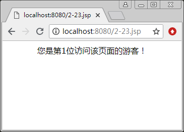
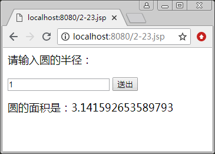

# JSP 声明：变量、方法和类的声明

在 JSP 页面中可以声明变量、方法和类，其声明格式如下：

<%!声明变量、方法和类的代码％>

特别要注意，在“<%“与“!”之间不要有空格。声明的语法与在 Java 语言中声明变量和方法时的语法是一样的。

## 声明变量

在“<%!”和“％>”标记之间声明变量，即在“<%!”和“％>”之间放置 Java 的变量声明语句。变量的类型可以是 Java 语言允许的任何数据类型。我们将这些变量称为 JSP 页面的成员变量。

【例 1】声明变量：

```
<%!
    int x,y=100,z;
    String tom=null,jery="Love JSP";
    Date date;
%>
```

这里，“<%!”和“％>”之间声明的变量在整个 JSP 页面内都有效，因为 JSP 引擎将 JSP 页面转译成 Java 文件时，将这些变量作为类的成员变量，这些变量的内存空间直到服务器关闭才被释放。

当多个客户请求一个 JSP 页面时，JSP 引擎为每个客户启动一个线程，这些线程由 JSP 引擎服务器来管理。这些线程共享 JSP 页面的成员变量，因此任何一个用户对 JSP 页面成员变量操作的结果，都会影响到其他用户。

## 声明方法

在“<%!”和“%>”标记之间声明的方法，在整个 JSP 页面有效，但是，方法内定义的变量只在方法内有效。

【例 2】声明方法：

```
<%@ page contentType="text/html; charset=utf-8" %>
<%!
    int num = 0;                    //声明一个计数变量
    synchronized void add()
    {
        //该方法实现访问次数的累加操作
        num++;
    }
%>
<% add(); %>           
<html>
    <body><center>您是第<%=num%>位访问该页面的游客！</center></body>
</html>
```

运行结果如图 1 所示。


图 1 使用方法的声明
示例中声明了一个 num 变量和 add() 方法。add() 方法对 num 变量进行累加操作，synchronized 修饰符可以使多个同时访问 add() 方法的线程排队调用。

当第一个用户访问该页面后，变量 num 被初始化，服务器执行 <% add(); %> 小脚本程序，从而 add() 方法被调用，num 变为 1。当第二个用户访问时，变量 num 不再被重新初始化，而使用前一个用户访问后的 num 值，之后调用 add() 方法，num 值变为 2。

## 声明类

可以在“<%!”和“%>”之间声明一个类。该类在 JSP 页面内有效，即在 JSP 页面的 Java 程序段部分可以使用该类创建对象。下例中，定义了一个 Circle 类，该类的对象负责求圆的面积。当客户向服务器提交圆的半径后，该对象计算圆的面积。

【例 3】使用类的声明：

```
<%@ page contentType="text/html; charset=utf-8"%>
<html>
    <head>
        <title></title>
    </head>
    <body>
        <p>
            <font size="4">请输入圆的半径：<br></font>
        </p>
        <form action="" method="get" name="form" id="form">
            <font size="4"><input type="text" name="cat" value="1"> <input type="submit" value="送出" name="submit"></font>
        </form><%!
        public class Circle
        {
            double r;
            Circle(double r)
        {
        this.r = r;
        }
        double 求面积()
        {
        return Math.PI*r*r;
        }
        }
        %><%
        String str = request.getParameter("cat");
        double r;
        if(str != null)
        {
            r = Double.parseDouble(str);
        }
        else
        {
            r = 1;
        }
        Circle circle = new Circle(r);
        %>
        <p>
            <font size="4">圆的面积是：<%=circle.求面积()%></font>
        </p>
    </body>
</html>
```

运行结果如图 2 所示。


图 2 使用类声明