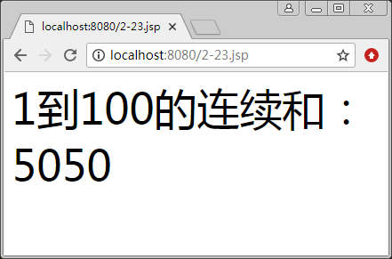

# JSP 中嵌入 Java 代码

JSP 允许在“<%”和“%>”之间插入 Java 程序段。一个 JSP 页面可以有许多程序段，这些程序段将被 JSP 引擎按顺序执行。

在一个程序段中声明的变量叫作 JSP 页面的局部变量，它们在 JSP 页面内的相关程序段以及表达式内都有效。这是因为 JSP 引擎将 JSP 页面转译成 Java 文件时，将各个程序段的这些变量作为类中某个方法的变量，即局部变量。

利用程序段的这个性质，有时可以将一个程序段分割成几个更小的程序段，然后在这些小的程序段之间再插入 JSP 页面的一些其他标记元素。

当程序段被调用执行时，会为这些变量分配内存空间，当所有的程序段调用完毕后，这些变量即可释放所占的内存。

当多个客户请求一个 JSP 页面时，JSP 引擎为每个客户启动一个线程，一个客户的局部变量和另一个客户的局部变量会分配不同的内存空间。因此，一个客户对 JSP 页面局部变量操作的结果，不会影响到其他客户的这个局部变量。

【例 1】下面的程序段可以计算 1 到 100 的和：

```
<%@ page contentType="text/html; charset=utf-8"%>
<html>
    <head>
        <title></title>
    </head>
    <body>
        <font size="10"><%!
        long continueSum(int n)
        {
            int sum=0;
            for(int i=1; i<=n; i++)
            {
                sum=sum + i;
            }
            return sum;
        }
        %></font>
        <p>
            <font size="10">1 到 100 的连续和：<br>
            <%
            long sum;
            sum=continueSum(100);
            out.print(" " + sum);
            %></font>
        </p>
    </body>
</html>
```

运行结果如图 1 所示。


图 1 在 JSP 中使用 Java 代码段