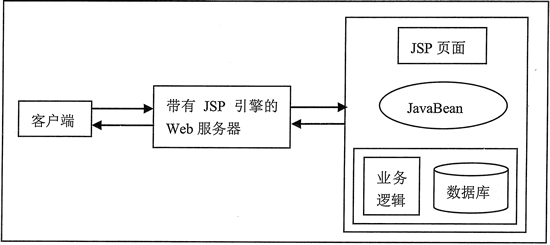
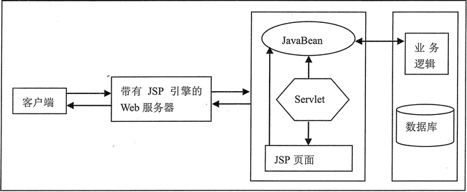
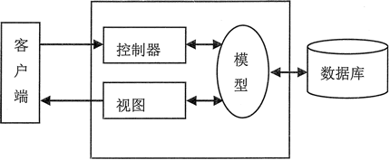

# JSP 开发模式（四种模式）

JSP 程序开发模式包括 JSP 编程、JSP+JavaBean 编程、JSP+JavaBean+Servlet 编程、MVC 模式。

## 单纯的 JSP 编程

在 JSP 编程模式下，通过应用 JSP 中的脚本标志，可以直接在 JSP 页面中实现各种功能。虽然这种模式很容易实现，但是，其缺点也非常明显。因为将大部分的 Java 代码与 HTML 代码混淆在一起，会给程序的维护和调试带来很多困难，而且难以理清完整的程序结构。

这就好比规划管理一个大型企业，如果将负责不同任务的所有员工都安排在一起工作，势必会造成公司秩序混乱、不易管理等许多隐患。所以说，单纯的 JSP 页面编程模式是无法应用到大型、中型甚至小型的 JSP Web 应用程序开发中的。

## JSP+JavaBean 编程

JSP+JavaBean 编程模式是 JSP 程序开发经典设计模式之一，适合小型或中型网站的开发。利用 JavaBean 技术，可以很容易地完成一些业务逻辑上的操作，例如数据库的连接、用户登录与注销等。

JavaBean 是一个遵循了一定规则的 Java 类，在程序的开发中，将要进行的业务逻辑封装到这个类中，在 JSP 页面中，通过动作标签来调用这个类，从而执行这个业务逻辑。此时的 JSP 除了负责部分流程的控制外，主要用来进行页面的显示，而 JavaBean 则负责业务逻辑的处理。

可以看出，JSP+JavaBean 设计模式具有一个比较清晰的程序结构，在 JSP 技术的起步阶段，该模式曾被广泛应用。

图 1 表示该模式对客户端的请求进行处理的过程，相关的说明如下。

1.  用户通过客户端浏览器请求服务器。
2.  服务器接收用户请求后调用 JSP 页面。
3.  在 JSP 页面中调用 JavaBean。
4.  在 JavaBean 中连接及操作数据库，或实现其他业务逻辑。
5.  JavaBean 将执行的结果返回 JSP+ 页面。
6.  服务器读取 JSP 页面中的内容（将页面中的静态内容与动态内容相结合）。
7.  服务器将最终的结果返回给客户端浏览器进行显示。

图 1 JSP+JavaBean 设计模式

## JSP+JavaBean+Servlet 编程

JSP+JavaBean 设计模式虽然已经对网站的业务逻辑和显示页面进行了分离，但这种模式下的 JSP 不但要控制程序中的大部分流程，而且还要负责页面的显示，所以仍然不是一种理想的设计模式。

在 JSP+JavaBean 设计模式的基础上加入 Servlet 来实现程序中的控制层，是一个很好的选择。在这种模式中，由 Servlet 来执行业务逻辑并负责程序的流程控制，JavaBean 组件实现业务逻辑，充当模型的角色，JSP 用于页面的显示。可以看出，这种模式使得程序中的层次关系更明显，各组件的分工也非常明确。图 2 表示该模式对客户端的请求进行处理的过程。

图 2 JSP+JavaBean+Servlet 设计模式
图 2 所示的模式中，各步骤的说明如下。

1.  用户通过客户端浏览器请求服务器。
2.  服务器接收用户请求后调用 Servlet。
3.  Servlet 根据用户请求调用 JavaBean 处理业务。
4.  在 JavaBean 中连接及操作数据库，或实现其他业务逻辑。
5.  JavaBean 将结果返回 Servlet，在 Servlet 中将结果保存到请求对象中。
6.  由 Servlet 转发请求到 JSP 页面。
7.  服务器读取 JSP 页面中的内容（将页面中的静态内容与动态内容结合）。
8.  服务器将最终的结果返回给客户端浏览器进行显示。

但 JSP+JavaBean+Servlet 模式同样也存在缺点。该模式遵循了 MVC 设计模式，MVC 只是一个抽象的设计概念，它将待开发的应用程序分解为三个独立的部分：模型（Model）、视图（View）和控制器（Controller）。

虽然用来实现 MVC 设计模式的技术可能都是相同的，但各公司都有自己的 MVC 架构。也就是说，这些公司用来实现自己的 MVC 架构所应用的技术可能都是 JSP、Servlet 与 JavaBean，但它们的流程及设计却是不同的，所以工程师需要花更多的时间去了解。

从项目开发的观点上来说，因为需要设计 MVC 各对象之间的数据交换格式与方法，所以在系统的设计上需要花费更多的时间。

使用 JSP+JavaBean+Servlet 模式进行项目开发时，可以选择一个实现了 MVC 模式的现成的框架，在此框架的基础上进行开发，能够大大节省开发时间，会取得事半功倍的效果。目前，已有很多可以使用的现成的 MVC 框架，例如 Struts 框架。

## MVC 模式

MVC（Model-View-Controller，模型-视图-控制器）是一种程序设计概念，它同时适用于简单的和复杂的程序。使用该模式，可将待开发的应用程序分解为三个独立的部分：模型、视图和控制器。

提出这种设计模式主要是因为应用程序中用来完成任务的代码（模型，也称为“业务逻辑”）通常是程序中相对稳定的部分，并且会被重复使用，而程序与用户进行交互的页面（视图），却是经常改变的。

如果因需要更新页面而不得不对业务逻辑代码进行改动，或者要在不同的模块中应用相同的功能时重复地编写业务逻辑代码，不仅会降低整体程序开发的进程，而且会使程序变得难以维护。因此，将业务逻辑代码与外观呈现分离，将会更容易地根据需求的改变来改进程序。MVC 模式的模型如图 3 所示。

图 3 MVC 模式的模型
Model（模型）：MVC 模式中的 Model（模型）指的是业务逻辑的代码，是应用程序中真正用来完成任务的部分。

View（视图）：视图实际上就是程序与用户进行交互的界面，用户可以看到它的存在。视图可以具备一定的功能，并应遵守对其所做的约束。在视图中，不应包含对数据处理的代码，即业务逻辑代码。

Controller（控制器）：控制器主要用于控制用户请求并做出响应。它根据用户的请求，选择模型或修改模型，并决定返回什么样的视图。