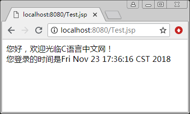
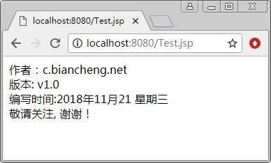
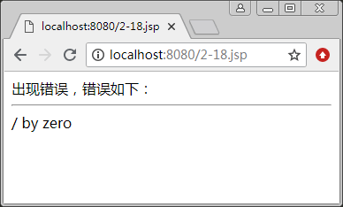

# JSP page 指令

JSP page 指令是页面指令，可以定义在整个 JSP 页面范围有效的属性和相关的功能。利用 page 指令，可以指定脚本语言，导入需要的类，指明输出内容的类型，指定处理异常的错误页面，以及指定页面输出缓存的大小，还可以一次设置多个属性。

page 指令的属性如下：

<%@ page
[language="java"]
[contentType="mimeType[ ;charset=CHARSET ]"]
[import="{package.class|package.*},..."]
[info="text"]
[extends="package.class"]
[session="true|false"]
[errorPage="relativeURL"]
[isThreadSafe="true|false"]
[buffer="none|8kb|size kb"]
[autoFlush="true|false"]
[isThreadSafe="true|false"]
[isELIgnored="true|false"]
[page Encoding="CHARSET"]
%>

#### 提示：

1.  语法格式说明中的“[”和“]”符号括起来的内容表示可选项。
2.  可以在一个页面上使用多个 page 指令，其中的属性只能使用一次（import 属性除外）。

JSP page 指令将使用这些属性的默认值来设置 JSP 页面，下面介绍 page 指令的 13 个属性。

(1) language 属性：设置当前页面中编写 JSP 脚本所使用的语言，默认值为 java。

例如：

```
<%@ page language="java" %>
```

目前只可以使用 Java 语言。

(2) contenType 属性：设置发送到客户端文档响应报头的 MIME（Multipurpose Internet MailExtention）类型和字符编码，多个值之间用“;”分开。contenType 的用法如下：

```
<%@ page contenType="MIME 类型; charset=字符编码" %>
```

MIME 类型被设置为 text/html，如果该属性设置不正确，如设置为 text/css，则客户端浏览器显示 HTML 样式时，不能对 HTML 标识进行解释，而直接显示 HTML 代码。

在 JSP 页面中，默认情况下设置的字符编码为 ISO-8859-1，即 contentType="text/html;charset=ISO-8859-1"。但一般情况下，应该将该属性设置为

```
contentType="text/html;charset=utf-8"
```

此处设置 MIME 类型为 text/html，网页所用字符集为 utf-8。

(3) import 属性：用来导入程序中要用到的包或类，可以有多个值，无论是 Java 核心包中自带的类还是用户自行编写的类，都要在 import 中引入。import 属性的用法如下：

<%@ page import="包名.类名" %>

如果想要导入包里的全部类，可以这样使用：

<%@ page import="包名.*" %>

在 JSP page 指令中，可多次使用该属性来导入多个类。例如：

<%@ page import="包名.类 1" %> <%@ page import="包名.类 2" %>

或者通过逗号间隔来导入多个类：

<%@ page import="包名.类 1,包名.类 2" %>

在 JSP 中，已经默认导入了以下包：

```
java.lang.*
javax.servlet.*
javax.servlet.jsp.*
javax.servlet.http.*
```

所以，即使没有用 import 属性进行导入，在 JSP 页面中也可以调用上述包中的类。

【例 1】显示欢迎信息和用户登录的日期时间。

本例通过导入 java.util.Date 类来显示当前的日期时间。具体步骤如下。

① 使用 page 指令的 import 属性将 java.util.Date 类导入，然后向用户显示欢迎信息，并把当前日期时间显示出来。具体代码如下：

```
<%@ page import="java.util.Date" language="java" contentType="text/html;charset=utf-8"%>
<html>
<body>
您好，欢迎光临 C 语言中文网！<br/>
您登录的时间是<%=new Date()  %>
</body>
</html>
```

② 运行该页面，结果如图 1 所示。


图 1 显示欢迎信息和用户登录的日期时间
(4) info 属性：设置 JSP 页面的相关信息，如当前页面的作者、编写时间等。此值可设置为任意字符串，由 Servlet.getServletInfo() 方法来获取所设置的值。

【例 2】设置并显示 JSP 页面的作者等相关信息。

本例通过 page 指令的 info 属性来设置页面的相关信息，通过 Servlet.getServletInfo() 方法来获取所设置的值，具体步骤如下。

① 使用 page 指令的 info 属性设置页面的作者、版本以及编写时间等。具体代码如下：

```
<%@ page import="java.util.Date" language="java" contentType="text/html;charset=utf-8"%>
<%@ page info="作者：c.biancheng.net <br/> 版本: v1.0 <br/> 编写时间:2018 年 11 月 21 星期三 <br/> 敬请关注, 谢谢！"%>
<html>
<body>
<%
String str=this.getServletInfo();
out.print (str) ;
%>
</body>
<html>
```

② 运行该页面，结果如图 2 所示。


图 2 设置并显示 JSP 页面的作者相关信息
(5)extends 属性：指定将 JSP 页面转换为 Servlet 后继承的类。在 JSP 中，通常不会设置该属性，JSP 容器会提供继承的父类。并且，如果设置了该属性，一些改动会影响 JSP 的编译能力。

(6) session 属性：表示当前页面是否支持 session，如果为 false，则在 JSP 页面中不能使用 session 对象以及 scope=session 的 JavaBean 或 EJB。该属性的默认值为 true。

(7) errorPage 属性：用于指定 JSP 文件的相对路径，在页面出错时，将转到这个 JSP 文件来进行处理。与此相适应，需要将这个 JSP 文件的 isErrorPage 属性设为 true。

设置 errorPage 属性后，JSP 网页中的异常仍然会产生，只不过此时捕捉到的异常将不由当前网页进行处理，而是由 errorPage 属性所指定的网页进行处理。如果该属性值设置为以“/”开头的路径，则错误处理页面在当前应用程序的根目录下；否则在当前页面所在的目录下。

(8) isErrorPage 属性：指示一个页面是否为错误处理页面。设置为 true 时，在这个 JSP 页面中的内置对象 exception 将被定义，其值将被设定为调用此页面的 JSP 页面的错误对象，以处理该页面所产生的错误。

isErrorPage 属性的默认值为 false，此时不能使用内置对象 exception 来处理异常，否则将产生编译错误。

例如，在发生异常的页面上有如下用法：

```
<%@ page errorPage="error.jsp" %>
```

用上面的代码，就可以指明当该 JSP 页面出现异常时，跳转到 error.jsp 去处理异常。而在 error.jsp 中，需要使用下面的语句来说明可以进行错误处理：

```
<%@ page isErrorPage="true" %>
```

【例 3】页面出现异常的处理。

本例通过 page 指令的 errorPage 和 isErrorPage 两个属性来演示当页面出现异常时应如何处理。具体步骤如下。

① 创建 2-18.jsp 页面，使用 page 指令的 errorPage 属性指定页面出现异常时所转向的页面。具体代码如下：

```
<%@ page contentType="text/html; charset=utf-8" errorPage="2-18error.jsp" %>
<html>
<body>
<%
//此页面如果发生异常，将向 2-18error.jsp 抛出异常，并令其进行处理
int x1=5;
int x2=0;
int x3=x1/x2;
out .print (x3);
%>
</body>
</html>
```

该程序执行的是除法运算，如果除数为 0，将会拋出一个数学运算异常，从 errorPage="2-18error.jsp" 可以看出，程序指定 2-18error.jsp 为其处理异常。

② 创建 2-18error.jsp 页面，使用 page 指令的 isErrorPage 属性指定为出错页面，此页面可以使用 exception 异常对象处理错误信息。具体代码如下：

```
<%@ page contentType="text/html; charset=utf-8" isErrorPage="true" %>
<html>
<body>
出现错误，错误如下：<br/>
<hr>
<%=exception.getMessage() %>
</body>
</html>
```

③ 运行 2-18.jsp 页面，结果如图 3 所示。


图 3 页面出现异常处理

#### 提示：

为了确译当页面出错时跳转到 errorPage 所指的页面，需要打开 IE 浏览器，选择“工具”→“Internet 选项”菜单命令，在弹出的对话框中选择“高级”选项卡，取消选中“显示友好 HTTP 错误信息”复选框。

(9) buffer 属性：内置输出流对象 out 负责将服务器的某些信息或运行结果发送到客户端显示，buffer 属性用来指定 out 缓冲区的大小。其值可以是 none、8KB 或是给定的 KB 值。

值为 none 表示没有缓存，直接输出至客户端的浏览器中；如果将该属性指定为数值，则输出缓冲区的大小不应小于该值，默认为 8KB（因不同的服务器而不同，但大多数情况下都为 8KB）。

(10) autoFlush 属性：当缓冲区满时，设置是否自动刷新缓冲区。默认值为 true，表示当缓冲区满时，自动将其中的内容输出到客户端；如果设为 false，则当缓冲区满时会出现 JSP Buffer overflow 溢出异常。

#### 提示：

当 buffer 属性的值设置为 none 时，autoFush 属性的值不能设置为 false。

(11) isThreadSafe 属性：设置 JSP 页面是否可以多线程访问。默认值为 true，表示当前 JSP 页面被转换为 Servlet 后，会以多线程的方式处理来自多个用户的请求；如果设置为 false，则转换后的 Servlet 会实现 SingleThreadMode 接口，并且将以单线程的方式来处理用户请求。

(12) pageEncoding 属性：设置 JSP 页面字符的编码，常见的编码类型有 ISO-8859-1、gb2312、utf-8 和 GBK 等。默认值为 ISO-8859-1。其用法如下：

<%@ page pageEncoding="字符编码" %>

例如：

```
<%@ page pageEncoding="utf-8" %>
```

这表示网页使用了 utf-8 编码，与 contentType 属性中的字符编码设置作用相同。

(13) isELIgnored 属性：其值可设置为 true 或 false，表示是否在此 JSP 网页中执行或忽略表达式语言 ${}。设置为 true 时，JSP 容器将忽略表达式语言。