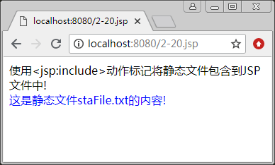

# JSP include 动作

include 动作用于把另外一个文件的输出内容插入当前 JSP 页面的输出内容中，这种在 JSP 页面执行时引入的方式称为动态引入，这样，主页面程序与被包含文件是彼此独立的，互不影响。被包含的文件可以是一个动态文件（JSP 文件），也可以是一个静态文件（如文本文件）。

其语法格式如下：

<jsp:include page="relativeURL | <%=expressicry%>" />

说明：page 属性指定了被包含文件的路径，其值可以是一个代表相对路径的表达式。当路径以“/”开头时，将在当前应用程序的根目录下查找文件；如果是以文件名或文件夹名开头，将在当前页面的目录下查找文件。书写此动作标记时，“jsp”和“:”以及“include”三者之间不要有空格，否则会出错。

include 动作对包含的动态文件和静态文件的处理方式是不同的。

*   如果包含的是一个静态文件，被包含文件的内容将直接嵌入 JSP 文件中存放 <jsp:include> 动作的位置，而且当静态文件改变时，必须将 JSP 文件重新保存（重新转译），然后才能访问变化了的文件。
*   如果包含的是一个动态文件，则由 Web 服务器负责执行，把执行后的结果传回包含它的 JSP 页面中，若动态文件被修改，则重新运行 JSP 文件时就会同步发生变化。

【例 1】在 JSP 文件中使用 <jsp:include> 动作包含静态文件。

① 创建静态文件 staFile.txt，输入以下代码：

```
<font color="blue" size="3">
<br>这是静态文件 staFile.txt 的内容!
</font>
```

② 创建主页面文件 2-20.jsp，具体代码如下：

```
<%@ page contentType="text/html;charset=utf-8" %>
<html>
<body>
使用&lt;jsp:include&gt;动作标记将静态文件包含到 JSP 文件中!
</hr>
<jsp:include page="staFile.txt"  />
</body>
</html>
```

③运行 2-20.jsp，运行结果如图 1 所示。


图 1 使用<jsp:include>动作标记包含静态文件
要注意，<jsp:indude> 动作与前面讲解的 include 指令作用类似，现将它们之间的差异总结如下。

#### 1\. 属性不同

include 指令通过 file 属性来指定被包含的页面，该属性不支持任何表达式。如果在 file 属性值中应用了 JSP 表达式，会拋出异常。例如下面的代码：

```
<% String fpath="top.jsp"; %>
<%@ include file="<%=fpath%>" %>
```

该用法将会拋出如下异常：

```
File "/<%=fpath%>" not fount
```

<jsp:include> 动作是通过 page 属性来指定被包含页面的，该属性支持 JSP 表达式。

#### 2\. 处理方式不同

使用 include 指令包含文件时，被包含文件的内容会原封不动地插入到包含页中使用该指令的位置，然后 JSP 编译器再对这个合成的文件进行翻译，所以最终编译后的文件只有一个。

而使用 <jsp:include> 动作包含文件时，只有当该标记被执行时，程序才会将请求转发到（注意是转发，而不是请求重定向）被包含的页面，再将其执行结果输出到浏览器中，然后重新返回到包含页来继续执行后面的代码。因为服务器执行的是两个文件，所以 JSP 编器将对这两个文件分别进行编译。

#### 3\. 包含方式不同

include 指令的包含过程为静态包含，因为在使用 include 指令包含文件时，服务器最终执行的是将两个文件合成后由 JSP 编译器编译成的一个 Class 文件，所以被包含文件的内容应是固定不变的，若改变了被包含的文件，则主文件的代码就发生了改变，因此服务器会重新编译主文件。

<jsp:include> 动作的包含过程为动态包含，通常用来包含那些经常需要改动的文件。

因为服务器执行的是两个文件，被包含文件的改动不会影响主文件，因此服务器不会对主文件重新编译，而只须重新编译被包含的文件即可。并且对被包含文件的编译是在执行时才进行的，也就是说，只有当 <jsp:include> 动作被执行时，使用该标记包含的目标文件才会被编译，否则，被包含的文件不会被编译。

#### 4\. 对被包含文件的约定不同

使用 include 指令包含文件时，因为 JSP 编译器是对主文件和被包含文件进行合成后再翻译，所以对被包含文件有约定。例如，被包含的文件中不能使用 <html></html>、<body></body> 标记；被包含文件要避免变量和方法在命名上与主文件冲突的问题。

#### 提示：

如果在 JSP 页面中需要显示大量的文本文字，可以将文字写入静态文件中（如记事本），然后通过 include 指令或动作标记包含进来，以提高代码的可读性。