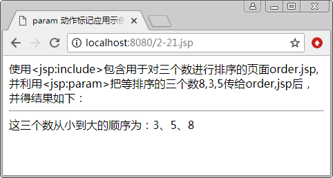

# JSP param 动作

当使用 <jsp:include> 动作标记引入的是一个能动态执行的程序时，如 Servlet 或 JSP 页面，可以通过使用 <jsp:param> 动作标记向这个程序传递参数信息。

其语法格式如下：

<jsp:include page="relativeURL | <%=expression%>">
<jsp:param name="pName1" value="pValue1 | <%=expression1%>" />
<jsp:param name="pName2" value="pValue2 | <%=expression2%>" />
...
</jsp:include>

说明：<jsp:param> 动作的 name 属性用于指定参数名，value 属性用于指定参数值。在 <jsp:include> 动作标记中，可以使用多个 <jsp:param> 传递参数。另外，<jsp:forward> 和 <jsp:plugin> 动作标记中都可以利用 <jsp:param> 传递参数。

【例 1】使用 <jsp:param> 动作标记向被包含文件传递参数。

① 创建主页面 2-21.jsp，用 <jsp:include> 包含用于对三个数进行排序的页面 order.jsp，并且使用 <jsp:param> 向其传递 3 个参数。具体代码如下：

```
<%@ page contentType="text/html;charset=utf-8" %>
<html>
<head>
<title> param 动作标记应用示例 </title>
</head>
<body>
使用&lt;jsp:include&gt;包含用于对三个数进行排序的页面 order.jsp,<br>
并利用&lt;jsp:param&gt;把等排序的三个数 8,3,5 传给 order,jsp 后，<br>
并得结果如下：
<hr/>
<jsp:include page="order.jsp">
<jsp:param name="num1" value="8"/>
<jsp:param name="num2" value="3"/>
<jsp:param name="num3" value="5"/>
</jsp:include>
</body >
</html>
```

② 创建用于对三个数进行排序的页面 order.jsp，具体代码如下：

```
<%@ page contentType="text/html;charset=utf-8" %>
<html>
<head>
<title> param 动作标记应用示例 </title>
</head>
<body>
<%
    String str1=request.getParameter("num1");    //取得参数 num1 的值
    int m1=Integer.parseInt(str1);                //将字符串转换成整型
    String str2=request.getParameter("num2");    //取得参数 num2 的值
    int m2=Integer.parseInt(str2);                //将字符串转换成整型
    String str3=request.getParameter("num3");    //取得参数 num3 的值
    int m3=Integer.parseInt(str3);                //将字符串转换成整型
    int t;
    if(m1>m2)
    {
        t=m1;
        m1=m2;
        m2=t;
    }
    if(m2>m3)
    {
        t=m2;
        m2=m3;
        m3=t;
    }
    if(m1>m2)
    {
        t=m1;
        m1=m2;
        m2=t;
    }
%>
<font color="blue" size="4">
</font>
这三个数从小到大的顺序为：<%=m1%>、<%=m2%>、<%=m3%>
</body>
</html>
```

③ 运行 2-21.jsp，运行结果如图 1 所示。


图 1 使用<jsp:param>动作标记向被包含文件传递参数