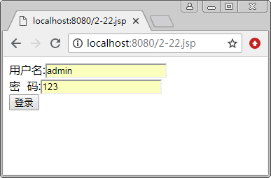
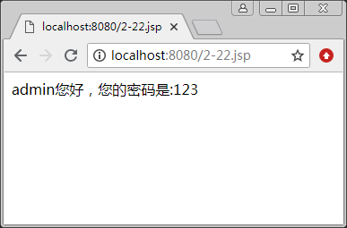

# JSP forward 动作

在大多数的网络应用程序中，都有这样的情况：在用户成功登录后转向欢迎页面，此处的“转向”，就是跳转。<jsp:forward> 动作标记就可以实现页面的跳转，用来将请求转到另外一个 JSP、HTML 或相关的资源文件中。

当 <jsp:forward> 动作标记被执行后，当前的页面将不再被执行，而是去执行该标记指定的目标页面，但是，用户此时在地址栏中看到的仍然是当前网页的地址，而内容却已经是转向的目标页面了。

其语法格式如下：

<jsp:forward page="relativeURL" | "<%=expression %>" />

如果转向的目标是一个动态文件，还可以向该文件传递参数，使用格式如下：

<jsp:forward page="relativeURL" | "<%=expression %>" />
<jsp:param name="pName1" value="pValue1 | <%=expression1 %>" />
<jsp:param name="pName2" value="pValue2 | <%=expression2 %>" />

说明如下：

1.  page 属性用于指定要跳转到的目标文件的相对路径，也可以通过执行一个表达式来获得。如果该值以“/”开头，表示在当前应用的根目录下查找目标文件，否则，就在当前路径下查找目标文件。请求被转向到的目标文件必须是内部的资源，即当前应用中的资源。如果想通过 forward 动作转发到外部的文件中，将出现资源不存在的错误信息。
2.  forward 动作执行后，当前页面将不再被执行，而是去执行指定的目标页面。
3.  转向到的文件可以是 HTML 文件、JSP 文件、程序段，或者其他能够处理 request 对象的文件。
4.  forward 动作实现的是请求的转发操作，而不是请求重定向。它们之间的一个区别就是：进行请求转发时，存储在 request 对象中的信息会被保留并被带到目标页面中；而请求重定向是重新生成一个 request 请求，然后将该请求重定向到指定的 URL，所以，事先储存在 request 对象中的信息都不存在了。

【例 1】使用 <jsp:forward> 动作标记实现网页跳转。

① 创建主页面 2-22.jsp，通过表单输入用户名和密码，单击“登录”按钮，利用 <jsp:forward> 动作标记跳转到页面 target.jsp。具体代码如下：

```
<%@ page contentType="text/html;charset=utf-8" %>
<html>
<body>
<form action=" " method="post" name="Form"> <!--提交给本页处理-->
用户名:<input name="UserName" type="text" /> <br/>
密&nbsp;&nbsp;码:<input name="UserPwd" type="text" /> <br/>
<input type="submit" value="登录" />
</form>
<%
    //当单击“登录”按钮时，调用 Form1.submit()方法提交表单至本文件，
    //用户名和密码均不为空时，跳转到 targe.jsp，并且把用户名和密码以参数形式传递
    String s1=null,s2=null;
    s1=request.getParameter("UserName");
    s2=request.getParameter("UserPwd");
    if(s1!=null && s2!=null)
    {
%>
<jsp:forward page="target.jsp" >
<jsp:param name="Name" value="<%=s1%>" />
<jsp:param name="Pwd" value="<%=s2%>" />
</jsp:forward >
<%
    }
%>
</body>
</html>
```

② 创建所转向的目标文件 target.jsp，具体代码如下：

```
<%@ page contentType="text/html;charset=utf-8" %>
<html>
<body>
<%
String strName=request.getParameter("UserName");
String strPwd=request.getParameter("UserPwd");
out.println(strName+"您好，您的密码是:"+strPwd);
%>
</body>
</html>
```

③ 运行 2-22.jsp，结果如图 1 所示。



图 1 使用<jsp:forward>动作标记实现网页跳转