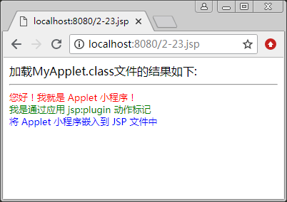

# JSP plugin 动作

<jsp:plugin> 动作可以在页面中插入 Java Applet 小程序或 JavaBean，它们能够在客户端运行，但此时，需要在 IE 浏览器中安装 Java 插件。当 JSP 文件被编译并送往浏览器时，<jsp:plugin> 动作将会根据浏览器的版本，替换成 <object> 或者 <embed> 页面 HTML 兀素。

注意，<object> 用于 HTML 4.0，<embed> 用于 HTML 3.2。

通常，<jsp:plugin> 元素会指定对象是 Applet 还是 Bean，同样也会指定 class 的名字以及位置。另外，还会指定将从哪里下载 Java 插件。该动作的语法格式如下：

<jsp:plugin
type="bean|applet" code="ClassFi1eName"
codebase="classFileDirectoryName"
[name="instanceName"]
[archive="URIToArchive,..."]
[align="bottom|top|middle|left|right"]
[height="displayPixels"]
[width="displayPixels"]
[hspace="leftRightPixels"]
[vspace="topBottomPixels"]
[jreversion="JREVersionNumber|1.1"]
[nspluginurl="URLToPlugin"]
[iepluginurl="URLToPlugin"] >
[<jsp:params>
<jsp:param name="parameterName"
value="{parameterValue|<%=expression %>" />
</jsp:params>]
[<jsp:fallback>text message for user</jsp:fallback>]
</jsp:plugin>

参数说明如下：

1.  type 属性的作用是定义插入对象的类型，对象类型有两个值，分别是 bean 或者 applet。（必须定义的属性）
2.  code 属性定义插入对象的类名，该类必须保存在 codebase 属性指定的目录内。（必须定义的属性）
3.  codebase 属性定义对象的保存目录。（必须定义的属性）
4.  name 属性定义 bean 或 Applet 的名字。
5.  archive 属性定义 Applet 运行时需要的类包文件。
6.  align 属性定义 Applet 的显示方式。
7.  height 属性定义 Applet 的高度。
8.  width 属性定义 Applet 的长度。
9.  hspace 属性定义 Applet 的水平空间。
10.  vspace 属性定义 Applet 的垂直空间。
11.  jreversion 属性定义 Applet 运行时所需要的 JRE 版本，缺省值是 1.1。
12.  nspluginurl 属性定义 Netscape Navigator 用户在没有定义 JRE 运行环境时下载 JRE 的地址。
13.  iepluginurl 属性定义 IE 用户在没有定义 JRE 运行环境时下载 JRE 的地址。
14.  jsp:params 标识的作用是定义 Applet 的传入参数。
15.  jsp:fallback 标识的作用是当对象不能正确显示时传给用户的信息。

【例 1】使用 <jsp:plugin> 动作标记在 JSP 中加载 Java Applet 小程序。

① 创建 2-23.jsp 页面，使用 <jsp:plugin> 动作标记加载：

```
<%@ page contentType="text/html;  charset=utf-8" %>
<html>
<body>
加载 MyApplet.class 文件的结果如下: <hr/>
<jsp:plugin type="applet" code="MyApplet.class" codebase="."
  jreversion="1.2" width="400" heigh="80">
<jsp:fallback>
   加载 Java Applet 小程序失败!
</jsp:fallback>
</jsp:plugin>
</body>
</html>
```

② 其中插件所执行的类 MyApplet.class 的源文件为 MyApplet.java，代码如下：

```
import java.applet.*;
import java.awt.*;
public class MyApplet extends Applet
{
    public void paint(Graphics g)
    {
        g.setColor(Color.red);
        g.drawString("您好！我就是 Applet 小程序！",5,10);
        g.setColor(Color.green);
        g.drawString("我是通过应用<jsp:plugin>动作标记",5,30);
        g.setColor(Color.blue);
        g.drawString("将 Applet 小程序嵌入到 JSP 文件中",5,50);
    }
}
```

将 2-23.jsp 及 MyApplet.java 文件经过 Java 编译器编译成功后，生成的 MyApplet.class 字节文件都存放在 ch02 目录下。

重新启动 Tomcat 后，在 IE 浏览器的地址栏中输入 http://localhost:8080/ch02/2-23.jsp，按 Enter 键后，若客户机上没有安装 JYM（Java 虚拟机），将会访问 Sun 公司的网站，并且弹出下载 Java plugin 的界面。

下载完毕后，将会出现 Java plugin 插件的安装界面，可以按照向导提示，逐步完成安装过程。然后，就可以使用 JVM 而不是 IE 浏览器自带的 JVM 来加载执行 MyApplet.class 字节码文件了，最终得到的运行结果如图 1 所示。


图 1 使用<jsp:plugin>标记在 JSP 中加载 Java Applet 小程序