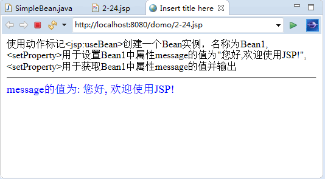

# JSP getProperty 动作

<jsp:getProperty> 标记用来获得 bean 中的属性，并将其转换为字符串，再在 JSP 页面中输出，该 bean 中必须具有 getXxx() 方法。使用的语法格式如下：

<jsp:getProperty name="Bean 实例名" property="prbpertyName" />

下面对 name 属性和 property 属性的用法进行详细介绍。

(1) name 属性：用来指定一个存在于 JSP 中某个范围内的 bean 实例。

<jsp:getProperty> 标记会按照 page、request、session 和 application 的顺序查找 bean 实例，直到第一个实例被找到。如果任何范围内都不存在这个 bean 实例，则会拋出异常。

(2) property 属性：该属性指定要获取由 name 属性指定的 bean 中的哪个属性的值。若它指定的值为 stuName，那么 bean 中必须存在 getStuName() 方法，否则会拋出异常。如果指定 bean 中的属性是一个对象，那么该对象的 toString() 方法将被调用，并输出执行结果。

【例 1】创建一个 JavaBean，设置并且读取它的 info 属性值。

① 在 Eclipse 环境下，创建 JavaBean 文件 SimpleBean.java，步骤如下。

鼠标右击，从快捷菜单中选择“新建”→“包”命令，输入包名“com.bean”，然后右击包名 com.bean，从快捷菜单中选择“新建”→“类”命令，输入类名“SimpleBean”，之后输入如下代码：

```
package com.bean;
public class SimpleBean
{
    private String message=" ";
    public String getMessage()
    {
        return(message);
    }
    public void setMessage(String str)
    {
        this.message=str;
    }
}
```

② 新建文件 2-24.jsp，创建名为 Beanl 的 JavaBean，设置 message 属性的值为“您好，欢迎使用 JSP!”，再获取其值输出到页面。具体代码如下：

```
<%@ page contentType="text/html;charset=utf-8" %>
<html>
<body>
使用动作标记&lt;jsp:useBean&gt;创建一个 Bean 实例，名称为 Bean1,<br/>
&lt;setProperty&gt;用于设置 Bean1 中属性 message 的值为"您好,欢迎使用 JSP!",<br/>
&lt;setProperty&gt;用于获取 Bean1 中属性 message 的值并输出<br/>
<jsp:useBean id="Bean1" class="com.bean.SimpleBean"  />
<jsp:setProperty name="Bean1" property="message" value="您好, 欢迎使用 JSP! "/>
<hr>
<font size=4 color="blue"> message 的值为:
  <jsp:getProperty name="Bean1" property="message"  />
</font >
</body>
</html>
```

③ 运行 2-24.jsp，运行结果如图 1 所示。


图 1 创建和使用 JavaBean