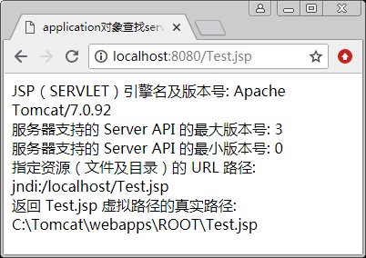
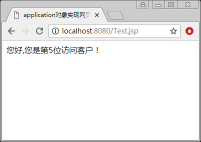

# JSP application 对象

JSP application 对象用于保存应用程序的公用数据，服务器启动并自动创建 application 对象后，只要没有关闭服务器，application 对象就一直存在，所有用户共享 application 对象。

## 查找 Servlet 有关的属性信息

JSP application 对象是 javax.servlet.ServletContext 类的实例，这有助于查找有关 Servlet 引擎和 Servlet 环境的信息。它的生命周期从服务器启动到关闭。在此期间，对象将一直存在。这样，在用户的前后连接或不同用户之间的连接中，可以对此对象的同一属性进行操作。在任何地方 对此对象属性的操作，都会影响到其他用户的访问。

表 1 列出了 application 对象的常用方法。

表 1 application 对象的常用方法

| 方法 | 说明 |
| getAttribute( String arg) | 获取 application 对象中含有关键字的对象 |
| getAttributeNames() | 获取 application 对象的所有参数名字 |
| getMajorVersion() | 获取服务器支持 Servlet 的主版本号 |
| getMinorVersion() | 获取服务器支持 Servlet 的从版本号 |
| removeAttribute(java.lang.String name) | 根据名字删除 application 对象的参数 |
| setAttribute(String key,Object obj) | 将参数 Object 指定的对象 obj 添加到 application 对象中，并 为添加的对象指定一个索引关键字 |

【例 1】利用 application 对象查找 Servlet 有关的属性信息，包括 Servlet 的引擎名、版本号、服务器支持的 Servlet API 的最大和最小版本号、指定资源的路径等。文件名为 Test.jsp，代码如下：

```
<%@ page contentType="text/html;charset=utf-8"%>
<html>
<head>
   <title>application 对象查找 servlet 有关的属性信息</title>
<head>
<body>
    JSP（SERVLET）引擎名及版本号:
    <%=application.getServerInfo()%><br>
    服务器支持的 Server API 的最大版本号:
    <%=application.getMajorVersion ()%><br>
    服务器支持的 Server API 的最小版本号:
    <%=application.getMinorVersion ()%><br>
    指定资源（文件及目录）的 URL 路径:
    <%=application.getResource("Test.jsp")%><br>
    返回 Test.jsp 虚拟路径的真实路径:
    <%=application.getRealPath("Test.jsp")%>
</body>
</html>
```

运行结果如图 1 所示。


图 1 利用 application 对象查找 Servlet 有关的属性信息

## 管理应用程序属性

application 对象与 session 对象相同，都可以设置属性。但是，两个属性的有效范围是不同的。

在 session 对象中，设置的属性只在当前客户的会话范围（session scope）有效，客户超过预期时间不发送请求时，session 对象将被回收。

在 application 对象中设置的属性在整个应用程序范围（application scope）都有效。即使所有的用户都不发送请求，只要不关闭应用服务器，在其中设置的属性也是有效的。

【例 2】以 application 对象管理应用程序属性。用 application 对象的 setAttribute() 和 getAttribute() 方法实现网页计数器功能，代码如下：

```
<%@ page contentType="text/html;charset=utf-8"%>
<html>
<head>
   <title>application 对象实现网页计数器</title>
<head>
<body>
<%
    int n=0;
    if(application.getAttribute("num")==null)
        n=1;
    else
    {
        String str=application.getAttribute("num").toString();
        //getAttribute("num")返回的是 Object 类型
        n=Integer.valueOf(str).intValue()+1;
    }
    application.setAttribute("num",n);
    out.println("您好,您是第"+application.getAttribute("num")+"位访问客户！");
%>
</body>
</html>
```

运行结果如图 2 所示。


图 2 网站计数器