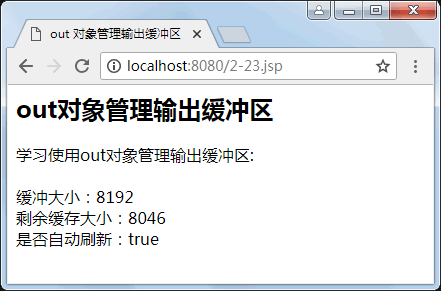

# JSP out 对象：向客户端输出数据

out 对象是一个输出流，用来向客户端输出数据，可以是各种数据类型的内容，同时，它还可以管理应用服务器上的输出缓冲区，缓冲区的默认值是 8KB，可以通过页面指令 page 来改变默认大小。

out 对象是一个继承自抽象类 javax.servlet.jsp.JspWriter 的实例，在实际应用中，out 对象会通过 JSP 容器变换为 java.io.PrintWriter 类的对象。

在使用 out 对象输出数据时，可以对数据缓冲区进行操作，及时清除缓冲区中的残余数据，为其他的输出让出缓冲空间。数据输出完毕后要及时关闭输出流。下面介绍 out 对象的应用。表 1 列出了 out 对象常用的方法。

表 1 out 对象常用的方法

| 方法 | 说明 |
| void print（各种数据类型） | 将指定类型的数据输出到 HTTP 流，不换行 |
| void println（各种数据类型） | 将指定类型的数据输出到 HTTP 流，并输出一个换行符 |
| void newline | 输出换行字符 |

## 向客户端输出数据

在使用 print() 或 println() 方法向客户端输出时，由于客户端是浏览器，因此可以使用 HTML 中的一些标记控制输出格式。例如：

```
out.println("<font color=red>Hello </font>");
```

## 管理输出缓冲区

默认情况下，服务端要输出到客户端的内容不直接写到客户端，而是先写到一个输出缓冲区中。使用 out 对象的 getBufferSize() 方法取得当前缓冲区的大小（单位是 KB），用 getRemaining() 方法取得当前使用后还剩余的缓冲区的大小（单位是 KB）。

JSP 只有在下面三种情况下，才会把缓冲区的内容输出到客户端。

1.  该 JSP 网页已完成信息的输出。
2.  输出缓冲区己满。
3.  JSP 中调用了 out.flush() 或 response.flushBuffer()。

另外，调用 out 对象的 clear() 方法，可以清除缓冲区的内容，类似于重置响应流，以便重新开始操作。如果响应已经提交，则会产生 IOException 异常。此外，另一种方法 clearBuffer() 可以清除缓冲区“当前”内容，而且即使内容已经提交给客户端，也能够访问该方法。

【例 1】用 out 对象管理输出缓冲区，代码如下：

```
<%@ page contentType="text/html;charset=utf-8"%>
<html>
<head>
<title>
    out 对象管理输出缓冲区
</title>
</head>
<body>
<h2>out 对象管理输出缓冲区</h2>
<%out.println("学习使用 out 对象管理输出缓冲区:<br>");%> <br>
缓冲大小：<%=out.getBufferSize()%> <br>
剩余缓存大小：<%=out.getRemaining()%> <br>
是否自动刷新：<%=out.isAutoFlush()%> <br>
</body>
</html>
```

运行结果如图 1 所示。


图 1 用 out 对象管理输出缓冲区