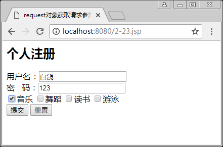
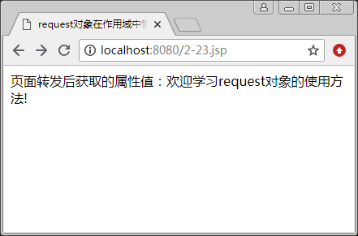
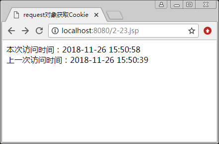

# JSP request 对象：获取客户端的请求信息

客户端可通过 HTML 表单或在网页地址后面提供参数的方法提交数据，然后通过 request 对象的相关方法来获取这些数据。request 对象封装了客户端的请求信息，包括用户提交的信息以及客户端的一些信息，服务端通过 request 对象可以了解到客户端的需求，然后做出响应。

request 对象是 HttpServletRequest（接口）的实例。请求信息的内容包括请求的标题头（Header）信息（如浏览器的版本信息语言和编码方式等），请求的方式（如 HTTP 的 GET 方法、POST 方法等），请求的参数名称、参数值和客户端的主机名称等。

request 对象提供了一些方法，主要用来处理客户端浏览器提交的请求中的各项参数和选项。表 1 列出了 request 对象常用的方法。下面介绍 request 对象的应用。

表 1 request 对象常用的方法

| 方法 | 说明 |
| Object getAttribute(String name) | 用于返回由 name 指定的属性值，如果指定的属性值不存在， 则返回一个 null 值 |
| Enumeration getAttributeNames() | 用于返回 request 对象的所有属性的名称集合 |
| String getCharacterEncoding() | 用于返回一个 String，它包含请求正文中所使用的字符编码 |
| int getContentLength() | 用于返回请求正文的长度（字节数），如果不确定，返回 -1 |
| String getContenType() | 得到请求体的 MIME 类型 |
| ServletlnputStream getInputStream() | 用于返回请求的输入流，用来显示请求中的数据 |
| String getParameter(String name) | 用于获取客户端传送给服务器端的参数。主要由 name 指定， 通常是表单中的参数 |
| Enumeration getParameterNames() | 用于获取客户端传送的所有参数的名字集合 |
| String getParameterValues(String name) | 用于获得指定参数的所有值，由 name 指定 |
| String getProtocol() | 用于返回客户端向服务器端传送数据所依据的协议名称 |
| String getMethod() | 用于获得客户端向服务器端传送数据的参数方法，主要有两个， 分别是 get() 和 post() |
| String getServerName() | 用于获得服务器端的主机名字 |
| int getServletPath() | 用于获得 JSP 文件相对于根地址的地址 |
| String getRemoteAddr() | 用于获得客户端的网络地址 |
| String getRemoteHost() | 用于获取发送此请求的客户端主机名 |
| String getRealPath(String path) | 用于获取一虚拟路径的真实路径 |
| cookie[] get Cookie() | 用于获取所有的 Cookie 对象 |
| void setAttribute(String key,Object obj) | 设置属性的属性值 |
| boolean isSecure() | 返回布尔类型的值，用于确定这个请求是否使用了一个安全协 议，如 HTTP |
| boolean isRequestedSessionldPromCookie() | 返回布尔类型的值，表示会话是否使用了一个 Cookie 来管理 会话 ID |
| boolean isRequestedSessionIdFromURL() | 返回布尔类型的值，表示会话是否使用了一个 URL 来管理会话 ID |
| boolean isRequestedSessionldFromVoid() | 检查请求的会话 ID 是否合法 |

## 获取客户信息

request 对象就是利用表 1 列举的那些 get 方法，来获取客户端的信息。

【例 1】应用 request 对象获取客户信息，代码如下：

```
<%@ page contentType="text/html;charset=utf-8" %>
<html>
<head>
<title>
    request 对象获取客户信息
</title>
</head>
<body>
客户提交信息的方式：<%=request.getMethod() %> <br/>
使用的协议：<%=request.getProtocol() %> <br/>
获取提交数据的客户端 IP 地址：<%=request.getRemoteAddr() %> <br/>
获取服务器端的名称：<%=request.getServerName() %> <br/>
获取服务器端口号：<%=request.getServerPort() %> <br/>
获取客户端的机器名称：<%=request.getRemoteHost() %> <br/>
</body>
</html>
```

送行结果如图 1 所示。


图 1 应用 request 对象获取客户信息

## 获取请求参数

用户借助表单向服务器提交数据，完成用户与网站之间的交互，大多数 Web 应用程序都是这样的。表单中包含文本框、列表、按钮等输入标记。当用户在表单中输入信息后，单击 Submit 按钮提交给服务器处理。

用户提交的表单数据存放在 request 对象里，通常在 JSP 代码中用 getParameter() 或者 getParameterValues() 方法来获取表单传送过来的数据，前者用于获取单值，如文本框、按钮等；后者用于获取数组，如复选框或者多选列表项。使用格式如下：

String getParameter(String name);
String[] getParameterValues(String name);

以上两种方法的参数 name 与 HTML 标记的 name 属性对应，如果不存在，则返回 null。

另外要注意的是，利用 request 的方法获取表单数据时，默认情况下，字符编码为 ISO-8859-1，所以，当获取客户提交的汉字字符时，会出现乱码问题，必须进行特殊处理。

首先，将获取的字符串用 ISO-8859-1 进行编码，并将编码存放到一个字节数组中，然后再将这个数组转化为字符串对象即可，这种方法仅适用于处理表单提交的单值数据或者查询字符串中所传递的参数。关键代码如下：

```
String s1=request.getParameter("UserName");
byte tempB[]=s1.getByte("ISO-8859-1");
String s1=new String(tempB);
```

在处理中文字符乱码问题时，下面设置编码格式的语句在获取表单提交的单值或者数组数据时都更为常用：

```
<%
request.setCharacterEncoding("GBK");    //设置编码格式为中文编码，或者 utf-8
%>
```

【例 2】应用 request 对象获取请求参数。在 3-5.jsp 页面中，利用表单向 3-5-1.jsp 页面提交用户的注册信息，包括用户名、密码和爱好。

3-5.jsp 的代码如下：

```
<%@ page contentType="text/html;charset=utf-8" %>
<html>
<head>
<title>
    request 对象获取请求参数
</title>
</head>
<body>
<h2> 个人注册 </h2>
<form name="form1" method="post" action="3-5-1.jsp">
用户名：<input name="username" type="text"/> <br>
密&nbsp;&nbsp;&nbsp;码：<input name="pwd" type="text" /> <br>
<input name="inst" type="checkbox" value="音乐">音乐
<input name="inst" type="checkbox" value="舞蹈">舞蹈
<input name="inst" type="checkbox" value="读书">读书
<input name="inst" type="checkbox" value="游泳">游泳 <br>
<input type="submit" value="提交" />
<input type="reset" value="重置" />
</form>
</body>
</html>
```

3-5-1.jsp 的代码如下：

```
<%@ page contentType="text/html;charset=utf-8" %>
<html>
<head>
<title>
    request 对象获请求参数
</title>
</head>
<body>
<h2> 获取到的注册信息如下：</h2>
<%
request.setCharacterEncoding("utf-8");
String username=request.getParameter("username");
String pwd=request.getParameter("pwd");
String inst[]=request.getParameterValues("inst");
out.println("用户名为："+username+"<br>");
out.println("密码为："+pwd+"<br>");
out.println("爱好为：");
for(int i=0;i<inst.length;i++)
   out.println(inst[i]+" ");
%>
</body>
</html>
```

3-5.jsp 运行结果如图 2(a) 所示。程序 3-5.jsp 通过表单向 3-5-l.jsp 提交信息，3-5-l.jsp 通过 request 对象获取用户提交的表单数据并进行处理，运行结果如图 2(b) 所示。


a)

b)
图 2 request 对象获取请求参数

## 获取查询字符串

为了在网页之间传递值，常常在请求的 URL 地址后面附加查询字符串，语法如下：

?变量名 1=值 1&变量名 2=值 2...

可以有多个变量参数，参数之间使用 & 来连接，变量的值可以是 JSP 表达式。利用 request getParameter() 方法获取查询字符串中的所有变量及其值。

【例 3】应用 request 对象获取查询字符串，实现页面之间传值的目的。在 3-6.jsp 页面中设置要传递的数据，当单击“显示”肘，超链接到 3-6-1.jsp 页面，并将所传递的信息显示出来。

3-6.jsp 的代码如下：

```
<%@ page contentType="text/html;charset=utf-8" %>
<html>
<head>
<title>
request 对象获取查询字符串
</title>
</head>
<body>
<%
String address="北京";
String college="清华大学";
%>
<h4>请单击下面的链接查看我的相关信息</h4>
<a href="3-6-1.jsp?name=白浅&add=<%=address%>&col=<%=college%>">显示</a>
</body>
</html>
```

3-6-1.jsp 的代码如下:

```
<%@ page contentType="text/html; charset=utf-8" %>
<html>
<head>
<title>
    request 对象获取查询字符串
</title>
</head>
<body>
<%
String m_name=request.getParameter("name");
String m_add=request.getParameter("add");
String m_col=request.getParameter("col");
//处理中文乱码
String ch_name=new String(m_name.getBytes("ISO-8859-1"),"utf-8");
String ch_add=new String(m_add.getBytes("ISO-8859-1"),"utf-8");
String ch_col=new String(m_col.getBytes("ISO-8859-1"),"utf-8");
%>
<%out.println(ch_name+"您好");%><br>
<%out.println("您来自中国"+ch_add);%><br>
<%out.println("毕业于"+ch_col);%><br>
</body>
</html>
```

运行结果分别如图 3(a) 和 (b) 所示。


(a)

(b)
图 3 request 对象获取查询字符串

## 在作用域中管理属性

在进行请求转发时，往往需要把一些数据带到转发后的页面进行处理。这时，就可以使用 request 对象的 setAttribute() 方法设置数据在 request 范围内存取。

#### 1\. 设置转发数据的格式

request.setAttribute("key",value);

参数 key 是键，为 String 类型。在转发后的贡面就通过这个键来获取数据。参数 value 是键值，为 Object 类型，它代表需要保存在 request 范围内的数据。

#### 2\. 获取转发数据的格式

request.getAttribute("key");

参数 key 表示键名，如果指定的属性值不存在，则返回一个 null 值。

在页面使用 request 对象的 setAttribute(“key”,value) 方法，可以把数据 value 设定在 request 范围内。请求转发后的页面使用 getAttribute(“key”) 就可以取得数据 value。

#### 提示：

这一对方法在不同的请求之间传递数据，而且从上一个请求到下一个请求必须是转发请求（使用 <jsp:forward> 动作来实现），即保存的属性在 request 属性范围（request scope）内，而不能是重定向请求（使用 response.sendRedirect() 或者超级链接来实现）。

【例 4】通过 request 对象在作用域中管理属性。使用 request 对象的 setAttribute() 方法设置数据，然后在请求转发后利用 getAttribnte() 取得设置的数据。代码如下：

```
<!--3-7.jsp-->
<%@ page contentType="text/html;charset=utf-8" %>
<html>
<head>
<title>
request 对象在作用域中管理属性
</title>
</head>
<body>
<% request.setAttribute("str","欢迎学习 request 对象的使用方法!"); %>
<jsp:forward page="3-7-1.jsp"/>
</body>
</html>
```

```
<!--3-7-1.jsp-->
<%@ page contentType="text/html; charset=utf-8" %>
<html>
<head>
<title>
    request 对象在作用域中管理属性
</title>
</head>
<body>
<% out.println("页面转发后获取的属性值："+request.getAttribute("str")); %>
</body>
</html>
```

运行结果如图 4 所示。


图 4 request 对象在作用域中管理属性

#### 提示：

在 3-7.jsp 中，若将语句`<jsp:forward page="3-7-1.jsp"/>`改成`response.sendRedirect("3-7.jsp")`或者`<a href="3-7-1.jsp">跳转</a>`，就不能获得 request 范围内的属性值。

## 获取 Cookie

Cookie 是一小段文本信息，伴随着用户请求和页面在 Web 服务器和浏览器之间传递。Cookie 常常用来保存用户信息，以便 Web 应用程序能进行读取，并且当用户每次访问站点时，Web 应用程序都可以读取 Cookie 包含的信息。

例如，当用户访问站点时，可以利用 Cookie 保存用户首选项或其他信息，这样，当用户再次访问站点时，应用程序就可以捡索以前保存的信息。

(1) 通过 request 对象的 getCookies() 方法获取 Cookie 中的数据。获取 Cookie 的方法如下：

Cookie[] cookie=request.getCookies();

request 对象的 getCookies() 方法返回的是 Cookie[] 数组。

(2) 通过 response 对象的 addCookie() 方法添加一个 Cookie 对象。添加 Cookie 的方法如下：

response.addCookie(Cookie cookie)

【例 5】通过 request 对象获取 Cookie。使用 request 对象的 get    () 方法和 response 对象的 addCookie() 方法，记录本次及上次访问网页的时间，代码如下：

```
<%@ page contentType="text/html; charset=utf-8" %>
<html>
<head>
<title>
    request 对象获取 Cookie
</title>
</head>
<body>
<%
    Cookie[] cookies=request.getCookies();   //从 request 中获得 Cookie 集
    Cookie cookies_response=null;         //初始化 Cookie 对象为空
    String t=new java.util.Date().toLocaleString();   //取得当前访问时间
    if(cookies==null)
    {
          cookies_response=new Cookie("AccessTime"," ");
          out.println("您第一次访问，本次访问时间："+t+"<br>");
          cookies_response.setValue(t);
          response.addCookie(cookies_response);
    }
    else
    {
          cookies_response=cookies[0];
          out.println("本次访问时间："+t+"<br>");
        out.println("上一次访问时间："+cookies_response.getValue());
        cookies_response.setValue(t);
        response.addCookie(cookies_response);
    }
%>
</body>
</html>
```

结果如图 5 所示。


图 5 request 对象获取 Cookie

## 访问安全信息

request 对象提供了访问安全属性的方法，主要包括以下 4 种。

1.  isSecure()。
2.  isRequestedSessionldFromCookie()。
3.  isRequestedSessionldFromURL()。
4.  isRequestedSessionldFromValid()。

例如，可使用 request 对象来确定当前请求是否使用了一个类似 HTTP 的安全协议：
用户安全信息：<%=reguest,isSecure() %>

## 访问国际化信息

很多 Web 应用程序都能够根据客户浏览器的设置做出国际化响应，这是因为浏览器会通过 accept-language 的 HTTP 报头向 Web 服务器指明它所使用的本地语言，JSP 开发人员就可以利用 request 对象中的 getLocale() 和 getLocales() 方法获取这一信息，获取的信息属于 Java.util.Local 类型。

使用报头的具体代码如下：

```
<%
java.util.Local locale=request.getLocale();
if(locale.equals(java.util.Locale.US))
{
out.print("Welcome to Beijing");
}
if(locale.equals(java.util.Local.CHINA))
{
out.print("北京欢迎您");
}
%>
```

上述代码表示，如果所在区域为中国，将显示“北京欢迎您”，而所在区域为英国，则显示“Welcome to Beijing”。