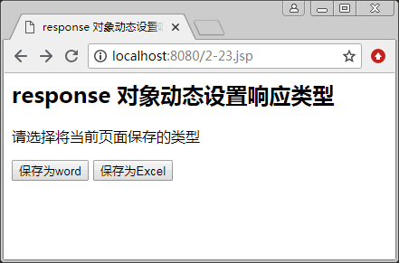
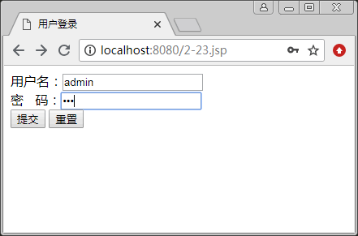
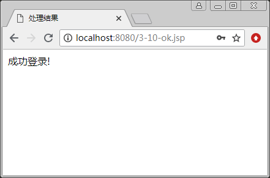
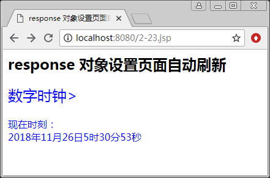
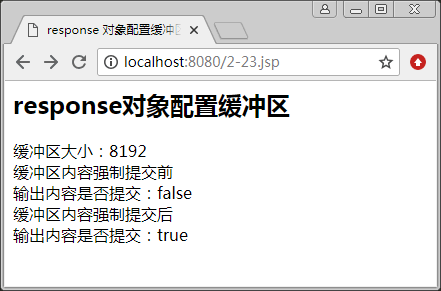

# JSP response 对象：响应客户端的请求并向客户端输出信息

response 对象和 request 对象相对应，用于响应客户请求，向客户端输出信息。response 是 HttpServletResponse 的实例，封装了 JSP 产生的响应客户端请求的有关信息，如回应的 Header，回应本体（HTML 的内容）以及服务器端的状态码等信息，提供给客户端。请求的信 息可以是各种数据类型的，甚至是文件。

response 对象的常用方法如表 1 所示。下面介绍 response 对象的应用。

表 1 response 对象的常用方法

| 方法 | 说明 |
| void addCookie(Cookie cookie) | 添加 Cookie 的方法 |
| void addHeader(String name,String value) | 添加 HTTP 文件指定的头信息 |
| String encodeURL(String url) | 将 URL 予以编码，回传包含 Session ID 的 URL |
| void flushBuffer() | 强制把当前缓冲区内容发送到客户端 |
| int getBufferSize() | 返回响应所使用的实际缓冲区大小，如果没使用缓冲区， 则该方法返回 0 |
| void set BufferSize(int size) | 为响应的主体设置首选的缓冲区大小 |
| boolean isCommitted() | 一个 boolean，表示响应是否已经提交；提交的响应已经 写入状态码和报头 |
| void reset() | 清除缓冲区存在的任何数据，并清除状态码和报头 |
| ServletOutputStream getOutputStream() | 返回到客户端的输出流对象 |
| void sendError(int xc[,String msg]) | 向客户端发送错误信息 |
| void sengRedirect(java.lang.String location) | 把响应发送到另一个位置进行处理 |
| void setCotentType(String type) | 设置响应的 MIME 类型 |
| void setHeader(String name,String value) | 设置指定名字的 HTTP 文件头信息 |
| void setCotentLength(int len) | 设置响应头的长度 |

## 动态设置响应的类型

利用 page 指令设置发送到客户端文档响应报头的 MIME 类型和字符编码，如 `<%@ page contentType="text/html;charset=utf-8"%>`，它表示当用户访问该页面时，JSP 引擎将按照 contentType 的属性值即 text/html（网页）做出反应。

如果要动态改变这个属性值来响应客户，就需要使用 response 对象的 setContentType(String s) 方法。语法格式如下：

response.setContentType("MIME");

MIME 可以为 text/html（网页）、text/plain（文本）、application/x-msexcel（Excel 文件）、application/msword（Word 文件）。

【例 1】通过 response 对象动态设置响应类型。

使用 response 对象的 setContentType(String s) 方法动态设置响应的类型，代码如下：

```
<%@ page contentType="text/html;charset=utf-8" %>
<html>
<head>
<title>
    response 对象动态设置响应类型
</title>
</head>
<body>
<h2> response 对象动态设置响应类型 </h2>
<p>请选择将当前页面保存的类型
<form action=" " method="post" name=frm>
   <input type="submit" value="保存为 word" name="submit1">
   <input type="submit" value="保存为 Excel" name="submit2">
</form>
<%
if(request.getParameter("submit1")!=null)
  response.setContentType("application/msword;charset=GB2312");
if(request.getParameter("submit2")!=null)
  response.setContentType("application/x-msexcel;charset=GB2312");
%>
</body>
</html>
```

运行结果如图 1 所示。


图 1 response 对象动态设置响应类型

## 重定向网页

在某些情况下，当响应客户时，需要将客户引导至另一个页面，例如，当客户输入正确的登录信息时，就需要被引导到登录成功页面，否则被引导到错误显示页面。此时，可以使用 response 的 sendRedirect(URL) 方法将客户请求重定向到一个不同的页面。例如，将客户请求重定向到 login_ok.jsp 页面的代码如下：

```
Response.sendRedirect("login_ok.jsp");
```

在 JSP 页面中，使用 response 对象中的 sendError() 方法指明一个错误状态。该方法接收一个错误以及一条可选的错误消息，该消息将内容主体返回给客户。

例如，代码 response.sendError(500"请求页面存在错误") 将客户请求重定向到一个在内容主体上包含出错消息的出错页面。

【例 2】通过 response 对象重定向网页。使用 response 对象的相关方法重定向网页，完成一个用户登录。

在页面 3-10.jsp 中输入用户名和密码，如图 2(a) 所示，提交给页面 3-10-deal.jsp 进行处理，如果检测到用户名是 Admin，密码是 123，则重定同到成功登录页面 3-10-ok.jsp，如图 2(b) 所示；否则向客户端发送错误信息。


a)

b)
图 2 通过 response 对象重定向网页 3-10.jsp 代码如下：

```
<%@ page contentType="text/html;charset=utf-8" %>
<html>
<head>
<title>
    用户登录
</title>
</head>
<body>
<form name="forml" method="post" action="3-10-deal.jsp">
用户名：<input name="user" type="text" /> <br>
密&nbsp;&nbsp;&nbsp;码：<input name="pwd" type="text" /> <br>
<input type="submit" value="提交" />
<input type="reset" value="重置" />
</form>
</body>
</html>
```

3-10-deal.jsp 代码如下：

```
<%@ page contentType="text/html;charset=utf-8" %>
<html>
<head>
<title>
    处理结果
</title>
</head>
<body>
<%
request.setCharacterEncoding("utf-8");
String user=request.getParameter("user");
String pwd=request.getParameter("pwd");
if(user.equals("Admin")&&pwd.equals("123"))
{
    response.sendRedirect("3-10-ok.jsp");
}
else
{
    response.sendError(500,"请输入正确的用户和密码!");
}
%>
</body>
</html>
```

3-10-ok.jsp 代码如下：

```
<%@ page contentType="text/html;charset=utf-8" %>
<html>
<head>
<title>
    处理结果
</title>
</head>
<body>
成功登录!
</body>
</html>
```

## 设置页面自动刷新以及定时跳转

response 对象的 setHeader() 方法用于设置指定名字的 HTTP 文件头的值，如果该值已经存在，则新值会覆盖旧值。最常用的一个头信息是 refresh，用于设置刷新或者跳转。

(1) 实现页面一秒钟刷新一次，设置语句如下：

response.setHeader("refresh","1");

(2) 实现页面定时跳转，如 2 秒钟后自动跳转到 URL 所指的页面，设置语句如下：

response.setHeader("refresh","2:URL=页面名称");

【例 3】用 response 对象自动刷新客户页面，实现秒表的功能，代码如下：

```
<%@ page contentType="text/html;charset=utf-8" %>
<%@ page import="java.util.*" %>
<html>
<head>
<title>
    response 对象设置页面自动刷新
</title>
</head>
<body>
<h2> response 对象设置页面自动刷新</h2>
<font size="5" color=blue> 数字时钟> </font> <br> <br>
<font size="3" color=blue> 现在时刻：<br>
<%
response.setHeader("refresh","1");
int y,m,d,h,mm,s;
Calendar c=Calendar.getInstance();
y=c.get(Calendar.YEAR);    //年
m=c.get(Calendar.MONTH)+1;    //月
d=c.get(Calendar.DAY_OF_MONTH);    //日
h=c.get(Calendar.HOUR);    //时（HOUR：十二小时制：HOUR_OF_DAY：十二四小时制）
mm=c.get(Calendar.MINUTE);    //分
s=c.get(Calendar.SECOND);    //分
out.println(y+"年"+m+"月"+d+"日"+h+"时"+mm+"分"+s+"秒");
%>
</font>
</body>
</html>
```

运行结果如图 3 所示。


图 3 response 对象自动刷新客户页面

## 配置缓冲区

缓冲可以更加有效地在服务器与客户之间传输内容。HttpServletResponse 对象为支持 jspWriter 对象而启用了缓冲区配置。

【例 4】用 response 对象配置缓冲区。使用 response 对象的相关方法输出缓冲区的大小，并测试强制将缓冲区的内容发送给客户，代码如下：

```
<%@ page contentType="text/html; charset=utf-8" %>
<html>
<head>
<title>
    response 对象配置缓冲区
</title>
</head>
<body>
<h2>response 对象配置缓冲区</h2>
<%
out.print("缓冲区大小："+response.getBufferSize()+"<br>");
out.print("缓冲区内容强制提交前"+"<br>");
out.print("输出内容是否提交："+response.isCommitted()+"<br>");
response.flushBuffer();
out.print("缓冲区内容强制提交后<br>");
out.print("输出内容是否提交："+response.isCommitted()+"<br>");
%>
</body>
</html>
```

运行结果如图 4 所示。


图 4 response 对象配置缓冲区