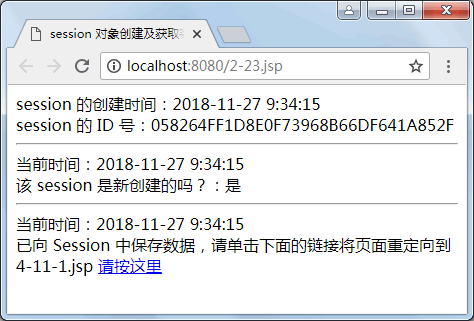
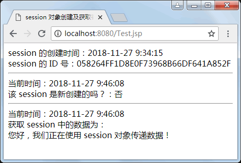
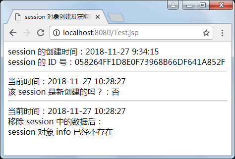
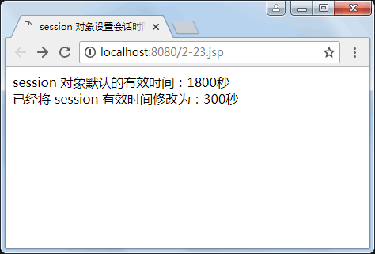

# JSP session 对象

客户与服务器之间的通信是通过 HTTP 协议完成的。HTTP 是一种无状态的协议，当客户向服务器发出请求，服务器接收请求并返回响应后，该连接就被关闭了。此时，服务器端不保留连接的有关信息，要想记住客户的连接信息，可以使用 JSP 提供的 session 对象。

用户登录网站时，系统将为其生成一个独一无二的 session 对象，用以记录该用户的个人信息。一旦用户退出网站，那么，所对应的 session 对象将被注销。session 对象可以绑定若干个用户信息或者 JSP 对象，不同的 session 对象的同名变量是不会相互干扰的。

当用户首次访问服务器上的一个 JSP 页面时，JSP 引擎便产生一个 session 对象，同时分配一个 String 类型的 ID 号，JSP 引擎同时将这个 ID 号发送到客户端，存放在 Cookie 中，这样，session 对象和客户端之间就建立了一一对应的关系。

当用户再次访问该服务器的其他页面时，不再分配给用户新的 session 对象，直到用户关闭浏览器，或者在一定时间（系统默认在 30 分钟内，但可在编写程序时，修改这个时间限定值或者显式地结束一个会话）客户端不向服务器发出应答请求，服务器端就会取消该用户的 session 对象，与用户的会话对应关系消失。当用户重新打开浏览器，再次连接到该服务器时，服务器为该用户再创建一个新的 session 对象。

session 对象保存的是每个用户专用的私有信息，可以是与客户端有关的，也可以是一般信息，可以根据需要设定相应的内容，并且所保存的信息在当前 session 属性范围内是共享的。表 1 列出了 session 对象的常用方法。

表 1 session 对象的常用方法

| 方法 | 说明 |
| Object getAttribute(String name) | 获取指定名字的属性 |
| Enumeration getAttributeName() | 获取 session 中全部属性的名字，一个枚举 |
| long getCreationTime() | 返回 session 的创建时间，单位：毫秒 |
| public String getld() | 返回创建 session 时 JSP 引擎为它设置的唯一 ID 号 |
| long getLastAccessedTime() | 返回此 session 中客户端最近一次请求的时间。由 1970-01-01 算起，单位是毫秒。使用这个方法，可以判断某个用户在站点上
一共停留了多长时间 |
| int getMaxInactiveInterval() | 返回两次请求间隔多长时间 session 被销毁(单位：秒） |
| void setMaxlnactivelnterval(int interval) | 设置两次请求间隔多长时间 session 被销毁(单位：秒） |
| void invalidate() | 销毁 session 对象 |
| boolean isNew() | 判断请求是否会产生新的 session 对象 |
| void removeAttxibute(String name) | 删除指定名字的属性 |
| void setAttribute(String name,String value) | 设定指定名字的属性值 |

使用 session 对象在不同的 JSP 文件（整个客户会话过程，即 session scope）中保存属性信息，比如用户名、验证信息等，最为典型的应用是实现网上商店购物车的信息存储。下面重点介绍 session 对象的应用。

## 创建及获取客户会话属性

JSP 页面可以将任何对象作为属性来保存。使用 setAttribute() 方法设置指定名称的属性，并将其存储在 session 对象中，使用 getAttribute() 方法获取与指定名字 name 相联系的属性。语法格式如下：

session.setAttribute(String name,String value);    //参数 name 为属性名称，value 为属性值
session.getAttribute(String name);    //参数 name 为属性名称

【例 1】用 session 对象创建及获取会话属性。通过 session 对象的 setAttribute() 方法，将数据保存在 session 对象中，并通过 getAttribute() 方法取得数据的值，代码如下：

```
<!--3-13.jsp-->
<%@ page language="java" import="java.util.*" pageEncoding="utf-8" %>
<html>
<head>
<title>
    session 对象创建及获取客户会话属性
</title>
</head>
<body>
    session 的创建时间：<%=new Date(session.getCreationTime()).toLocaleString() %> <br>
    session 的 ID 号：<%=session.getId() %> <br> <hr>
    当前时间：<%=new Date().toLocaleString( ) %> <br>
    该 session 是新创建的吗？：<%=session.isNew()?"是":"否" %> <br> <hr>
    当前时间：<%=new Date().toLocaleString( ) %> <br>
    <% session.setAttribute("info","您好，我们正在使用 session 对象传递数据！"); %>
    已向 Session 中保存数据，请单击下面的链接将页面重定向到 4-11-1.jsp
    <a href="Test.jsp"> 请按这里</a>
</body>
</html>
```

3-13-1.jsp 与 3-13.jsp 的代码基本相同，不同的是获取 session 对象中的属性值的方法，重要代码如下：

```
获取 session 中的数据为：<br>
<%=session.setAttribute("info")%>
```

运行结果如图 1(a) 所示，单击超链接“请按这里”，进入如图 1(b) 所示的页面。


a)页面 3-13.jsp 的运行结果

b)页面 3-13-1.jsp 的运行结果
图 1 用 session 对象创建及获取会话属性

## 从会话中移除指定的对象

JSP 页面可以将任何已经保存的对象部分或者全部移除。使用 removeAttribute() 方法，将指定名称的对象移除，也就是说，从这个会话删除与指定名称绑定的对象。使用 invalidate() 方法，可以将会话中的全部内容删除。语法格式如下：

session.removeAttribute(String name);    //参数 name 为 session 对象的属性名，代表要移除的对象名
session.invalidate();    //把保存的所有对象全部删除

【例 1】用 session 对象从会话中移除指定的对象。继续沿用例 1 中的 3-13.jsp 页面，并且改造 3-13-1.jsp，代码如下：

```
<%@ page language="java" import="java.util.*" pageEncoding="utf-8" %>
<html>
<head>
<title>
    session 对象创建及获取客户会话属性
</title>
</head>
<body>
    session 的创建时间：<%=new Date(session.getCreationTime()).toLocaleString() %> <br>
    session 的 ID 号：<%=session.getId() %> <br> <hr>
    当前时间：<%=new Date().toLocaleString( ) %> <br>
    该 session 是新创建的吗？：<%=session.isNew()?"是":"否" %> <br> <hr>
    当前时间：<%=new Date().toLocaleString( ) %> <br>
    移除 session 中的数据后：<br>
    <%
    session.removeAttribute("info");
    if(session.getAttribute("info")==null)
    {
        out.println("session 对象 info 已经不存在");
    }
    else
    {
        out.println(session.getAttribute("info"));
    }
%>
</body>
</html>
```

运行程序，单击“请按这里”超链接后，将会显示如图 2 所示的页面。


图 2 用 session 对象从会话中移除指定的对象

## 设置会话时限

当某一客户与 Web 应用程序之间处于非活动状态时，并不以显式的方式通知服务器，所以，在 Servlet 程序或 JSP 文件中，做超时设置是确保客户会话终止的唯一方法。

Servlet 程序容器设置一个超时时长，当客户非活动的时间超出时长的大小时，JSP 容器将使 session 对象无效，并撤销所有属性的绑定，这样，就清除了客户申请的资源，从而实现了会话生命周期的管理。

session 用于管理会话生命周期的方法有 getLastAccessedTime()、getMaxInactiveInterval() 和 setMaxInactiveInterval(int interval)。

【例 3】为 session 对象设置会话时限。首先输出 session 对象默认的有效时间，然后设置为 5 分钟，并输出新设置的有效时间。代码如下：

```
<%@ page language="java"  pageEncoding="utf-8" %>
<html>
<head>
<title>
    session 对象设置会话时限
</title>
</head>
<body>
    session 对象默认的有效时间：<%=session.getMaxInactiveInterval()%>秒<br>
    <%
    session.setMaxInactiveInterval(60*5);    //设置 session 的有效时间为 5 分钟
    %>
    已经将 session 有效时间修改为：<%=session.getMaxInactiveInterval()%>秒<br>
</body>
</html>
```

运行结果如图 3 所示。


图 3 session 对象设置会话时限