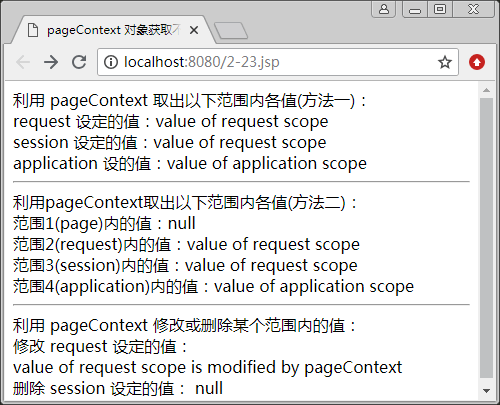

# JSP pageContext 对象

JSP 的内置对象还包括 pageContext、page、config，在接下来的教程中我们将介绍这些内置对象的语法与应用。

pageContext 是页面上下文对象，这个特殊的对象提供了 JSP 程序执行时所需要用到的所有属性和方法，如 session、application、config、out 等对象的属性，也就是说，它可以访问本页所有的 session，也可以取本页所在的 application 的某一属性值，它相当于页面中所有其他对象功能的集大成者，可以用它访问本页中所有的其他对象。

pageContext 对象是 javax.servlet:jsp.pageContext 类的一个实例，它的创建和初始化都是由容器来完成的，JSP 页面里可以直接使用 pageContext 对象的句柄，pageContext 对象的 getXxx()、setXxx() 和 findXxx() 方法可以根据不同的对象范围实现对这些对象的管理。表 1 列出了 pageContext 对象的常用方法。

表 1 pageContext 对象的常用方法

| 方法 | 说明 |
| void forward(String relativeUrlPath) | 把页面转发到另一个页面或者 Servlet 组件上 |
| Exception getException() | 返回当前页的 Exception 对象 |
| ServletRequest getRequest() | 返回当前页的 request 对象 |
| ServletResponse getResponse() | 返回当前页的 response 对象 |
| ServletConfig getServletConfig() | 返回当前页的 ServletConfig 对象 |
| HttpSession getSession() | 返回当前页的 session 对象 |
| Object getPage() | 返回当前页的 page 对象 |
| ServletContext getServletContext() | 返回当前页的 application 对象 |
| public Object getAttribute(String name) | 获取属性值 |
| Object getAttribute(String name,int scope) | 在指定的范围内获取属性值 |
| void setAttribute(String name,Object attribute) | 设置属性及属性值 |
| void setAttribute(String name,Object obj,int scope) | 在指定范围内设置属性及属性值 |
| void removeAttribute(String name) | 删除某属性 |
| void removeAttribute(String name,int scope) | 在指定范围内删除某属性 |
| void invalidate() | 返回 servletContext 对象，全部销毁 |

pageContext 对象的主要作用是提供一个单一界面，以管理各种公开对象（如 session、application、config、request、response 等），提供一个单一的 API 来管理对象和属性。

【例 1】通过 pageContext 对象取得不同范围的属性值，代码如下：

```
<%@ page contentType="text/html;charset=utf-8" %>
<html>
<head>
<title>
    pageContext 对象获取不同范围属性
</title>
</head>
<body>
<%
request.setAttribute("info","value of request scope");
session.setAttribute("info","value of request scope");
application.setAttribute("info","value of application scope");
%>
利用 pageContext 取出以下范围内各值(方法一)：<br>
request 设定的值：<%=pageContext.getRequest().getAttribute("info") %> <br>
session 设定的值：<%=pageContext.getSession().getAttribute("info") %> <br>
application 设的值：<%=pageContext.getServletContext().getAttribute("info") %> <hr>
利用 pageContext 取出以下范围内各值(方法二)：<br>
范围 1(page)内的值：<%=pageContext.getAttribute("info",1) %> <br>
范围 2(request)内的值：<%=pageContext.getAttribute("info",2) %> <br>
范围 3(session)内的值：<%=pageContext.getAttribute("info",3) %> <br>
范围 4(application)内的值：<%=pageContext.getAttribute("info",4) %> <hr>
利用 pageContext 修改或删除某个范围内的值：
<% pageContext.setAttribute("info","value of request scope is modified by pageContext",2); %> <br>
修改 request 设定的值：<br>
<%=pageContext.getRequest().getAttribute("info") %> <br>
<% pageContext.removeAttribute("info"); %>
删除 session 设定的值：<%=session.getAttribute("info") %>
</body>
</html>
```

运行结果如图 1 所示。


图 1 通过 pageContext 对象取得不同范围的属性值

#### 提示：

pageContext 对象在实际 JSP 开发过程中很少使用，因为 request 和 response 等对象可以直接调用方法进行使用，而通过 pageContext 来调用其他对象，会觉得有些麻烦。