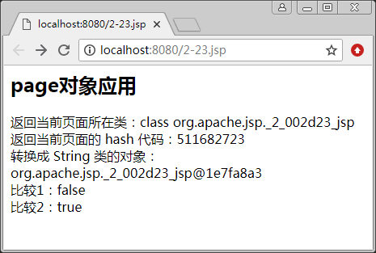

# JSP page 对象

page 对象是为了执行当前页面应答请求而设置的 Servlet 类的实体，即显示 JSP 页面自身，与类的 this 指针类似，使用它来调用 Servlet 类中所定义的方法，只有在本页面内才是合法的。它是 java.lang.Object 类的实例，对于开发 JSP 比较有用。表 1 列出了 page 对象常用的方法。

表 1 page 对象常用的方法

| 方法 | 说明 |
| class getClass() | 返回当前 Object 的类 |
| int hashCode | 返回 Object 的 hash 代码 |
| String toString | 把 Object 对象转换成 String 类的对象 |
| boolean equals(Object obj) | 比较对象和指定的对象是否相等 |
| void copy (Object obj) | 把对象拷贝到指定的对象中 |
| Object clone() | 复制对象（克隆对象） |

【例 1】page 对象的应用。用 page 对象访问当前页面的信息，代码如下：

```
<%@ page contentType="text/html;charset=utf-8" import="java.lang.Object" %>
<html>
<body>
    <h2> page 对象应用</h2>
<%
Object obj;
obj=null;
%>
返回当前页面所在类：<%=page.getClass()%> <br>
返回当前页面的 hash 代码：<%=page.hashCode()%> <br>
转换成 String 类的对象：<%=page.toString()%> <br>
比较 1：<%=page.equals(obj) %> <br>
比较 2：<%=page.equals(this) %>
</body>
</html>
```

运行结果如图 1 所示。


图 1 page 对象的应用