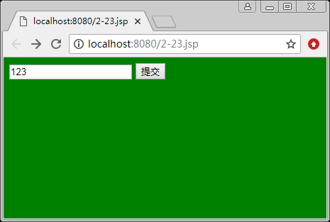
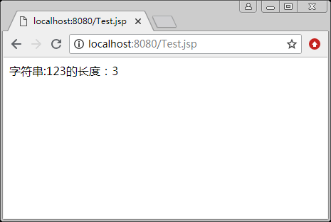

# JSP 获取并显示字符串长度

## 实训内容和要求

编写两个 JSP 页面 inputString.jsp 和 computer.jsp，用户可以使用 inputString.jsp 提供的表单输入一个字符串，并提交给 computer.jsp 页面，该页面通过内置对象获取 inputString.jsp 页面提交的字符串，并显示该字符串的长度。

## 实训步骤

(1)    inputString.jsp 的代码如下：

```
<%@ page contentType="text/html;charset=utf-8" %>
<html>
<body bgcolor=green>
    <form action="computer.jsp" method=post name=form>
        <input type="text" name="str">
        <input type="submit" value="提交" name="submit">
    </form>
</body>
</html>
```

(2)    computer.jsp 的代码如下：

```
<%@ page contentType="text/html;charset=utf-8" %>
<html>
<body>
<%
    String textContent=request.getParameter("str");
    byte  b[]=textContent.getBytes("utf-8");
    textContent=new String(b);
%>
字符串:<%=textContent%>的长度：<%=textContent.length()%>
</body>
</html>
```

程序的运行结果如图 1 所示。


a)

b)
图 1 通过内置对象获取并显示字符串