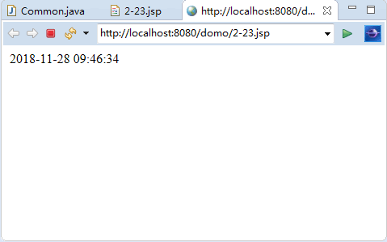

# JavaBean 的 Scope 属性

对于 JSP 程序而言，使用 JavaBean 组件不仅可以封装许多信息，而且还可以将一些数据处理的逻辑隐藏到 JavaBeah 的内部。除此之外，我们还可以设定 JavaBean 的 Scope 属性，使得 JavaBean 组件对于不同的任务具有不同的生命周期和不同的使用范围。

在前面我们己经提到过 Scope 属性具有四个可能的值，分别是 application、session、request、page，分别代表 JavaBean 的四种不同的生命周期和四种不同的使用范围。bean 只有在它定义的范围里才能使用，在它的活动范围外将无法访问。

JSP 设定的范围如下：

1.  page：bean 的默认使用范围。
2.  request：作用于任何相同请求的 JSP 文件中，直到页面执行完毕向客户端发回响应或在此之前已通过某种方式（如重定向、链接等方式）转到另一个文件为止。还可通过使用 Request 对象访问 bean，如 request.getAttribute(beanName)。
3.  session：作用于 session 的整个生存周期，在 session 的生存周期内，对此 bean 属性的任何改动，都会影响在此 session 内的另一 page、另一 request 里对此 bean 的调用。但必须在创建此 bean 的文件里事先用 page 指令指定了 session=true。
4.  application：作用于 application 的整个生存周期，在 application 的生存周期内，对此 bean 属性的任何改动，都会影响到此 application 内另一 page、另一 request 以及另一 session 里对此 bean 的调用。

下面我们用一个最为简单的例子来理解。

【例 1】利用 JavaBean 获取当前时间，其代码如下：

```
package example;
import java.util.Date;
import java.text.*;
public class Common
{
    Date d=new Date();
    public String now(String s)
    {
        SimpleDateFormat formatter=new SimpleDateFormat(s);
        return formatter.format(d);
    }
}
```

测试页面的代码如下：

```
<jsp:useBean scope="page" id="dt" class="example.Common"/>
<%
    out.print(dt.now("yyyy-MM-dd HH:mm:ss"));
%>
```

程序的运行结果如图 1 所示。


图 1 显示当前时间
通过上述程序，我们可以得知：

*   当 scope=application 时，我们浏览 date.jsp，这时显示出了系统时间。可是不管我们怎么刷新，重新打开一次浏览器，甚至换台机器，它显示的时间始终不变，都是当初的时间（即 bean 刚创建时得到的系统时间），因为 scope=application，所以 bean 的实例在内存中只有一份，此时只要不重新启动 Web 服务，输出不会变化。
*   当 scopp=session 时，浏览 date.jsp，刷新时显示也不会变化。可是当我们重新打开浏览器，即一个新的 session 时，系统便再次创建 bean 的实例，取得当前系统时间，这时将得到正确的时间。同样，再次刷新新打开的页面（新的 session），显示也不会变化。
*   当 scope=page/request（它们的区别只在于包含静态文件时，此处无区别）时，不断刷新页面将不断得到当前系统时间。

以上可以看出对于不同的 scope，bean 有不同的作用域。使用时一定注意，不要将经常变动的 bean 的 scope 设为 application 或 session，那将得到不正确的结果。