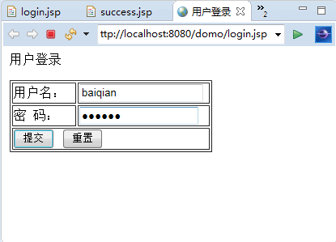
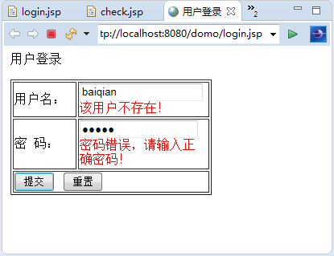
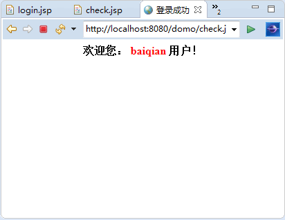

# JavaBean 实现用户登录界面

## 实训内容和要求

应用 JavaBean 方式实现用户的登录验证，当用户在表单中填写正确的用户名和密码后，提示成功登录。若输入的密码错误，则提示“密码错误，请输入正确密码！”。

## 实训步骤

(1) 用 JavaBean 用户登录验证。类 User 包含基础的用户名、密码属性，用 Map 来保存错误信息，代码如下：

```
package com.eshore.pojo;
import java.io.Serializable;
import java.util.HashMap;
import java.util.Map;
public class User implements Serializable
{
    private String username="";    //用户名
    private String passwd="";    //密码
    Map<String,String> userMap=null;    //存放用户
    Map<String,String> errorsMap=null;    //存放错误信息

    public User()
    {
        //无参的构造方法
        super();
        this.username="";
        this.passwd="";
        userMap=new HashMap<String,String>();
        errorsMap=new HashMap<String,String>();
        //添加用户，模拟从数据库中查询出的数据库
        userMap.put("baiqian","123zs");
        userMap.put("baifengjiu","1234zs");
        userMap.put("yehua","1234ww");
        userMap.put("zheyan","1234zq");
        userMap.put("baichen","1234zl");
        //TODO Auto-generated constructor stub
    }
    //数据验证
    public boolean isValidate()
    {
        boolean flag=true;
        //用户名验证
        if(!this.userMap.containsKey(this.username))
        {
            flag=false;
            errorsMap.put("username","该用户不存在！");
            this.username="";
        }
        //根据用户名进行密码验证
        String password = this.userMap.get(this.username);
        if(password==null||!password.equals(this.passwd))
        {
            flag=false;
            this.passwd="";
            errorsMap.put("passwd","密码错误，请输入正确密码！");
            this.username="";
        }
        return flag;
    }
    //获取错误信息
    public String getErrors(String key)
    {
        String errorV=this.errorsMap.get(key);
        return errorV==null?"":errorV;
    }
    //以下是属性的 get 和 set 方法，但必须是 public
    public String getUsername()
    {
        return username;
    }
    public void setUsername(String username)
    {
        this.username=username;
    }
    public String getPasswd()
    {
        return passwd;
    }
    public void setPasswd(String passwd)
    {
        this.passwd=passwd;
    }
}
```

(2) 登录页面 login.jsp，引用 User 类并用表单提交的方式；设定 User 属性值，代码如下：

```
<%@ page language="java" import="java.util.*" pageEncoding="UTF-8"%>
<jsp:useBean id="user" class="com.eshore.pojo.User" scope="session"/>
<!DOCTYPE HTML PUBLIC "-//W3C//DTD HTML 4.01 Transitional//EN">
<html>
<head>
    <title>用户登录</title>
</head>
<body>
<p>用户登录</p>
<!--用 form 表单提交，用户名跟密码-->
<form action="check.jsp" method="post">
<table border="1" width="250px;">
<tr>
    <td width="75px;">用户名：</td>
    <td><input name="username" value="<jsp:getProperty name="user" property="username"/>"/>
    <!--用户错误信息-->
    <span style="color:red"><%=user.getErrors("username") %></span><br/></td>
</tr>
<tr>
      <td width="75px;">密&nbsp;&nbsp;码：</td>
      <td><input type="password" name="passwd" value="<jsp:getProperty name="user" property="passwd"/>"/>
      <!--密码错误信息-->
      <span style="color:red"> <%=user.getErrors("passwd") %></span><br/></td>
</tr>
<tr>
      <td colspan="2">
          <input type="submit" value="提交"/>&nbsp;&nbsp;
          <input type="reset" value="重置"/>
      </td>
</tr>
</table>
</form>
</body>
</html>
```

(3) 检验页面 check.jsp，同样定义一个范围为 session 的 User，调用类的验证方法进行判断，代码如下：

```
<%@ page language="java" import="java.util.*" pageEncoding="UTF-8"%>
<jsp:useBean id="user" class="com.eshore.pojo.User" scope="session"/>
<!DOCTYPE HTML PUBLIC "-//W3C//DTD HTML 4.01 Transitional//EN">
<html>
<head>
    <title>验证用户</title>
</head>
<body>
<!--
    设置 user 属性，判断是否合法
    合法跳转成功，否则跳转到登录页面
-->
<jsp:setProperty property="*" name="user"/>
<%
    if(user.isValidate())
    {
%>
<jsp:forward page="success.jsp"/>
<%
    }else{
%>
<jsp:forward page="login.jsp"/>
<% } %>
</body>
</html>
```

(4) success.jsp 文件显示欢迎界面，代码如下：

```
<%@ page language="java" import="java.util.*" pageEncoding="UTF-8"%>
<% request.setCharacterEncoding("UTF-8"); %>
<jsp:useBean id="user" class="com.eshore.pojo.User" scope="session"/>
<!DOCTYPE HTML PUBLIC "-//W3C//DTD HTML 4.01 Transitional//EN">
<html>
<head>
    <title>登录成功</title>
</head>
<body>
<center>
    <h4>欢迎您：
        <SPAN style="color: red">
            <jsp:getProperty property="username" name="user"/>
        </SPAN>用户！
    </h4>
</center>
</body>
</html>
```

程序运行结果如图 1、图 2、图 3 所示。


图 1 用户登录界面

图 2 输入错误信息提示

图 3 成功登录的效果