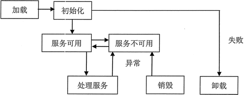

# Servlet 的生命周期

Servlet 程序是运行在服务端的 Java 程序，生命周期受 Web 容器的控制。Servlet 生命周期包括加载、初始化、服务、销毁、卸载 5 个部分，如图 1 所示。

图 1 Servlet 的生命周期示意图

#### 1\. 加载

加载一般是运行 Web 容器中的 Tomcat 来完成的。当 Web 容器启动时，或第一次使用某个 Servlet 时，Web 容器创建 Servlet 实例。此时，用户必须通过 web.xml 文件指定 Servlet 所在的包和类名称。成功加载后，Web 容器会通过反射机制对 Servlet 进行实例化。

#### 2\. 初始化

当 Web 容器实例化 Servlet 对象后，它将调用 init() 方法初始化这个实例对象。初始化可以让 Servlet 对象在处理客户端请求前完成一系列的准备工作，如建立数据连接、读取源文件。

#### 3\. 服务

当发现有请求提交时，Servlet 调用 service() 方法进行处理，该方法将根据客户端的请求方式，调用 doGet() 或 doPost() 方法。在 service() 方法中，Servlet 通过 ServletRequest 对象接收客户端请求，通过 ServletRequest 对象设置响应信息。

#### 4\. 销毁

当 Servlet 在 Web 服务器中销毁时，Web 服务器将调用 Servlet 的 destroy() 方法，以便让该 Servlet 释放所占用的资源。

#### 5\. 卸载

当一个 Servlet 完成 destroy() 方法后，此 Servlet 实例将等待被垃圾回收器回收。