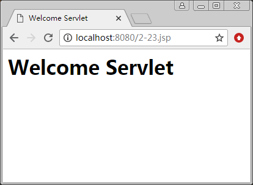

# Servlet 的类和方法

开发 Servlet 相关的程序包主要有两个，即 javax. servlet 和 j avax.servlet.http。大多数 Servlet 是针对 HTTP 协议的 Web 容器，这样，开发 Servlet 的方法时，会使用 javax.servlet.http.Httpservlet 类。下面介绍 Servlet 开发中经常使用的 API。

#### 1\. Servlet 接口

此接口位于 javax.servlet 包中，定义了 Servlet 的主要方法，声明如表 1 所示。

表 1 常用 Servlet 接口的方法声明

| 方法声明 | 说明 |
| public void service(ServletRequest request, ServletResponse response) | Servlet 在处理客户端请求时调用此方法 |
| public void destroy() | Servlet 容器移除 Servlet 对象时调用此方法，以释放资源空间 |
| public ServletConfig getServletConfig() | 用于获取 Servlet 对象的配置信 息，返回 ServletConfig 对象 |
| public String getServletInfo() | 返回有关 Servlet 的信息，如作者、版本柄息等 |

#### 2\. HttpServlet 类

HttpServlet 类是 Servlet 接口的实现类，主要封装了 HTTP 请求的方法，常用的方法声明如表 2 所示。

表 2 HttpServlet 类的常用方法与声明

| 方法声明 | 说明 |
| protected void doGet(HttpServletRequest req, HttpServletResponse resp) | 用于处理 GET 类型的 HTTP 请求方法 |
| protected void doPost(HttpServletRequest req, HttpServletResponse resp) | 用于处理 POST 类型的 HTTP 请求方法 |
| protected void doPut(HttpServletRequest req, HttpServletResponse resp) | 用于处理 PUT 类型的 HTTP 请求方法 |

#### 3\. HttpServletRequest 接口

HttpServletRequest 接口位于 javax.servlet.http 包中，用于封装 HTTP 的请求。通过此接口，可以获取客户端传递的 HTTP 请求参数，常用方法的声明及其说明如表 3 所示。

表 3 HttpServletRequest 接口的常用方法

| 方法声明 | 说明 |
| public String getContextPath() | 返回上下文路径，此路径以“/”开始 |
| public Cookie getCookies() | 返回所有 Cookie 对象，返回值类型为 Cookie 数组 |
| public String getMethod() | 返回 HTTP 请求的类型，如 GET 和 POST 等 |
| public String getQueryString() | 返回请求的查询字符串 |
| public String getRequestURI() | 返回主机名到请求参数之间的部分字符串 |
| public HttpSession getSession() | 返回与客户端页面关联的 HttpSession 对象 |

#### 4\. HttpServletResponse 接口

HttpServletResponse 接口位于 javax.servlet.http 包中，它封装了对 HTTP 请求的响应。

通过此接口，可以向客户端发送回应，其常用方法声明及说明如表 4 所示。

表 4 HttpServletResponse 接口的常用方法

| 方法声明 | 说明 |
| public void addCookie(Cookie cookie) | 向客户端发送 Cookie 信息 |
| public void sendError(int sc) | 发送一个错误状态码为 sc 的错误响应到客户端 |
| public void sendError(int sc,String msg) | 发送包含错误状态码及错误信息响应到客户端 |
| public void sendRedirect(String location) | 将客户端请求重定向到新的 URL |

HttpServletRequest 接口和 HttpServletResponse 接口中封装了 HTTP 请求，更多的方法读者可以参阅 JavaEE API 文档。

要开发一个可以处理 HTTP 请求的 Servlet 程序，需要继承 HttpServlet 类，继承 HttpServlet 之后，就可以重写 HttpServlet 类中的方法，然后编写代码实现。

【例 1】创建 Servlet 程序 Welcome.java，程序运行显示 “Welcome Servlet”。

首先创建一个 Servlet 文件 Welcome.java，编写代码如下：

```
import javax.servlet.ServletException;
import javax.servlet.http.HttpServlet;
import javax.servlet.http.HttpServletRequest;
import javax.servlet.http.HttpServletResponse;
public class Welcome extends HttpServlet
{
    //第一个 Servlet
    public void goGet(HttpServletRequest request,HttpServletResponse response) throws ServletException,IOException
    {
        PrintWrite out=response.getWrite();    //创建输出流对象，准备输出
        out.println("<HTML>");
        out.println("<HEAD><TITLE>Welcome Servlet</TITLE></HEAD>");
        out.println("<BODY>");
        out.print("<h1> Welcome Servlet </h1>");
        out.println("</BODY>");
        out.println("</HTML>");
        out.close();
    }
}
```

以上代码从 HttpServletResponse 对象中获取一个输出流对象，然后通过输出流对象 out 输出每个 HTML 元素。

编译后仍无法直接访问，需要在 \WEB-INF\web.xml 文件中进行配置，完成 Servlet 程序的映射，Servlet 才能执行。本例在 web.xml 文件中添加如下代码：

<servlet>
    <servlet-name> Welcome</servlet-name >
    <servlet-class>ch05.Welcome</servlet-class >
</servlet>
<servlet-mapping>
<servlet-name> Welcome</servlet-name >
    <url-pattern>/servlet/Welcome</url-pattern>
</servlet-mapping>

上面的配置程序表示：通过 /servlet/Welcome 路径可以找到对应的 <servlet> 节点，找到 <servlet -class> 所指定的 Servlet 程序。

启动服务器后，在浏览器中输入 http://localhost:8080/ch05/5-2/servlet/Welcome，程序运行结果如图 1 所示。


图 1 Welcome 程序的运行结果